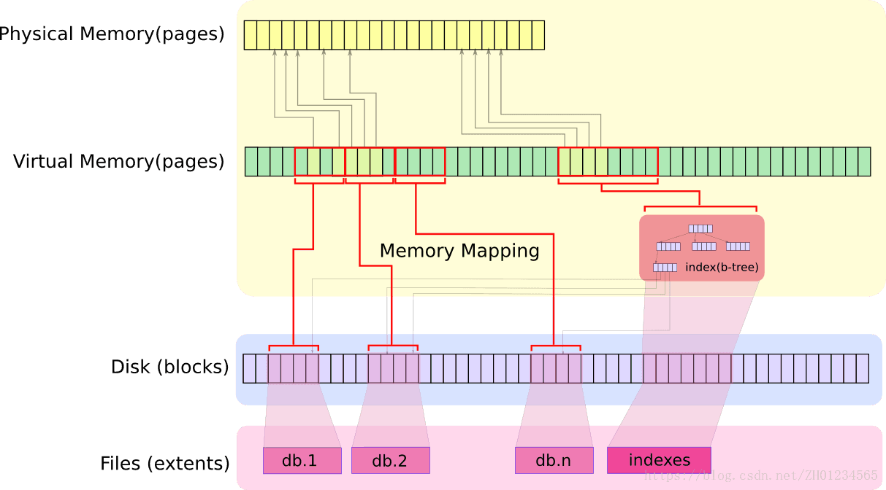

# emeraldDB implements

## enveriments

在项目 emeralddb 目录下运行 build.sh ，emralddb 可执行文件编译连接成功，执行后输出hello world。

### 安装boost库

参考boost官网提供的[安装方法](https://www.boost.org/doc/libs/1_72_0/more/getting_started/unix-variants.html#id20)

如果你希望使用一个单独编译的Boost库，那么首先要对之前下载解压的Boost工程进行编译
 Boost库的编译安装还有一些依赖库，需要先安装

```csharp
g++ gdb make mpi-default-dev libicu-dev python-dev libbz2-dev
```

Issue the following commands in the shell (don't type `$`; that represents the shell's prompt):

```
$ cd path/to/boost_1_72_0
$ ./bootstrap.sh --help
```

Select your configuration options and invoke `./bootstrap.sh` again without the `--help` option. Unless you have write permission in your system's `/usr/local/` directory, you'll probably want to at least use

```
$ ./bootstrap.sh --prefix=path/to/installation/prefix
```

to install somewhere else. Also, consider using the `--show-libraries` and `--with-libraries=`*library-name-list* options to limit the long wait you'll experience if you build everything. Finally,

```
$ ./b2 install
```

will leave Boost binaries in the `lib/` subdirectory of your installation prefix. You will also find a copy of the Boost headers in the `include/` subdirectory of the installation prefix, so you can henceforth use that directory as an `#include` path in place of the Boost root directory.

### 安装BSON

bson 是MongoDB开发的开源库，用于数据存储对象的封装。

官方给出的implements：[BSON Libraries]([http://bsonspec.org/implementations.html](http://bsonspec.org/implementations.html))

在EDB系统中，直接下载C++格式的库文件——[bson/src](https://github.com/jbenet/bson-cpp)

使用方法：`#include <bson/bson.h>` 

如果仅仅copy文件目录到项目中，则使用`#include "bson.h"`

## Socket通信

创建一个类ossSocket, 该类实现socket通信的几个步骤，包括初始化socket，绑定监听bind/listen，发送接收send/recv等。

### ossSocket类

#### 私有成员变量

1.  int _fd, socket的描述符。一个ossSocket类维持一个sock，它有一个Unix文件描述符提供给用户进行程序操作。
2.  socketlen_t  _addressLen，主机地址长度。
3.  socketlen_t  _peerAddressLen, 客户机地址长度。
4.  struct sockaddr_in _sockAddress，主机地址结构体。struct sockaddr_in 是Unix封装好的IPv4类型地址结构。
5.  struct sockaddr_in _peerAddress, 客户机地址结构体。
6.  bool _init，sock对象是否已经被初始化。对应sock对象初始化函数initSocket()。
7.  int _timeout，超时设置。

#### 构造函数

**ossSocket()，构造一个全新的套接字**

```c
ossSocket::ossSocket()
{
    _init = false;
    _fd = 0;
    _timeout = 0;
    memset(&_sockAddress, 0, sizeof(sockaddr_in));
    memset(&_peerAddress, 0, sizeof(sockaddr_in));
    _peerAddressLen = sizeof(_peerAddress);
    _addressLen = sizeof(_sockAddress);
}
```

将初始化状态\_init设置为false，文件描述符\_fd设置为0，超时\_timeout设置为0，地址结构体\_sockAddress和\_peerAddress内存置0，地址长度\_peerAddressLen和\_addressLen内存置0.

**ossSocket(unsigned int port, int timeout)，构造服务端用于监听的socket**

```c
ossSocket::ossSocket(unsigned int port, int timeout)
{
    _init = false;
    _fd = 0;
    _timeout = timeout;
    memset(&_sockAddress, 0, sizeof(sockaddr_in));
    memset(&_peerAddress, 0, sizeof(sockaddr_in));
    _peerAddressLen = sizeof(_peerAddress);
    _sockAddress.sin_family = AF_INET;
    _sockAddress.sin_addr.s_addr = htonl(INADDR_ANY);
    _sockAddress.sin_port = htons(port);
    _addressLen = sizeof(_sockAddress);
}
```

服务端的socket要初始化本地的socket。

部分参数参考上述。这里的服务端socket设置：

\_sockAddress.sin_family 通信协议族为 AF\_INET(IPV4).

 \_sockAddress.sin\_addr.s\_addr 绑定socket宿主机IP地址。htonl 将主机字节类型转换为网络字节类型 l表示hostlong 主机为长整型,htons s表示短整型。 INADDR_ANY 为表示创建的socket接收任何地址的信息。If the (sin_addr.s_addr) field is set to the constant INADDR_ANY, as defined in netinet/in.h, the caller is requesting that the socket be bound to all network interfaces on the host.

_sockAddress.sin_port = htons(port) 转换int型的port为短整型。

**ossSocket(const char \*pHostName, unsigned int port, int timeout) 构造客户端的套接字**

```c
ossSocket::ossSocket(const char *pHostName, unsigned int port, int timeout)
{
    struct hostent *hp;
    _init = false;
    _timeout = timeout;
    _fd = 0;
    memset(&_sockAddress, 0, sizeof(sockaddr_in));
    memset(&_peerAddress, 0, sizeof(sockaddr_in));
    _peerAddressLen = sizeof(_peerAddress);
    _sockAddress.sin_family = AF_INET;
    // 解析对方的机型
    if( (hp=gethostbyname(pHostName)) )
    {
        _sockAddress.sin_addr.s_addr = *((int *)hp->h_addr_list[0]);
    }else
    {
        _sockAddress.sin_addr.s_addr = inet_addr(pHostName);
    }
    _sockAddress.sin_port = htons(port);
    _addressLen = sizeof(_sockAddress);
}
```

客户端的套接字socket要解析服务端的地址信息，一般传入的是服务端ip地址或者hostname(若host文件保存对方hostname)，所以这里使用struct hostent以及函数gethostbyname()来解析对方的地址；若解析失败，使用inet_addr()解析传进来的点分十进制ip地址。

**ossSocket(int *sock, int timeout)，从一个已经存在的socket创建新的ossSocket对象**

```c
ossSocket::ossSocket(int *sock, int timeout)
{
    int rc = EDB_OK;
    _fd = *sock;
    // 已经存在的socket表示已经初始化过
    _init = true;
    _timeout = timeout;
    _addressLen = sizeof(_sockAddress);
    memset(&_peerAddress, 0 , sizeof(sockaddr_in));
    _peerAddressLen = sizeof(_peerAddress);
    rc = getsockname(_fd, (sockaddr*)&_sockAddress, &_addressLen);
    if  (rc)
    {
        PD_LOG(PDERROR, "Failed to get sock name, error = %d", 
                SOCKET_GETLASTERROR);
        _init = false;
    }else
    {
        rc = getpeername(_fd, (sockaddr *)&_peerAddress, &_peerAddressLen);
        PD_RC_CHECK(rc, PDERROR, "Failed to get peer name, error = %d",
                    SOCKET_GETLASTERROR);
    }
  done:
  	return;
  error:
  	goto done;
}
```

一般来说，服务端的socket在监听状态下，会有accept()函数，以阻塞进程的方式等待接收客户端的请求，接收到请求后返回一个新的socket描述符，用于对socket的信息读写操作。所以，这里封装新的socket描述符。

get socket name.  get peer name，_fd 为已知socket的描述符，将新分配内存空间的 _sockAddress 作为引用参数传入，可以将socket的主机地址保存到该内存空间，同理对peerAddress。

#### 初始化socket

`int initSocket()`，该函数是对socket()函数的封装

```c
int ossSocket::initSocket()
{
    int rc = EDB_OK;
    if(_init)
    {
        goto done;
    }
    memset(&_peerAddress, 0, sizeof(sockaddr_in));
    _peerAddressLen = sizeof(_peerAddress);
    _fd = socket(AF_INET, SOCK_STREAM, IPPROTO_TCP);
    if(-1 == _fd)
    {
        PD_RC_CHECK(EDB_NETWORK, PDERROR, "Failed to initialize socket, error = %d",
                SOCKET_GETLASTERROR);
    }
    _init = true;
    // set timeout
    setTimeout(_timeout);

done :
    return rc;
error :
    goto done;
}
```

首先判断是否已经初始化，若已经初始化直接goto done. 使用系统提供的socket()函数，传入协议族，TCP传输协议，并将生成的socket描述符赋值给对象的成员变量_fd. 最后设置超时时间。

#### 设置服务端地址

```c
void ossSocket::setAddress(const char *pHostName, unsigned int port)
{
    struct hostent *hp;
    memset(&_sockAddress, 0, sizeof(sockaddr_in));
    memset(&_peerAddress, 0, sizeof(sockaddr_in));
    _peerAddressLen = sizeof(_peerAddress);
    _sockAddress.sin_family = AF_INET;  // IPV4
    //获取hostent结构体
    if( (hp=gethostbyname(pHostName)) )
        _sockAddress.sin_addr.s_addr = *((int *)hp->h_addr_list[0]);
    else
        _sockAddress.sin_addr.s_addr = inet_addr(pHostName);

    _sockAddress.sin_port = htons(port);
    _addressLen = sizeof(_sockAddress);
}
```

一般该函数使给客户端socket调用，用来绑定请求服务的服务器地址。

函数结构与构造客户端ossSocket对象类似。

#### 发送队列linger

```c
int ossSocket::setSocketLi(int lOnOff, int linger)
{
    int rc = EDB_OK;
    struct linger _linger;
    _linger.l_onoff = lOnOff;
    _linger.l_linger = linger;
    rc = setsockopt(_fd, SOL_SOCKET, SO_LINGER,
                    (const char *)&_linger, sizeof(_linger));
    return rc;
}
```

当调用closesocket关闭套接字时，SO_LINGER将决定系统如何处理残存在套接字发送队列中的数据。处理方式无非两种：丢弃或者将数据继续发送至对端，优雅关闭连接。事实上，SO_LINGER并不被推荐使用，大多数情况下我们推荐使用默认的关闭方式。

#### 绑定监听

bing_listen()，绑定ossSocket对象成员变量\_sockAddress提供的socket地址信息，以及\_addressLen地址长度。

```c
int ossSocket::bind_listen()
{
    int rc = EDB_OK;
    int temp = 1;
    rc = setsockopt(_fd, SOL_SOCKET,
                    SO_REUSEADDR, (char *)&temp, sizeof(int));
    if(rc)
    {
        PD_LOG(PDWARNING, "Failed to setsocktopt SO_REUSEADDR, error = %d",
                SOCKET_GETLASTERROR);
    }
    rc = setSocketLi(1,30);
    if (rc)
    {   
        PD_LOG(PDWARNING, "Failed to setsockopt SO_LINGER, error = %d", 
                SOCKET_GETLASTERROR);
    }
    rc = ::bind(_fd, (struct sockaddr*)&_sockAddress, _addressLen);
    if(rc)
    {
        PD_RC_CHECK(EDB_NETWORK, PDERROR, "Failed to bind socket, error = %d", 
                SOCKET_GETLASTERROR);
    }
    rc = listen(_fd, SOMAXCONN);
    if(rc)
    {   
        PD_RC_CHECK(EDB_NETWORK, PDERROR, "Failed to listen socket, error = %d",
                SOCKET_GETLASTERROR);
    }

done:
    return rc;
error:
    close();
    goto done;
}
```

`setsockopt(_fd, SOL_SOCKET, SO_REUSEADDR, (char *)&temp, sizeof(int));`

编写 TCP/SOCK_STREAM 服务程序时，SO_REUSEADDR 这个套接字选项通知内核，如果端口忙，但TCP状态位于 TIME_WAIT ，可以重用端口。如果端口忙，而TCP状态位于其他状态，重用端口时依旧得到一个错误信息，指明"地址已经使用中"。如果你的服务程序停止后想立即重启，而新套接字依旧使用同一端口，此时SO_REUSEADDR 选项非常有用。其实一般来说不使用。

`setSocketLi(1,30);` 

设置socketLinger，阻塞进程知道队列消息全部处理完，缓存队列的处理等待时间30ms。

`::bind(_fd, (struct sockaddr*)&_sockAddress, _addressLen);`

绑定socket地址信息

`listen(_fd, SOMAXCONN)`

进入被动监听状态，函数原型`int listen(int sock, int backlog);	//linux`。backlog 为请求队列最大长度，被动监听是套接字在没有请求时进入睡眠状态，接收到请求时被唤醒。

#### 接收请求

accept(), 接收请求的函数是客户发送请求过来后，服务端进行响应的函数。期间阻塞进程，直到客户发送请求。

```c
int ossSocket::accept(int *sock, struct sockaddr *addr, socklen_t *addrlen,
                      int timeout)
{
    int rc = EDB_OK;
    int maxFD = _fd;
    struct timeval maxSelectTime;
    fd_set fds;
    maxSelectTime.tv_sec = timeout/1000000;
    maxSelectTime.tv_usec = timeout%1000000;
    while(true)
    {
        FD_ZERO(&fds);
        FD_SET(_fd, &fds);
        rc = select(maxFD+1, &fds, NULL, NULL,
                    timeout>=0?&maxSelectTime:NULL);
        // 0 means timeout
        if(0==rc)
        {
            rc = EDB_TIMEOUT;
            goto done;
        }
        // if < 0 , something wrong
        if(0>rc)
        {
            rc = SOCKET_GETLASTERROR;
            if(EINTR==rc)
            {
                continue;
            }
            PD_RC_CHECK(EDB_NETWORK, PDERROR, 
                        "Failed to select from socket, error = %d", rc);
        }
        if(FD_ISSET(_fd, &fds))
        {
            break;
        }
    }
    rc = EDB_OK;
    *sock = ::accept(_fd, addr, addrlen);
    if(-1 == *sock)
    {
        PD_RC_CHECK(EDB_NETWORK, PDERROR, 
                    "Failed to accept socket, error = %d", SOCKET_GETLASTERROR);
    }
done:
    return rc;
error:
    goto done;
}
```

select()函数用来检查套接字描述符(sockets descriptors)是否已准备好读/写，提供了一种同时检查多个套接字的方法。

定义：
int select(int fd_max, fd_set *readfds, fd_set *writefds, fd_set *exceptfds, struct timeval *timeout);

当参数中文件描述符集合fds内发生变化时，函数返回变化的描述符个数；-1：发生错误，并将所有描述符集合清0，可通过errno输出错误详情；0：超时。每次调用完select()函数后需要将文件描述符集合清空并重新设置，也就是设置的文件描述符集合是一次性使用的。原因是调用完select()后文件描述符集合可能发生改变。

```c
FD_ZERO(fd_set *fd);             /* 清空该组文件描述符集合 */
FD_CLR(int fd,fd_set *fd);       /* 清除该组文件描述符集合中的指定文件描述符 */
FD_ISSET(int fd,fd_set *fd);     /* 测试指定的文件描述符是否在该文件描述符集合中 */
FD_SET(int fd,fd_set *fd);       /* 向该文件描述符集合中添加文件描述符 */
```

设置select参数READ若检测到文件描述符\_fd发生变化后，集合内保存的文件描述符_fd, 表明文件准备读取就绪，则调用accept()函数来接收客户端请求，即读取并处理数据。accept()函数返回值为新的套接字，之后的两者之间的通信则使用这个新生成的套接字。

#### 客户端连接

connect()函数是客户端连接到服务端的socket调用的。

```c
int ossSocket::connect()
{
    int rc = EDB_OK;
    rc = ::connect(_fd, (struct sockaddr *)&_sockAddress, _addressLen);
    if(rc)
    {
        PD_RC_CHECK(EDB_NETWORK, PDERROR, 
                    "Failed to connect, error = %d", SOCKET_GETLASTERROR);
    }
    rc = getsockname(_fd, (sockaddr*)&_sockAddress, &_addressLen);
    if (rc)
    {
        PD_RC_CHECK(EDB_NETWORK, PDERROR,
                    "Failed to get local address, error = %d", rc);
    }
    // get peer address
    rc = getpeername(_fd, (sockaddr*)&_peerAddress, &_peerAddressLen);
    if(rc)
    {
        PD_RC_CHECK(EDB_NETWORK, PDERROR,
                    "Failed to get peer address, error = %d", rc);
    }

done:
    return rc;
error:
    goto done;
}
```

ossSocket类对connect()函数封装，将连接后的双方socketAddress结构体保存到私有成员变量，\_sockAddress/\_peerAddress.

#### 发送和接收

**send() 发送消息**

```c
int ossSocket::send(const char *pMsg, int len,
                    int timeout, int flags)
{
    int rc = EDB_OK;
    int maxFD = _fd;
    struct timeval maxSelectTime;
    fd_set fds;

    maxSelectTime.tv_sec = timeout / 1000000;
    maxSelectTime.tv_usec = timeout % 1000000;
    // if len==0 then let's just return
    if(0==len)
    {
        return EDB_OK;
    }
    // wait loop until socket is ready
    while(true)
    {
        // 清空
        FD_ZERO(&fds);
        // add
        FD_SET(_fd, &fds);
        rc = select(maxFD + 1, NULL, &fds, NULL,
                    timeout>=0?&maxSelectTime:NULL);
        if(0==rc)
        {
            // timeout
            rc = EDB_TIMEOUT;
            goto done;
        }
        // if rf < 0, someting wrong
        if(0>rc)
        {
            rc = SOCKET_GETLASTERROR;
            // failed due to interrupt, let's continue
            if(EINTR==rc)
            {
                continue;
            }
            PD_RC_CHECK(EDB_NETWORK, PDERROR, "Failed to select from socket, error = %d",
                    SOCKET_GETLASTERROR);
        }
        // FD_ISSET() tests to see if a file descriptor is part of the set; 
        if(FD_ISSET(_fd, &fds))
        {
            break;
        }
    }
    // 发送消息
    while(len>0)
    {
        // MSG_NOSIGNAL: Requests not to send SIGPIPE on errors on stream oriented sockets
        // when the other end breaks the connetction. The EPIPE error is still returned
        rc = ::send(_fd, pMsg, len, MSG_NOSIGNAL|flags);
        if (-1 == rc)
        {
            PD_RC_CHECK(EDB_NETWORK, PDERROR, "Failed to send, error = %d", 
                        SOCKET_GETLASTERROR);
        }
        len -=rc;
        pMsg += rc;
    }
    rc = EDB_OK;

done:
    return rc;
error:
    goto done;
}

```

select()函数设置文件集合可写性，当准备好后进行socket写入操作(send)。

这里对sned函数进行了二次封装，保证发送的健壮性。发送len长度的消息，发送可能截断一部分，send()函数返回完成的字节数，len减去这个字节数，消息指针移动到字节数后一个位置，重新发送，重复上述步骤直到len==0.

**recv()接收函数**

```c
#define MAX_RECV_PETRIES 5
int _ossSocket::recv(char *pMsg, int len,
                    int timeout, int flags)
{
    int rc = EDB_OK;
    int retries = 0;
    int maxFD = _fd;
    struct timeval maxSelectTime;
    fd_set fds;

    if(0==len)
        return EDB_OK;
    maxSelectTime.tv_sec = timeout/1000000;
    maxSelectTime.tv_usec = timeout%1000000;
    while(true)
    {
        FD_ZERO(&fds);
        FD_SET(_fd, &fds);
        rc = select(maxFD+1, &fds, NULL, NULL,
                    timeout>=0?&maxSelectTime:NULL);
        // 0 means timeout
        if(0==rc)
        {
            rc = EDB_TIMEOUT;
            goto done;
        }
        // if < 0 , something wrong
        if(0>rc)
        {
            rc = SOCKET_GETLASTERROR;
            if(EINTR==rc)
            {
                continue;
            }
            PD_RC_CHECK(EDB_NETWORK, PDERROR, 
                        "Failed to select from socket, error = %d", 
                        rc);
        }
        if(FD_ISSET(_fd, &fds))
        {
            break;
        }
    }
    while(len > 0 )
    {
        rc = ::recv(_fd, pMsg, len, MSG_NOSIGNAL|flags);
        if(rc > 0)
        {
            if(flags & MSG_PEEK)
            {
                goto done;
            }
            len -= rc;
            pMsg += rc;
        }
        else if(rc==0)
        {
            PD_RC_CHECK(EDB_NETWORK_CLOSE, PDINFO, 
                        "Peer unexcepted shutdown");
        }
        else
        {
            rc = SOCKET_GETLASTERROR;
            if((EAGAIN==rc||EWOULDBLOCK==rc) &&
                _timeout>0)
            {
                PD_RC_CHECK(EDB_NETWORK, PDERROR, 
                            "Recv() timeout, error = %d", rc);
            }
            if((EINTR == rc) && (retries<MAX_RECV_PETRIES))
            {
                retries++;
                continue;
            }
            PD_RC_CHECK(EDB_NETWORK, PDERROR, 
                        "Recv() Failed, error = %d", rc);
        }
    }
    rc = EDB_OK;
done:
    return rc;
error:
    goto done;
}
```

select()函数部分，与send()函数类似，唯一差别在于设置文件描述符集合的可读性，当文件_fd准备好可读时，进行socket读操作(revc）

recv()函数同样进行封装，保证接收的健壮性。

recv的原型是ssize_t recv(int s, void *buf, size_t len, int flags); 通常flags都设置为0，此时recv函数读取tcp buffer中的数据到buf中，并从tcp buffer中移除已读取的数据。把flags设置为MSG_PEEK，仅把tcp buffer中的数据读取到buf中，并不把已读取的数据从tcp buffer中移除，再次调用recv仍然可以读到刚才读到的数据。

程序从socket中读取数据，若flags设置了MSG_PEEK，意味着读取操作不移除socket内存空间数据，此时仅读取定长len的数据到pMsg；读取文件返回值<0报错，若为中断错误进行重新读取，retries次数超过定值最后报错，写入日志。

#### 关闭socket文件

close()函数封装

```c
void ossSocket::close()
{
    if(_init)
    {
        int i=0;
        i = ::close(_fd);
        if(i<0)
            i = -1;
        _init = false;
    }
}
```

最后将初始化状态置false.

#### 禁用Nagle算法 心跳检测

```c
int _ossSocket::disableNagle ()
{
   int rc = EDB_OK ;
   int temp = 1 ;
   rc = setsockopt ( _fd, IPPROTO_TCP, TCP_NODELAY, (char *) &temp,
                     sizeof ( int ) ) ;
   if ( rc )
   {
      PD_LOG ( PDWARNING, "Failed to setsockopt, rc = %d", SOCKET_GETLASTERROR ) ;
   }

   rc = setsockopt ( _fd, SOL_SOCKET, SO_KEEPALIVE, (char *) &temp,
                     sizeof ( int ) ) ;
   if ( rc )
   {
      PD_LOG ( PDWARNING, "Failed to setsockopt, rc = %d", SOCKET_GETLASTERROR ) ;
   }
   return rc ;
}
```

Nagle算法用于将小包封装打包发送，禁用该算法保证低延迟。SO_KEEPALIVE选项在检测到对方未响应后主动关闭TCP连接。

#### 辅助函数

```c
unsigned int _ossSocket::_getPort(sockaddr_in *addr)
{
    return ntohs(addr->sin_port);
}

int _ossSocket::_getAddress(sockaddr_in *addr, char *pAddress, unsigned int length)
{
    int rc = EDB_OK;
    length = length < NI_MAXHOST ? length : NI_MAXHOST;
    rc = getnameinfo((struct sockaddr*)addr, sizeof(sockaddr),  pAddress, length,
                    NULL, 0, NI_NUMERICHOST);
    if(rc)
    {
        PD_RC_CHECK(EDB_NETWORK, PDERROR,
                    "Failed to getnameinfo, error = %d", rc);
    }
done:
    return rc;
error:
    goto done;
}

unsigned int _ossSocket::getLocalPort()
{
    return _getPort(&_sockAddress);
}

unsigned int _ossSocket::getPeerPort()
{
    return _getPort(&_peerAddress);
}

int _ossSocket::getLocalAddress(char * pAddress, unsigned int length)
{
    return _getAddress(&_sockAddress, pAddress, length);
}

int _ossSocket::getPeerAddress(char * pAddress, unsigned int length)
{
    return _getAddress(&_peerAddress, pAddress, length);
}

```

各个函数功能显而易见。

### 客户端socket应用设计

**edb class 私有成员变量**

```c
ossSocket       _sock;
```

_sock 是客户端创建并初始化的socket文件对象。

**connect 命令连接服务端socket**

```c
int ConnectCommand::execute(ossSocket &sock, std::vector<std::string> &argVec)
{
    int ret = EDB_OK;
    _address = argVec[0];
    _port = atoi(argVec[1].c_str());
    sock.close();
    sock.setAddress(_address.c_str(), _port);
    ret = sock.initSocket();
    if(ret)
    {
        return getError(EDB_SOCK_INIT_FAILED);
    }
    ret = sock.connect();
    if(ret)
    {
        return getError(EDB_SOCK_CONNECT_FAILED);
    }
    sock.disableNagle();
    return ret;
}
```

这是一条执行命令的类ConnectCommand的成员函数execute()，暂时只关注它实现的功能—连接到服务端socket。argVec是解析好的用户传入命令，每个元素代表一个参数。第一个参数为目标主机地址赋值给私有成员变量\_address，第二个参数为目标主机端口号赋值给私有成员变量\_port. 

先关闭sock，再根据上述地址和端口号设置socket绑定地址，然后初始化socket，并调用connect()函数进行连接socket，最后禁用Nagle算法函数。上述几个步骤进行的同时，设置异常。

**sendOrder()函数** 客户端发送数据

```c
int ICommand::sendOrder(ossSocket &sock, int opCode)
{
    int ret = EDB_OK;
    memset(_sendBuf, 0, SEND_BUF_SIZE);
    char * pSendBuf = _sendBuf;
    const char *pStr = "hello world";
    *(int *)pSendBuf = strlen(pStr) + 1 + sizeof(int);
    memcpy(&pSendBuf[sizeof(int)], pStr, strlen(pStr)+1);
    ret = sock.send(pSendBuf, *(int *)pSendBuf);
}
```

这是一个测试类型的函数，用于验证是否能够通信。ossSocket &sock传入edb类的私有成员变量\_sock；\_sendBuf是ICommand的私有成员变量，用于存储发送的数据；*(int *)pSendBuf = — 是指向字符串数组的指针pSendBuf的数组长度，计算得= 11 + 1 + 4  = 16; 由于\_sendBuf前四个字节存储消息字节数，故从sizeof(int )开始存储消息。最后调用ossSocket对象sock的send函数进行消息发送。

### 服务端socket连接测试设计

```c
int pmdTcpListenerEntryPoint()
{
    int rc = EDB_OK;
    int port = 12551;
    ossSocket sock(port);
    rc = sock.initSocket();
    if(rc)
    {
        printf("Failed to initialize socket, rc = %d", rc);
        goto error;
    }
    rc = sock.bind_listen();
    if(rc)
    {
        printf("Failed to bid/listen socket, rc = %d", rc);
        goto error;
    }
    // master loop for tcp listener
    while(true)
    {
        int s;
        rc = sock.accept(&s, NULL, NULL);
        // if we dont get anything from period of time, lets loop
        if(EDB_TIMEOUT == rc)
        {
            rc = EDB_OK;
            continue;
        }
        char buffer[1024];
        int size;
        ossSocket sock1(&s);
        sock1.disableNagle();
        do
        {
            rc = sock1.recv((char*)&size, 4);
            if(rc && rc!=EDB_TIMEOUT)
            {
                printf("Failed to receive size, rc = %d", rc);
                goto error;
            }
        }while(EDB_TIMEOUT == rc);
        do
        {
            rc = sock1.recv(&buffer[0], size-sizeof(int));
            if(rc && rc!=EDB_TIMEOUT)
            {
                printf("Failed to receive buffer, rc = %d", rc);
                goto error;
            }
        }while(EDB_TIMEOUT == rc);
        printf("%s\n", buffer);
        sock1.close();
    }

error:
    switch (rc)
    {
    case EDB_SYS:
        printf("system error occured");
        break;
    
    default:
        printf("internal error");
    }
    goto done;
done:
    return rc;
}
```

设置socket监听端口为port = 12551

使用ossSocket(port)的重载函数构造服务器端socket对象，并调用initSocket()函数进行初始化，最后绑定监听

进入迭代循环，一直监听端口是否有客户端访问，若有访问请求，则在accept()函数得到新的socket文件描述符s，调用ossSocket(int *sock)的构造函数构造socket对象sock1，先接收消息的字节数，再传入字节数接收消息内容。最后关闭socket.

## 锁机制

两个锁类对互斥锁、读写锁进行封装

### ossXLatch类 互斥锁

私有成员变量：

pthread_mutex_t _lock; 互斥锁

成员函数

```c
public:
        ossXLatch()
        {
            pthread_mutex_init(&_lock, 0);
        }
        ~ossXLatch()
        {
            pthread_mutex_destroy(&_lock);
        }
        void get()
        {
            pthread_mutex_lock(&_lock);
        }
        void release()
        {
            pthread_mutex_unlock(&_lock);
        }
        bool try_get()
        {
            return (pthread_mutex_trylock(&_lock)==0);
        }
```

### ossSLatch类 读写锁

私有成员变量：

pthread_rwlock_t _lock;

成员函数：

```c
				ossSLatch()
        {
            pthread_rwlock_init(&_lock, 0);
        }
        ~ossSLatch()
        {
            pthread_rwlock_destroy(&_lock);
        }
        void get()
        {
            pthread_rwlock_wrlock(&_lock);
        }
        void release()
        {
            pthread_rwlock_unlock(&_lock);
        }
        bool try_get()
        {
            return (pthread_rwlock_trywrlock(&_lock)==0);
        }
        void get_shared()
        {
            pthread_rwlock_rdlock(&_lock);
        }
        void release_shared()
        {
            pthread_rwlock_unlock(&_lock);
        }
        bool try_get_shared()
        {
            return (pthread_rwlock_tryrdlock(&_lock)==0);
        }
```

加锁的封装暂时不关注。

## 文件操作

### ossPrimitiveFileOp 类 文件操作封装

文件操作创建一个ossPrimitiveFileOp类，类内包含句柄\_fileHandle, 是否设置标准输出\_bisStdout等私有成员变量；类内公有成员函数 Open()/Close() 打开文件/关闭文件，Read()/Write() 读/写数据，seekToOffset() 跳转文件游标位置等。

#### 私有成员与构造函数

定义私有成员变量_fileHandle, 是文件操作对象操纵具体文件的文件描述符。

```c
class ossPrimitiveFileOp
{
    public:
    		// 在linux中文件描述符为int型
        typedef int handleType;
    private:
    		// 定义一个文件操作对象的句柄 即为文件描述符
        handleType  _fileHandle;
```

声明无法直接生成对象的的构造函数

```c
private:
        // 构造方法的两种方式 禁止从一个对象生成另外一个对象
				// 将()表达式写为私有成员 用户将不能调用
        ossPrimitiveFileOp(const ossPrimitiveFileOp &){};
				// 重载‘=’运算符号为私有成员，用户不能调用
        const ossPrimitiveFileOp &operator=(const ossPrimitiveFileOp &);
				// 是否为标准输出
        bool _bIsStdout;
```

#### 构造函数

```c
ossPrimitiveFileOp::ossPrimitiveFileOp()
{
    _fileHandle = OSS_INVALID_HANDLE_FD_VALUE;
    _bIsStdout  = false;
}
```

OSS_INVALID_HANDLE_FD_VALUE 为定义的宏 `#define OSS_INVALID_HANDLE_FD_VALUE (-1)` -1的文件描述符表示非法。

#### Open() 打开文件函数

函数声明：


```c
int Open
   (
      const char * pFilePath,
      unsigned int options = OSS_PRIMITIVE_FILE_OP_OPEN_ALWAYS
   ) ;
// optoins->打开方式 reading only or writing only etc.
```

函数定义：

```c
int ossPrimitiveFileOp::Open(const char * pFilePath, unsigned int options)
{
    int rc = 0;
    int mode = O_RDWR;

    if(options & OSS_PRIMITIVE_FILE_OP_READ_ONLY)
    {
        mode = O_RDONLY;
    }
    else if(options & OSS_PRIMITIVE_FILE_OP_WRITE_ONLY)
    {
        mode = O_WRONLY;
    }
    
    if(options & OSS_PRIMITIVE_FILE_OP_OPEN_EXISTING)
    {

    }
    else if(options & OSS_PRIMITIVE_FILE_OP_OPEN_ALWAYS)
    {
        mode |= O_CREAT;
    }
    if(options & OSS_PRIMITIVE_FILE_OP_OPEN_TRUNC)
    {
        mode |= O_TRUNC;
    }
    
    do
    {
        _fileHandle = oss_open(pFilePath, mode, 0644);
    }while((-1==_fileHandle)&&(EINTR == errno));
    if(_fileHandle <= OSS_INVALID_HANDLE_FD_VALUE)
    {
        rc = errno;
        goto exit;
    }

exit:
    return rc;

}

```

选项options的宏定义：

```c
#define OSS_PRIMITIVE_FILE_OP_READ_ONLY         (((unsigned int)1) << 1)
#define OSS_PRIMITIVE_FILE_OP_WRITE_ONLY        (((unsigned int)1) << 2)
#define OSS_PRIMITIVE_FILE_OP_OPEN_EXISTING     (((unsigned int)1) << 3)
#define OSS_PRIMITIVE_FILE_OP_OPEN_ALWAYS       (((unsigned int)1) << 4)
#define OSS_PRIMITIVE_FILE_OP_OPEN_TRUNC        (((unsigned int)1) << 5)
```

传入的options参数通过位的与操作，判断打开文件时选择的打开方式：O_RDONLY or O_WRONLY or O_RDWR。详见文件IO。

oss_open 是对open64的宏定义，open64()函数 原型：`int open64(const char *pathname, int oflag,...);` 

open64() 与open()类似 ，是linux提供文件操作API的扩展方法，

open(), open64() open a file 

SYNOPSIS

```
#include <sys/types.h>
#include <sys/stat.h>
#include <fcntl.h>
int open(const char **pathname*, int *oflag*,...);
int open64(const char **pathname*, int *oflag*,...);
```

DESCRIPTION

The `open()` function establishes the connection between a file and a file descriptor. It creates an open file description that refers to a file and a file descriptor that refers to the open file description. The file descriptor is used by other I/O functions to refer to that file.

The `open()` function returns a file descriptor for the named file that is the lowest file descriptor not currently open for that process. The open file description is new, and therefore the file descriptor does not share it with any other process in the system. The `FD_CLOEXEC` file descriptor flag associated with the new file descriptor is cleared.

The `open64()` function is a part of the large file extensions, and is equivalent to calling `open()` with the `O_LARGEFILE` flag.

The file offset used to mark the current position within the file is set to the beginning of the file.

The file status flags and file access modes of the open file description are set according to the value of *oflag*. 

#### Close() 关闭文件函数

```c
void ossPrimitiveFileOp::Close()
{
    if(isValid()&&(!_bIsStdout))
    {
        oss_close(_fileHandle);
        _fileHandle = OSS_INVALID_HANDLE_FD_VALUE;
    }
}
```

oss_close 是Unix文件操作close的宏定义，close函数原型：`int close(int fd);`在调用关闭函数之前，判断文件是否非法以及是否是标准输出(标准输出不能关闭)，调用close函数后，将对象的成员变量_fileHandle设置为非法状态。

#### Read() 读文件

函数原型：`Read(const size_t size, void * const pBuffer,  int * const pBytesRead)`

size_t size, 要读取的字节数 正数size_t.

void * const pBuffer, 指向任意类型存储空间的不可变指针，指向的是读取数据完成后数据保存的内存空间。

int * const pBytesRead, 指向int的不可变指针，指向的是读取数据完成后读取到的数据长度保存的内存空间。

```c
int ossPrimitiveFileOp::Read(const size_t size,
                             void * const pBuffer,
                             int * const pBytesRead)
{
    int retval = 0;
    ssize_t bytesRead = 0;
    if(isValid())
    {
        do
        {
            bytesRead = oss_read(_fileHandle, pBuffer, size);
        } while ((-1 == bytesRead) && (EINTR == errno));
        if(-1 == bytesRead)
        {
            goto err_read;
        }
    }
    else
    {
        goto err_read;
    }
    if(pBytesRead)
    {
        *pBytesRead = bytesRead;
    }
exit:
    return retval;
err_read:
    *pBytesRead = 0;
    retval = errno;
    goto exit;
}
```

oss_read 是Unix文件操作read的宏定义，read函数原型 `ssize_t read(int fd, void *buf, size_t, n);` read读取失败返回-1，进入异常处理：读取到的数据长度设置为0，返回错误代码

Write() 写入文件

函数原型：`ossPrimitiveFileOp::Write(const void *pBuffer, size_t size)`

const void *pBuffer, 写入的数据存储空间。

size_t size, 正数的写入的数据存储空间字节数。

```c
int ossPrimitiveFileOp::Write(const void *pBuffer, size_t size)
{
    int rc = 0;
    size_t currentSize = 0;
    if(0==size)
    {
        size = strlen((char *)pBuffer);
    }

    if(isValid())
    {
        do
        {
            rc = oss_write(_fileHandle, &((char *)pBuffer)[currentSize], 
                            size-currentSize);
            if(rc > 0)
                currentSize += rc;
        }while(((-1 == rc) && (EINTR == errno)) ||
                ((-1 != rc) && (currentSize != size)));
        
        if(-1 == rc)
        {
            rc = errno;
            goto exit;
        }
        rc = 0;
    }
exit:
    return rc;

}

```

oss_write 是对Unix 文件操作write的宏定义，其函数原型：`ssize_t write(int fd, const void *buf, size_t n);`这里设置了currentSize标记已经读取到的字节个数。下次迭代传入的写入字节数变为size-currentSize.

#### 文件游标跳转seek

**seekToEnd() 跳转到文件末尾**

```c
void ossPrimitiveFileOp::seekToEnd(void)
{
    oss_lseek(_fileHandle, 0, SEEK_END);
}
```

oss_lseek 是Unix文件操作lseek64的宏定义，seek函数原型：`off_t lseek(int filedes, off_t offset, int whence);` whence 是跳转标记，as follows:

-   **SEEK_SET**

    The offset is set to *offset* bytes.

-   **SEEK_CUR**

    The offset is set to its current location plus *offset* bytes.

-   **SEEK_END**

    The offset is set to the size of the file plus *offset* bytes.

**getCurrentOffset() 获取当前游标偏移量**

```c
offsetType ossPrimitiveFileOp::getCurrentOffset() const
{
    return oss_lseek(_fileHandle, 0, SEEK_CUR);
}
```

**seekToOffset() 跳转到指定偏移量的位置**

```
void ossPrimitiveFileOp::seekToOffset(offsetType offset)
{
    if((oss_off_t)-1 != offset)
    {
        oss_lseek(_fileHandle, offset, SEEK_SET);
    }
}
```

#### getSize() 获取文件大小

```c
int ossPrimitiveFileOp::getSize(offsetType *const pFileSize)
{
    int rc = 0;
    oss_struct_stat buf = {0};

    if(-1 == oss_fstat(_fileHandle, &buf))
    {
        rc = errno;
        goto err_exit;
    }
    *pFileSize = buf.st_size;

exit:
    return rc;
err_exit:
    *pFileSize = 0;
    goto exit;
}
```

oss_fstat是对Unix文件操作fstat64的宏定义，其函数原型：`int fstat64(int fildes, struct stat64 *buf);`传入参数buf为struct stat64结构体stat类型，where status information about the file is to be placed. offsetType *const fFileSize 是指向off64_t类型的不可变指针，用于存储查询到的文件大小：buf.st_size.

>   **errno**
>
>   NAME  
>
>   ```
>          errno - number of last error
>   ```
>
>   SYNOPSIS      
>
>   ```
>          #include <errno.h>
>   ```
>
>   DESCRIPTION      
>
>   ```
>          The <errno.h> header file defines the integer variable errno, which
>          is set by system calls and some library functions in the event of an
>          error to indicate what went wrong.
>   ```
>


------

```c
int ossPrimitiveFileOp::fWrite( const char * format, ... )
{
   int rc = 0 ;
   va_list ap ;
   char buf[OSS_PRIMITIVE_FILE_OP_FWRITE_BUF_SIZE] = { 0 } ;

   va_start( ap, format ) ;
   vsnprintf( buf, sizeof( buf ), format, ap ) ;
   va_end( ap ) ;

   rc = Write( buf ) ;

   return rc ;
}
```

格式化输入，*format为格式化字符串形式。

`(...)`参数使用va_list 读取，保存在ap变量中，va_start(ap, format)表示序列化开始使用，vsnprintf(buf, sizeof(buf), format, ap)表示将按照字符个数(sizeof(buf))将格式化的字符串赋值给buf. 最后以va_end(ap) 结束序列化。

缺省参数格式化读取 va_start

>    Description
>
>   The C library macro **void va_start(va_list ap, last_arg)** initializes **ap** variable to be used with the **va_arg** and **va_end** macros. The **last_arg** is the last known fixed argument being passed to the function i.e. the argument before the ellipsis.
>
>   This macro must be called before using **va_arg** and **va_end**.
>
>   Declaration
>
>   Following is the declaration for va_start() macro.
>
>   ```
>   void va_start(va_list ap, last_arg);
>   ```
>
>   Parameters
>
>   - **ap** − This is the object of **va_list** and it will hold the information needed to retrieve the additional arguments with **va_arg**.
>   - **last_arg** − This is the last known fixed argument being passed to the function.
>
>   Example
>
>   The following example shows the usage of va_start() macro.
>
>   ```c
>   #include<stdarg.h>
>   #include<stdio.h>
>   
>   int sum(int, ...);
>   
>   int main(void) {
>      printf("Sum of 10, 20 and 30 = %d\n",  sum(3, 10, 20, 30) );
>      printf("Sum of 4, 20, 25 and 30 = %d\n",  sum(4, 4, 20, 25, 30) );
>   
>      return 0;
>   }
>   
>   int sum(int num_args, ...) {
>      int val = 0;
>      va_list ap;
>      int i;
>   
>      va_start(ap, num_args);
>      for(i = 0; i < num_args; i++) {
>         val += va_arg(ap, int);
>      }
>      va_end(ap);
>    
>      return val;
>   }
>   ```
>
>   Let us compile and run the above program to produce the following result −
>
>   ```
>   Sum of 10, 20 and 30 = 60
>   Sum of 4, 20, 25 and 30 = 79
>   ```
>
>   **vsprintf**
>
>   ```
>   int vsprintf (char * s, const char * format, va_list arg );
>   ```
>
>   Write formatted data from variable argument list to string
>
>   Composes a string with the same text that would be printed if *format* was used on [printf](http://www.cplusplus.com/printf), but using the elements in the variable argument list identified by *arg* instead of additional function arguments and storing the resulting content as a *C string* in the buffer pointed by *s*.
>
>   Internally, the function retrieves arguments from the list identified by *arg* as if [va_arg](http://www.cplusplus.com/va_arg) was used on it, and thus the state of *arg* is likely to be altered by the call.
>
>   In any case, *arg* should have been initialized by [va_start](http://www.cplusplus.com/va_start) at some point before the call, and it is expected to be released by [va_end](http://www.cplusplus.com/va_end) at some point after the call.
>
>   Parameters
>
>   - s
>
>     Pointer to a buffer where the resulting C-string is stored. The buffer should be large enough to contain the resulting string.
>
>   - format
>
>     C string that contains a format string that follows the same specifications as *format* in [printf](http://www.cplusplus.com/printf) (see [printf](http://www.cplusplus.com/printf) for details).
>
>   - arg
>
>     A value identifying a variable arguments list initialized with [va_start](http://www.cplusplus.com/va_start). [va_list](http://www.cplusplus.com/va_list) is a special type defined in <cstdarg>.
>
>     
>

## 日志管理

在代码中嵌入log代码信息，主要记录下列信息： 

（1）记录系统运行异常信息。 

（2）记录系统运行状态信息。

（3）记录系统运行性能指标。  

### 全局工作

枚举类型的PDLEVEL. 从高到低代表的6种日志级别

```c
enum PDLEVEL
{
    PDSEVERE    =0,
    PDERROR,
    PDEVENT,
    PDWARNING,
    PDINFO,
    PDDEBUG
};
```

日志格式化输出形式：

```c
const static char *PD_LOG_HEADER_FORMAT="%04d-%02d-%02d-%02d:%02d:%02d:%06d\
Level:%s" OSS_NEWLINE"PID:%-37dTID:%d" OSS_NEWLINE"Funtion:%-32sLine:%d"\
 OSS_NEWLINE"File:%s" OSS_NEWLINE"Message:" OSS_NEWLINE"%s" OSS_NEWLINE OSS_NEWLINE;
```

日志的环境下全局变量设置：

```c
PDLEVEL _curPDLevel = PD_DFT_DIAGLEVEL;    // _curPDLevel 当前日志级别
char _pdDiagLogPath [OSS_MAX_PATHSIZE+1] = {0};	// _pdDiagLogPath 日志保存默认路径

ossXLatch _pdLogMutex;	// 互斥锁 保证日志文件在线程的安全性
ossPrimitiveFileOp _pdLogFile;	// 文件操作对象 用于保存日志
```

宏定义日志函数：

```c
#define PD_LOG(level, fmt, ...)                                             \
    do{                                                                     \
        if(_curPDLevel >= level)                                            \
        {                                                                   \                                         
            pdLog(level, __func__, __FILE__, __LINE__, fmt, ##__VA_ARGS__); \   
        }                                                                   \
    }while(0)

#define PD_CHECK(cond, retCode, gotoLabel, level, fmt, ...)                 \
    do{                                                                     \
        if(!(cond))                                                         \
        {                                                                   \
            rc = (retCode);                                                 \
            PD_LOG((level), fmt, ##__VA_ARGS__);                            \
            goto gotoLabel;                                                 \
        }                                                                   \
    }while(0)

#define PD_RC_CHECK(rc, level, fmt, ...)                                    \
    do{                                                                     \
        PD_CHECK((EDB_OK==rc), (rc), error, (level), fmt, ##__VA_ARGS__);   \
    }while(0)

```

引用：

> `__VA_ARGS__` is only for macros; variadic functions are rather different. You need to use [`va_start`](http://www.cplusplus.com/reference/clibrary/cstdarg/va_start/), `va_arg` and `va_end` from `stdarg.h` to handle them.
>
> First, your function needs at least one named parameter, e.g.:
>
> ```c
> void COMMON_Print(const char* fmt, ...)
> ```
>
> Then you can define a `va_list` and use `va_start` to set it:
>
> ```c
> va_list args;
> va_start(args, fmt);
> // your code here
> va_end(args);
> ```
>
> Now you can use `args` to access the arguments; calling `va_arg(args, TYPE)` will return the next variadic argument, so you can just keep calling that until you've read all the arguments.
>
> If you're just trying to call `printf`, there's a printf variant called `vprintf` that takes the `va_list` directly:
>
> ```c
> vprintf(fmt, args);
> ```
>
> There is no easy way to call one variadic function from another; you need something like `vprintf` that takes the whole `va_list`

### 日志生成函数

```c
// log
void pdLog(PDLEVEL level, const char *func, const char *file, unsigned int line,
            const char *format, ...)
```

参数说明：

1. PDLEVEL level, 日志级别
2. char *func，日志记录函数名称
3. char *file， 日志记录文件名称
4. unsigned int line，源代码行号
5. char *format，格式化输出，其后 … 可以使用va_list 进行格式化输入

时间处理：

```c
struct tm otm;
struct timeval tv;
struct timezone tz;
time_t tt;
gettimeofday(&tv, &tz);
tt = tv.tv_sec;
localtime_r (&tt, &otm);
```

引用：

> **struct tm**
>
> Time structure
>
> Structure containing a calendar date and time broken down into its components.
>
> The structure contains nine members of type int(in any order), which are:
>
> - [C99 (C++11)](javascript:switch1.select(2))
>
> | Member   | Type  | Meaning                   | Range   |
> | -------- | ----- | ------------------------- | ------- |
> | tm_sec   | `int` | seconds after the minute  | `0-60*` |
> | tm_min   | `int` | minutes after the hour    | `0-59`  |
> | tm_hour  | `int` | hours since midnight      | `0-23`  |
> | tm_mday  | `int` | day of the month          | `1-31`  |
> | tm_mon   | `int` | months since January      | `0-11`  |
> | tm_year  | `int` | years since 1900          | ``      |
> | tm_wday  | `int` | days since Sunday         | `0-6`   |
> | tm_yday  | `int` | days since January 1      | `0-365` |
> | tm_isdst | `int` | Daylight Saving Time flag | ``      |
>
> The Daylight Saving Time flag(tm_isdst) is greater than zero if Daylight Saving Time is in effect, zero if Daylight Saving Time is not in effect, and less than zero if the information is not available.
>
> Data Type: **struct timeval**
>
> The `struct timeval` structure represents an elapsed time. It is declared in sys/time.h and has the following members:
>
> - `time_t tv_sec`
>
>   This represents the number of whole seconds of elapsed time.
>
> - `long int tv_usec`
>
>   This is the rest of the elapsed time (a fraction of a second), represented as the number of microseconds. It is always less than one million.
>
> Data Type: **struct timezone**
>
> ```c
> struct timezone {
>   int tz_minuteswest;     /* minutes west of Greenwich */
>   int tz_dsttime;         /* type of DST correction */
>  };
> ```
>
> **gettimeofday(), settimeofday()**
>
> The functions gettimeofday() and settimeofday() can get and set the time as well as a timezone.
>
> 函数原型：
>
> ```c
> #include <sys/time.h>
> 
> int gettimeofday(struct timeval *tv, struct timezone *tz);
> 
> int settimeofday(const struct timeval *tv, const struct timezone *tz);
> ```
>
> **localtime_r**
>
> `struct tm *localtime_r(const time_t *timep, struct tm *result);`
>
> `struct tm *localtime(const time_t *timep);`
>
> The **localtime**() function converts the calendar time *timep* to broken-down time representation, expressed relative to the user's specified timezone. The function acts as if it called **tzset**(3) and sets the external variables *tzname* with information about the current timezone, *timezone* with the difference between Coordinated Universal Time (UTC) and local standard time in seconds, and *daylight* to a nonzero value if daylight savings time rules apply during some part of the year. The return value points to a statically allocated struct which might be overwritten by subsequent calls to any of the date and time functions. The **localtime_r**() function does the same, but stores the data in a user-supplied struct. It need not set *tzname*, *timezone*, and *daylight*.

信息采集：

包括系统时间、格式化后保存到userInfo数组中。

```c
// create user information
    va_start(ap, format);
    vsnprintf(userInfo, PD_LOG_STRINGMAX, format, ap);
    va_end(ap);
snprintf(sysInfo, PD_LOG_STRINGMAX, PD_LOG_HEADER_FORMAT,
            otm.tm_year+1900,
            otm.tm_mon+1,
            otm.tm_mday,
            otm.tm_hour,
            otm.tm_min,
            otm.tm_sec,
            tv.tv_usec,
            PDLEVELSTRING[level],
            getpid(),
            syscall(SYS_gettid),
            func,
            line,
            file,
            userInfo
    );
```


> **snprintf**
>
> ```
> int snprintf ( char * s, size_t n, const char * format, ... );
> ```
>
> Write formatted output to sized buffer
>
> Composes a string with the same text that would be printed if *format* was used on [printf](http://www.cplusplus.com/printf), but instead of being printed, the content is stored as a *C string* in the buffer pointed by *s* (taking *n* as the maximum buffer capacity to fill).
>
> If the resulting string would be longer than *n-1* characters, the remaining characters are discarded and not stored, but counted for the value returned by the function.
>
> A terminating null character is automatically appended after the content written.
>
> After the *format* parameter, the function expects at least as many additional arguments as needed for *format*.
>
> Parameters
>
> - s
>
>   Pointer to a buffer where the resulting C-string is stored. The buffer should have a size of at least *n* characters.
>
> - n
>
>   Maximum number of bytes to be used in the buffer. The generated string has a length of at most `n-1`, leaving space for the additional terminating null character. [size_t](http://www.cplusplus.com/size_t) is an unsigned integral type.
>
> - format
>
>   C string that contains a format string that follows the same specifications as *format* in [printf](http://www.cplusplus.com/printf) (see [printf](http://www.cplusplus.com/printf) for details).
>
> - ... *(additional arguments)*
>
>   Depending on the *format* string, the function may expect a sequence of additional arguments, each containing a value to be used to replace a *format specifier* in the *format* string (or a pointer to a storage location, for `n`). There should be at least as many of these arguments as the number of values specified in the *format specifiers*. Additional arguments are ignored by the function. 
>
> Return Value
>
> The number of characters that would have been written if n had been sufficiently large, not counting the terminating null character. If an encoding error occurs, a negative number is returned.Notice that only when this returned value is non-negative and less than n, the string has been completely written.
>
> **getpid**, **getppid** 
>
> -- get parent or calling process identification
>
> SYNOPSIS
>
> include <unistd.h>
>
>      pid_t
>      getpid(void);
>    
>      pid_t
>      getppid(void);
>
> DESCRIPTION
>      getpid() returns the process ID of the calling process.  The ID is guaranteed to be unique and is useful for constructing temporary file names.
> 	 getppid() returns the process ID of the parent of the calling process.
>
> **gettid**
>
> gettid - get thread identification
>
> SYNOPSIS
>
> ```
> `**#include <sys/types.h>**   **pid_t gettid(void);**  `
> ```
>
> DESCRIPTION
>
> gettid
>
> () returns the thread ID of the current process. This is equal to the process ID (as returned by 
>
> getpid
>
> (2)), unless the process is part of a thread group (created by specifying the CLONE_THREAD flag to the 
>
> clone
>
> (2) system call). All processes in the same thread group have the same PID, but each one has a unique TID.
>
> RETURN VALUE
>
> On success, returns the thread ID of the current process. 
>
> notes:
>
> This is a silly glibc bug. Work around it like this:
>
> ```cpp
> #include <unistd.h>
> #include <sys/syscall.h>
> #define gettid() syscall(SYS_gettid)
> ```
>
> Glibc does not provide a wrapper for this system call; call it using syscall(2).
>
> The thread ID returned by this call is not the same thing as a POSIX thread ID (i.e., the opaque value returned by pthread_self(3)).

### 日志文件写入

函数原型：

static int _pdLogFileWrite(const char **pData*)`

传入参数为字符串指针 pData

```c
int rc = EDB_OK;
size_t dataSize = strlen(pData);
_pdLogMutex.get();
if(!_pdLogFile.isValid())
    {
        // open the file
        rc = _pdLogFileReopen();
        if(rc)
        {
            printf("Failed to open log file, error = %d" OSS_NEWLINE, rc);
            goto error;
        }
	}
// write to the file
    rc = _pdLogFile.Write(pData, dataSize);
    if(rc) 
    {
        printf("Failed to write into log file, error = %d" OSS_NEWLINE, rc);
        goto error;
    }

done:
    _pdLogMutex.release();
    return rc;
error:
    goto done;
```

1. 获取互斥锁，保证文件写入安全
2. 保证日志文件处于有效状态
3. 调用文件操作Write()函数写入日志字符串
4. 写入日志成功则释放锁，否则也释放锁

## 读取命令行或配置文件

### 命令定义

```c
#define PMD_OPTION_HELP             "help"
#define PMD_OPTION_DBPATH           "dbpath"
#define PMD_OPTION_SVCNAME          "svcname"
#define PMD_OPTION_MAXPOOL          "maxpool"
#define PMD_OPTION_LOGPATH          "logpath"
#define PMD_OPTION_CONFPATH         "confpath"

#define PMD_ADD_PARAM_OPTIONS_BEGIN(desc) \
    desc.add_options()

#define PMD_ADD_PRARM_OPTIONS_END ;

#define PMD_COMMANDS_STRING(a,b)    (string(a) + string(b)).c_str()

#define PMD_COMMANDS_OPTIONS \
    (PMD_COMMANDS_STRING(PMD_OPTION_HELP, ",h"), "help") \
    (PMD_COMMANDS_STRING(PMD_OPTION_DBPATH, ",d"), boost::program_options::value<string>(), "database file full path") \
    (PMD_COMMANDS_STRING(PMD_OPTION_SVCNAME, ",s"), boost::program_options::value<string>(), "local service name")  \
    (PMD_COMMANDS_STRING(PMD_OPTION_MAXPOOL, ",m"), boost::program_options::value<string>(), "max pooled agent")  \
    (PMD_COMMANDS_STRING(PMD_OPTION_LOGPATH, ",l"), boost::program_options::value<string>(), "diagnostic log file full path")   \
    (PMD_COMMANDS_STRING(PMD_OPTION_CONFPATH, ",c"), boost::program_options::value<string>(), "configuration file full path")  \

```

在全局宏定义命令名称，方便修改。

应用配置：

```c++
		po::options_description all("Command options");
    po::variables_map vm; // from command line
    po::variables_map vm2; // form configure file

    PMD_ADD_PARAM_OPTIONS_BEGIN(all)
        PMD_COMMANDS_OPTIONS
    PMD_ADD_PRARM_OPTIONS_END
    rc = readCmd(argc, argv, all, vm);
		
		rc = importVM(vm2);
		rc = importVM(vm);
```

这里先应用配置文件参数，后应用命令行参数，表示命令行设置优先。

### 读取命令行函数

函数原型：

```c
int pmdOptions::readCmd(int argc, char **argv,
                    po::options_description &desc,
                    po::variables_map &vm)
```

参数说明：

1. argc, 参数个数
2. char **argv, 参数列表
3. po::options_description &desc, 参数描述信息
4. po::variables_map &vm, 参数选项存储

### 读取配置文件参数

函数原型：

```c
int pmdOptions::readConfigureFile(const char *path,
                            po::options_description &desc,
                            po::variables_map &vm)
```

参数说明：

1. const char \*path, 配置文件路径 . notes：const char\* path, pat为指向字符串的指针，指针指向的内容不可变。

```c
// conf -> path
try
    {
        po::store(po::parse_config_file<char>(conf, desc, true), vm);
        po::notify(vm);
    }
    catch(po::reading_file)
    {
        std::cerr << "Failed to open config file: "
                    << (std::string) conf << std::endl
                    << "Using default settings"<<std::endl;
        rc = EDB_IO;
        goto error;
    }
    catch(po::unknown_option &e)
    {
        std::cerr << "Unkown config element: "
                    << e.get_option_name() << std::endl;
        rc = EDB_INVALIDARG;
        goto error;
    }
    catch(po::invalid_option_value &e)
    {
        std::cerr << (std::string) "Invalid config element: "
                    << e.get_option_name() << std::endl;
        rc = EDB_INVALIDARG;
        goto error;
    }
```


> parse_config_file 函数说明：
>
> Parse a config file.
>
> Read from given stream.
>
> ```c
> basic_parsed_options<charT>
> parse_config_file(const char* filename, const options_description&,
>                bool allow_unregistered = false);
> ```
>
> 

### 解析命令参数

```c
try
    {
        po::store(po::command_line_parser(argc, argv).options(
            desc).allow_unregistered().run(), vm);
        po::notify(vm);
    }
    catch(po::unknown_option &e)
    {
        std::cerr << "Unknown arguments: "
                    << e.get_option_name() << std::endl;
        rc = EDB_INVALIDARG;
        goto error;
    }
    catch(po::invalid_option_value &e)
    {
        std::cerr << "Invalid arguments: "
                    << e.get_option_name() << std::endl;
        rc = EDB_INVALIDARG;
        goto error; 
    }
    catch(po::error &e)
    {
        std::cerr << "Error: " << e.what() << std::endl;
        rc = EDB_INVALIDARG;
        goto error;
    }
```

notes:

Specifies that unregistered options are allowed and should be passed though. For each command like token that looks like an option but does not contain a recognized name, an instance of basic_option<charT> will be added to result, with 'unrecognized' field set to 'true'. It's possible to collect all unrecognized options with the 'collect_unrecognized' funciton.

### 存储命令参数到全局变量

函数原型：

`int pmdOptions::importVM(const po::variables_map &vm, bool isDefault)`

参数说明：

1. vm，variables_map类型变量，存储store()函数解析后的参数。
2. isDefault，是否取默认值

```c
const char *p = NULL; // p的地址为const
// conf path
    if(vm.count(PMD_OPTION_CONFPATH))
    {
        p = vm[PMD_OPTION_CONFPATH].as<string>().c_str();
        strncpy(_confPath, p,OSS_MAX_PATHSIZE);
    }
    else if(isDefault)
    {
        strcpy(_confPath, "./" CONFFILENAME);
    }
```

## 客户端设计Client

### 主程序edb

#### Edb类

```c
class Edb
{
    public:
        Edb() {};
        ~Edb() {};
    
    public:
        void start(void);
    
    protected:
        void prompt(void);
    
    private:
        void        split(const std::string &text, char delim, std::vector<std::string> &result);
        char*       readLine(char *p, int length);
        int         readInput(const char* pPrompt, int numIndent);
    
    private:
        ossSocket       _sock;
        CommandFactory  _cmdFactory;
        char            _cmdBuffer[CMD_BUFFER_SIZE];
};
```

公有成员函数：

-   start() 启动客户端主程序
-   prompt() 人机交互窗口，用于提示信息，并将命令输入机器

私有成员函数：

-   split() 解析一段字符串
-   readLine() 读取用户输入的一行
-   readInput() 读取用户输入，并进行处理

私有成员变量：

-   ossSocket _sock, 客户端socket对象，用于socket消息传递
-   CommandFactory \_cmdFactory, 命令工厂类，对程序内置命令进行初始化，并存储到类的成员变量\_cmdMap中，\_cmdMap主要用来映射命令字符串与相应命令类
-   char \_cmdBuffer[], 存储用户输入 

#### start()启动

```c
void Edb::start(void)
{
    std::cout<< "Welcome to EmeraldDB shell!" << std::endl;
    std::cout<< "edb help for help, Ctrl+c or quit to exit " << std::endl;
    while(0==gQuit)
    {
        prompt();
    }
}
```

屏幕打印基本信息，进入循环。设置全局变量`int gQuit = 0;`当gQuit不变时客户端保持在人机交互窗口，用户输入退出命令时gQuit置1，程序结束。

#### 读取输入信息

**读取一行**

```c
char *Edb::readLine(char *p, int length)
{
    int len = 0;
    char ch;
    while((ch=getchar()) != NEW_LINE)
    {
        switch (ch)
        {
        case BACK_SLANT:
            break;
        default:
            p[len] = ch;
            len++;
        }
        continue;
    }
    len = strlen(p);
    p[len] = 0;
    return p;
}
```

宏定义NEW_LINE -> '\n', BACK_SLANT -> '\\\\'. 读取标准输入，直到遇到换行符或者反斜杠(表示下文继续这一行)

**读取用户输入的完整信息**

```c
int Edb::readInput(const char *pPrompt, int numIndent)
{
    memset(_cmdBuffer, 0, CMD_BUFFER_SIZE);
    // print tab
    for(int i=0; i<numIndent; ++i)
    {
        std::cout << TAB;
    }
    // print "edb>    "
    std::cout << pPrompt << ">  ";
    // read a line from cmd
    readLine(_cmdBuffer, CMD_BUFFER_SIZE-1);
    int curBufLen = strlen(_cmdBuffer);
    // "\" means continue
    while(_cmdBuffer[curBufLen-1] == BACK_SLANT
        && (CMD_BUFFER_SIZE-curBufLen)>0)
    {
        for(int i=0; i<numIndent; ++i)
        {
            std::cout<< TAB;
        }
        std::cout<<"> ";
        readLine(&_cmdBuffer[curBufLen-1], CMD_BUFFER_SIZE-curBufLen);
    }
    curBufLen = strlen(_cmdBuffer);
    for(int i=0; i < curBufLen; ++i)
    {
        if(_cmdBuffer[i] == TAB)
        {
            _cmdBuffer[i]=SPACE;
        }
    }
    return EDB_OK;
}

```

与只读一行信息不同的是，读取完整的信息时readInput()函数对用户操作进行了界面美化，即每一步输出 ">",并且允许用户输入多行，使用反斜杠"\\"进行标记。首先读取第一行，若第一行行尾是"\\"则继续读取下一行。

**命令解析 delim切割**

```c
void Edb::split(const std::string &text, char delim, std::vector<std::string> &result)
{
    size_t strLen = text.length();
    size_t first = 0;
    size_t pos = 0;
    for(first = 0; first<strLen; first=pos+1)
    {
        pos = first;
        while(text[pos]!=delim && pos<strLen)
        {
            pos++;
        }
        // truncate str
        std::string str = text.substr(first, pos-first);
        result.push_back(str);
    }
    return;
}
```

对传入的字符串text以delim为单位进行切割，使用字符串的substr(start, len)函数切割，切割后的每个元素str保存在vector\<string\> 类型参数的result中.

**prompt()交互窗口**

```c
void Edb::prompt(void)
{
    int ret = EDB_OK;
    ret = readInput("edb", 0);
    if(ret)
    {
        return;
    }
    // Input string
    std::string textInput = _cmdBuffer;
    // split the input sentence
    std::vector<std::string> textVec;
    split(textInput, SPACE, textVec);
    int count = 0;
    std::string cmd = "";
    std::vector<std::string> optionVec;

    std::vector<std::string>::iterator iter = textVec.begin();
    // handle different command here.
    ICommand * pCmd = NULL;
    for(; iter!=textVec.end(); ++iter)
    {
        std::string str = *iter;
        if(0==count)
        {
            cmd = str;
            count ++;
        }
        else
        {
            optionVec.push_back(str);
        }
    }
    pCmd = _cmdFactory.getCommandProcesser(cmd.c_str());
    if(NULL!=pCmd)
    {
        pCmd->execute(_sock, optionVec);
    }
}
```

首先调用readInput()函数，并传入提示信息'edb', 接收用户输入到\_cmdBuffer存储空间,  这里拷贝\_cmdBuffer字符串到新的string对象textInput来进行命令切割,切割完的字符串保存到vector \<string\>对象textVec, 接下来遍历该vector，读取到cmd命令字符串；获取到命令代码后调用\_cmdFactory类的getCommandProcesser()方法，参数为命令代码字符串，该方法返回指向ICommand类的指针，方法内是遍历\_cmdMap, 一个map类型的容器，存储命令字符串与命令类的映射，每次遍历到的命令字符串存放到vector；vector存放的第一个元素是cmd命令字符串，传入客户端socket对象和optionVec执行命令，即调用ICommand类的子类的execute()方法。

### 命令类

#### Icommand 类

ICommand作为基类，提供给几个命令类继承，重写execute()函数

```c++
class ICommand
{
    typedef int(*OnMsgBuild)(char ** ppBuffer, int * pBufferSize,   \
                bson::BSONObj &obj);
    public:
        virtual int execute(ossSocket &sock, std::vector<std::string> &argVec);
        int         getError(int code);
    
    protected:
        int         recvReply(ossSocket &sock);
        int         sendOrder(ossSocket &sock, OnMsgBuild onMsgBuild);
        int         sendOrder(ossSocket &sock, int opCode);
    
    protected:
        virtual int handleReply()   {return EDB_OK;}
    
    protected:
        char _recvBuf[RECV_BUF_SIZE];
        char _sendBuf[SEND_BUF_SIZE];
        std::string _jsonString;
};
```

ICommand类有两个公有函数 execute()和getError(), 前者基于建立的socket对象发送给服务端消息或执行本地化命令，后者是返回错误码。保护函数: recvReply() 接收服务端发来的数据，sendOrder() 发送命令到服务端程序。

recvReply()函数

接收socket数据，并将数据保存在ICommand类的私有成员变量`_recvBuf`内存空间。

```c++
// receive a message that replyed
int ICommand::recvReply(ossSocket &sock)
{
    // define message data length
    int length = 0;
    int ret = EDB_OK;
    // fill receive buffer with 0.
    memset(_recvBuf, 0, RECV_BUF_SIZE);
    if(!sock.isConnected())
    {
        return getError(EDB_SOCK_NOT_CONNECT);
    }
    while(1)
    {
        // receive data from the server.first receive the length of the data
        ret = sock.recv(_recvBuf, sizeof(int));
        if(EDB_TIMEOUT == ret)
        {
            continue;
        }
        else if(EDB_NETWORK_CLOSE == ret)
        {
            return getError(EDB_SOCK_REMOTE_CLOSED);
        }
        else
        {
            break;
        }
    }
    // get the value of length
    length = *(int *)_recvBuf;
    if(length > RECV_BUF_SIZE)
    {
        return getError(EDB_RECV_DATA_LENGTH_ERROR);
    }

    // receive data from the server.second receive the last data
    while(1)
    {
        ret = sock.recv(&_recvBuf[sizeof(int)], length-sizeof(int));
        if(ret == EDB_TIMEOUT)
        {
            continue;
        }
        else if(EDB_NETWORK_CLOSE == ret)
        {
            return getError(EDB_SOCK_REMOTE_CLOSED);
        }
        else
        {
            break;
        }
    }
    return ret;
} 
```

先接收数据的长度，再接收数据。接收方法使用ossSocket类的recv方法，健壮地读消息，返回错误码后调用getError()方法输出错误消息。

**sendOrder() 发送命令**

参数只包含socket对象和操作码

```c++
int ICommand::sendOrder(ossSocket &sock, int opCode)
{
    int ret = EDB_OK;
    memset(_sendBuf, 0, SEND_BUF_SIZE);
    char * pSendBuf = _sendBuf;
    const char *pStr = "hello world";
    *(int *)pSendBuf = strlen(pStr) + 1 + sizeof(int);
    memcpy(&pSendBuf[sizeof(int)], pStr, strlen(pStr)+1);
    ret = sock.send(pSendBuf, *(int *)pSendBuf);
}
```

测试使用，发送消息为helloworld，

**sendOrder() 发送命令**

参数包括socket对象和函数调用方法指针。这里的onMsgBuild为指向函数的指针类型，如下所示，参数依次为指向缓存空间指针的指针，缓存空间大小，BSON对象。

```cpp
typedef int(*OnMsgBuild)(char ** ppBuffer, int * pBufferSize,   \
                bson::BSONObj &obj);
```

`bsonData = bson::fromjson(_jsonString)` 将ICommand私有成员变量`_jsonString`转化成bson对象bsonData。

将发送缓冲区清空内容，置0.

执行参数指向的函数，传入所需的参数。这里的函数是不同命令对应的消息打包方法，参数格式应相同。

socket对象调用send函数，遵照协议发送消息。

```cpp
int ICommand::sendOrder(ossSocket &sock, OnMsgBuild onMsgBuild)
{
  // OnMsgBuild 是一个函数指针，指向的是要执行的函数
    int ret = EDB_OK;
    bson::BSONObj bsonData;
    try
    {
        bsonData = bson::fromjson(_jsonString);
    }
    catch(const std::exception& e)
    {
        return getError(EDB_INVALID_RECORD);
    }
    memset(_sendBuf, 0, SEND_BUF_SIZE);
    int size = SEND_BUF_SIZE;
    char *pSendBuf = _sendBuf;
    // _sendBuf 是类Command的一块私有内存空间 用于缓冲将要发送的字节
    // onMsgBuild 是用户自定义的函数，不同的命令发送不同的函数。主要功能都是将数据打包成MsgReply数据结构并保存到
    // pSendBuf指向的内存空间
    ret = onMsgBuild(&pSendBuf, &size, bsonData);
    if(ret)
    {
        return getError(EDB_MSG_BUILD_FAILED);
    }
    // 发送pSendBuf的数据，*(int *)pSendBuf是前int个字节 表示数据包的长度
    ret = sock.send(pSendBuf, *(int *)pSendBuf);
    if(ret)
    {
        return getError(EDB_SOCK_SEND_FAILED);
    }
    return ret;
}
```


#### ConnectCommand 连接命令

公有继承ICommand类，并重写execute() 函数. 连接命令是用来实现socket客户端与服务端的连接.

std::string _address,存储 用户传入的ip地址，字符串格式。

int _port，存储用户传入的port

类的声明：

```c++
class ConnectCommand: public ICommand
{
    public:
        int execute(ossSocket &sock, std::vector<std::string> &argVec);
    
    private:
        std::string _address;
        int         _port;
};
```

类的实现：

**execute()命令执行函数**

传入的参数为ossSocket对象 sock/vector\<std::string\> argVec命令容器建立该socket的连接。socket建立连接执行ossSocket对象的几个命令：先close()关闭文件描述符对应的socket，再setAddress(add, port)设置socket监听的地址和端口，然后initSocket()初始化客户端socket并创建socket文件，初始化成功后调用连接函数connect()，本地的客户端socket文件就可以和服务端socket建立连接，最后设置disableNagle()函数，禁止小包打包成大包再发送。

```c++
/****************************Connect Command**********************************/
int ConnectCommand::execute(ossSocket &sock, std::vector<std::string> &argVec)
{
    int ret = EDB_OK;
    _address = argVec[0];
    _port = atoi(argVec[1].c_str());
    sock.close();
    sock.setAddress(_address.c_str(), _port);
    ret = sock.initSocket();
    if(ret)
    {
        return getError(EDB_SOCK_INIT_FAILED);
    }
    ret = sock.connect();
    if(ret)
    {
        return getError(EDB_SOCK_CONNECT_FAILED);
    }
    sock.disableNagle();
    return ret;
}

```

#### help命令

用户输入help后屏幕输出提示信息

```c++
int HelpCommand::execute(ossSocket &sock, std::vector<std::string> &argVec)
{
    int ret = EDB_OK;
    printf("List of classes of commands:\n\n");
    printf("%s [server] [port]-- connecting emeralddb server\n", COMMAND_CONNECT);
    printf("%s -- sending a insert command to emeralddb server\n", COMMAND_INSERT);
    printf("%s -- sending a query command to emeralddb server\n", COMMAND_QUERY);
    printf("%s -- sending a delete command to emeralddb server\n", COMMAND_DELETE);
    printf("%s [number]-- sending a test command to emeralddb server\n", COMMAND_TEST);
    printf("%s -- providing current number of record inserting\n", COMMAND_SNAPSHOT);
    printf("%s -- quitting command\n\n", COMMAND_QUIT);
    printf("Type \"help\" command for help\n");
    return ret;
}
```

#### quit命令

离开客户端命令quit

```c++
/****************************Quit Command**********************************/
int QuitCommand::handleReply()
{
    int ret = EDB_OK;
    // gQuit = 1;
    return ret;
}

int QuitCommand::execute(ossSocket &sock, std::vector<std::string> &argVec)
{
    int ret = EDB_OK;
    if(!sock.isConnected())
    {
        return getError(EDB_SOCK_NOT_CONNECT);
    }
    ret = sendOrder(sock, 0);
    // sock.close();
    ret = handleReply();
    return ret;
}

```

#### query命令

query命令是客户端发送到服务端进行数据查询请求的命令。

QueryCommand是封装query命令的类，继承自ICommand类，该类重写handleReply()、execute()两个函数。

execute()是客户端用来执行用户输入的命令：

将用户输入的字符串作为内容传给Command类的私有成员变量`_jsonString`.

向服务端发送命令，执行sendOrder()函数，并传入消息构造方法指针，msgBuild函数。

处理服务端返回的消息，handleReply()，客户端打印输出.

```cpp
// QUERY
/******************************QueryCommand**********************************************/
int QueryCommand::handleReply()
{
  // 处理接收到的数据，数据在_recvBuf, 根据通信协议的数据结构MsgReply进行解析
   MsgReply * msg = (MsgReply*)_recvBuf;
   int returnCode = msg->returnCode;
   int ret = getError(returnCode);
   if(ret)
   {
      return ret;
   }
   if ( msg->numReturn )
   {
      bson::BSONObj bsonData = bson::BSONObj( &(msg->data[0]) );
      std::cout << bsonData.toString() << std::endl;
   }
   return ret;
}

int QueryCommand::execute( ossSocket & sock, std::vector<std::string> & argVec )
{
   int rc = EDB_OK;
   if( argVec.size() <1 )
   {
      return getError(EDB_QUERY_INVALID_ARGUMENT);
   }
   _jsonString = argVec[0];
   if( !sock.isConnected() )
   {
      return getError(EDB_SOCK_NOT_CONNECT);
   }

   rc = sendOrder( sock, msgBuildQuery );
   PD_RC_CHECK ( rc, PDERROR, "Failed to send order, rc = %d", rc ) ;
   rc = recvReply( sock );
   PD_RC_CHECK ( rc, PDERROR, "Failed to receive reply, rc = %d", rc ) ;
   rc = handleReply();
   PD_RC_CHECK ( rc, PDERROR, "Failed to receive reply, rc = %d", rc ) ;
done :
   return rc;
error :
   goto done ;
}
```


### CommandFactory 类

该类将各种基于ICommand类派生的命令类，如ConnectCommand类，将该类与命令字符串映射，并存储到容器 std::map\<std::string, ICommand*\>  \_cmdMap 中。CommandFactory类有一个公有函数getCommandProcesser()，该函数传入命令字符串，遍历上述\_cmdMap找到命令类，并返回指针。

类的定义

```c++
#define COMMAND_BEGIN void CommandFactory::addCommand() {
#define COMMAND_END }
#define COMMAND_ADD(cmdName,cmdClass) {                         \
   ICommand* pObj = new cmdClass();                             \
   std::string str = cmdName;                                   \
   _cmdMap.insert(COMMAND_MAP::value_type(str,pObj));           \
   } 

class CommandFactory
{
    typedef std::map<std::string, ICommand*> COMMAND_MAP;
    public:
        CommandFactory();
        ~CommandFactory(){}
        void addCommand();
        ICommand * getCommandProcesser(const char * pcmd);
    private:
        COMMAND_MAP _cmdMap;
};
```

getCommandProcesser()

```c++
ICommand *CommandFactory::getCommandProcesser(const char* pcmd)
{
    ICommand * pProcessor = NULL;
    do{
        COMMAND_MAP::iterator iter;
        iter = _cmdMap.find(pcmd);
        if(iter != _cmdMap.end())
        {
            pProcessor = iter->second;
        }
    }while(0);
    return pProcessor;
}
```

利用宏定义来格式化命令类

```

COMMAND_BEGIN   
COMMAND_ADD(COMMAND_CONNECT,ConnectCommand)
COMMAND_ADD(COMMAND_QUIT,QuitCommand)
COMMAND_ADD(COMMAND_HELP,HelpCommand)
COMMAND_END
```

这里不再推荐这种方式 太难读了，也不好调试。

## 核调度设计

### KRCB

对于emeralddb数据库系统，应该有一个主模块用于管理数据库当前状态，以及诸如数据库文件存储位置、日志文件存储位置等系统基本配置，以及获取配置的方法。

#### 核状态

数据库的状态如下表，不同状态应有不同的操作方法

| 状态名   | 变量名          | 代码 |
| -------- | --------------- | ---- |
| 正常状态 | EDB_DB_NORMAL   | 0    |
| 关机状态 | EDB_DB_SHUTDOWN | 1    |
| 病态     | EDB_DB_PANIC    | 2    |

#### 类 EDB_KRCB

class EDB_KRCB, 

成员变量：

```c++
char            _dataFilePath[OSS_MAX_PATHSIZE+1];	// 数据存储文件
char            _logFilePath[OSS_MAX_PATHSIZE+1];	// 日志文件
int             _maxPool;							// 线程池大小
char            _svcName[NI_MAXSERV+1];				// 服务端名称
EDB_DB_STATUS   _dbStatus;							// 数据库状态
pmdEDUMgr       _eduMgr;							// EDU线程管理单元
```

类的构造函数，char 数组全部设置为0，_dbStatus设置为EDB_DB_NORMAL，int 类型变量设置为0。

成员函数：

```c++
// get edumgr
inline pmdEDUMgr *getEDUMgr()
{
    return &_eduMgr;
} 

// get database status
inline EDB_DB_STATUS getDBStatus()
{
    return _dbStatus;
}
// setup database status
inline void setDBStatus(EDB_DB_STATUS status)
{
	_dbStatus = status;
}
```

类似的有：`const char *getDataFilePath()`，`const char *getLogFilePath()`，`const char *getSvcName()`, `int getMaxPool()`, `setDBStatus(EDB_DB_STATUS status)`, `setDataFilePath(const char *pPath)`, `setLogFilePath(const char *pPath)`,。

并设置全局的函数：

```C++
inline EDB_KRCB *pmdGetKRCB()
{
    return &pmd_krcb;
}
```

用于获取内核控制块KRCB。

#### 类初始化

内核控制块有一个

```C++
// setup from pmdOptions
int init(pmdOptions *options);
```

初始化函数

```c++
int EDB_KRCB::init(pmdOptions *options)
{
    setDBStatus(EDB_DB_NORMAL);
    setDataFilePath(options->getDBPath());
    setLogFilePath(options->getLogPath());
    strncpy(_pdDiagLogPath, getLogFilePath(), sizeof(_pdDiagLogPath));
    setSvcName(options->getServiceName());
    setMaxPool(options->getMaxPool());
    return EDB_OK;
}
```

内核控制块初始化时，读取命令行或者配置文件的配置参数，例如DBpath，LogPath等。

### EDU 线程单元

数据库维护一个线程池，线程池内的每个线程称为EDU，每个线程由一个EDUMgr进行管理(创建、销毁、回调线程池等操作)。多线程的作用是在同一时间提供给多个客户端多路访问数据库，

```c++
enum EDU_STATUS
{
    PMD_EDU_CREATING = 0,
    PMD_EDU_RUNNING,
    PMD_EDU_WAITING,
    PMD_EDU_IDLE,
    PMD_EDU_DESTROY,
    PMD_EDU_UNKNOWN,
    PMD_EDU_STATUS_MAXIMUM = PMD_EDU_UNKNOWN
};
```

EDU状态表

| 状态(EDU_STATUS) | 说明             |
| ---------------- | ---------------- |
| PMD_EDU_CREATING | 线程正在创建     |
| PMD_EDU_RUNNING  | 线程正在运行     |
| PMD_EDU_WAITING  | 等待调用         |
| PMD_EDU_IDLE     | 线程回调入线程池 |
| PMD_EDU_DESTROY  | 销毁             |
| PMD_EDU_UNKNOWN  | 未知             |

对于UNIX下系统线程操作，使用boost提供的thread类。

EDU种类：

| 类型(EDU_TYPES)      | 说明         |
| -------------------- | ------------ |
| EDU_TYPE_TCPLISTENER | TCP通信线程  |
| EDU_TYPE_AGENT       | 主程代理分发 |
| EDU_TYPE_UNKNOWN     | 未知         |


### EDUCB 线程单元控制块

EDU作为线程操作的封装，不但具有一个核控制的ID，同时拥有一个控制块CB(pmdEDUCB类)来进行线程控制。

CB的私有成员：

```C++
private:
        EDUID           _id;	// 创建的EDU id
        EDU_TYPES       _type;	// EDU 类型
        EDU_STATUS      _status;  // EDU 状态
        pmdEDUMgr       *_mgr;		// 内核manager，用于内核调度该EDU
        bool            _isForced;	// 是否强制停止
        bool            _isDisconnected;	// 失去连接
        ossQueue<pmdEDUEvent>   _queue;		// 该EDU拥有一个事件队列，处理内核分发的事务
```

CB的构造函数，首先要获取内核创建的线程manager—pmdEDUMgr, 再传入要创建的EDU类型— EDU_TYPES。

```cpp
pmdEDUCB::pmdEDUCB ( pmdEDUMgr *mgr, EDU_TYPES type ):
    _type(type),
    _mgr(mgr),
    _status(PMD_EDU_CREATING),
    _id(0),
    _isForced(false),
    _isDisconnected(false)
{
}
```

内联函数：

getID(), 获取该CB控制块控制的EDU的ID。

postEvent(), 将要处理的EDUEvent post到CB的私有成员变量_queue队列（存储待处理任务）。

waitEvent(), 在\_queue队列中获取一个待处理任务，注意到这里的wait，就是当_queue队列为空时。waitEvent()函数传入一个millsec作为事件post等待时间。CB执行waitEvent()方法时，EDU状态应该设置为WAITTING或者本身处于IDLE。当传入的millsec参数不合法(小于0)，队列\_queue 使用wait_and_pop()方法pop出一个Event，即等待队列不空时pop；当传入的参数合法，队列\_queue执行time\_wait\_and_pop() 方法pop Event。

其他的get/set系列函数顾名思义。

```C++
// 控制块
class pmdEDUCB
{
    public:
        pmdEDUCB(pmdEDUMgr *mgr, EDU_TYPES type);
        
        inline EDUID getID()
        {
            return _id;
        }
        inline void postEvent(pmdEDUEvent const &data)
        {
            _queue.push(data);
        }

        bool waitEvent(pmdEDUEvent &data, long long millsec)
        {
            // if millsec is not 0, that means we want timeout
            bool waitMsg = false;
            if(PMD_EDU_IDLE != _status)
            {
                _status = PMD_EDU_WAITING;
            }
            if(0>millsec)
            {
                _queue.wait_and_pop(data);
                waitMsg = true;
            }
            else
            {
                waitMsg = _queue.time_wait_and_pop(data, millsec);
            }
            if(waitMsg)
            {
                if(data._eventType == PMD_EDU_EVENT_TERM)
                {
                    _isDisconnected = true;
                }
                else
                {
                    _status = PMD_EDU_RUNNING;
                }
            }
            return waitMsg;
        }
        inline void force()
        {
            _isForced = true;
        }
        inline void disconnect()
        {
            _isDisconnected = true;
        }
        inline EDU_TYPES getType()
        {
            return _type;
        }
        inline EDU_STATUS getStatus()
        {
            return _status;
        }
        inline void setType(EDU_TYPES type)
        {
            _type = type;
        }
        inline void setID(EDUID id)
        {
            _id = id;
        }
        inline void setStatus(EDU_STATUS status)
        {
            _status = status;
        }
        inline bool isForced()
        {
            return _isForced;
        }
        inline pmdEDUMgr *getEDUMgr()
        {
            return _mgr;
        }
    
    private:
        EDUID           _id;
        EDU_TYPES       _type;
        EDU_STATUS      _status;
        pmdEDUMgr       *_mgr;
        bool            _isForced;
        bool            _isDisconnected;
        ossQueue<pmdEDUEvent>   _queue;
};
```

### EDUMgr 线程单元管理

线程的所有操作由控制块CB完成，给控制块下达指令的则是核内唯一的管理线程EDUMgr，它维护一个线程池，线程池分为\_runQueue(正在运行的线程队列)和\_idleQueue(等待运行的线程队列)。EDUMgr可以获取线程池的状态信息，例如EDU队列大小、系统EDU、创建EDU、销毁EDU、激活EDU等。

#### 类的成员变量

```c++
private:
        std::map<EDUID, pmdEDUCB *> _runQueue;
        std::map<EDUID, pmdEDUCB *> _idleQueue;
        std::map<unsigned int, EDUID> _tid_eduid_map;

        ossSLatch _mutex;
        // increamental-only EDU id
        // 64 bit is big enough for most
        EDUID _EDUID;
        // list of system EDUS
        std::map<EDU_TYPES, EDUID> _mapSystemEDUS;
        // no new requests are allowed
        bool _isQuiesced;
        bool _isDestroyed;

```

`std::map<EDUID, pmdEDUCB *> _runQueue`, 这是EDUMgr类的成员设计的一个map容器，用于存储处于RUNNING状态的EDU，映射关系为线程单元ID到线程单元控制块的指针。

`std::map<EDUID, pmdEDUCB *> _idleQueue`，功能与\_runQueue区别在于存储处于IDLE状态的EDU。

`std::map<unsigned int, EDUID> _tid_eduid_map`, 线程池的EDU在创建时会被系统分配一个`thread_id`, 设计一个map容器用于存储tid与EDUID的映射关系，方便系统使用tid找到EDB系统中对应的EDUID。

`ossSLatch _mutex`，多线程的程序开发中，对于临界资源的访问要保证读取数据的干净，所以在读数据时加锁。

`EDUID _EDUID`, 线程单元管理员Mgr维护一个递增的`_EDUID`,新建的EDU使用这个`_EDUID` 。

` std::map<EDU_TYPES, EDUID> _mapSystemEDUS`, 在EDB系统中有些EDU线程单元是要为系统运行服务的，将其定义为SystemEDUS，映射关系为EDU类型到线程单元ID。

`bool _isQuiesced`, 布尔变量表示系统是否暂停。

`bool _isDestroyed`, 布尔变量表示EDUMgr是否销毁。

#### 类的成员方法

`size():unsigned int`, 获取线程池大小。

线程管理单元类内的线程池作为公共资源被客户端的线程访问，需要使用共享锁(用于读数据多)`ossSLatch _mutex`。读取完数据后释放锁。

```cpp
unsigned int size()
{
    unsigned int num = 0;
    _mutex.get_shared();    // 拿到共享锁
    num = (unsigned int)_runQueue.size() + 
        (unsigned int)_idleQueue.size();
    _mutex.release_shared();
    return num;
}
```

与`size()`方法类似的方法还有：`sizeRun()`, `sizeIdle()`, `sizeSystem()`.

##### EDU线程执行方法入口

新建的EDU线程单元对应一个需要执行的任务函数，需要把这个函数入口提供给EDU。

获取指定TYPE类型的方法：

在EDB系统中，将EDU分为不同的TYPE，每种TYPE执行的任务函数不同。

本系统中设计一个数据结构`_eduEntryInfo`, 结构体内有三个成员：EDU类型 type，EDU注册结构 regResult， EDU的入口函数 entryFunc。静态常量entry[]里保存不同TYPE的`_eduEntryInfo`, 在外部调用`getEntryFuncByType()`时就可以根据传入的type参数来获取对应的入口函数。

这里返回的是函数指针，为了表示方便以及便于阅读，重新定义类型 `pmdEntryPoint`

```cpp
// 函数指针
typedef int (*pmdEntryPoint) (pmdEDUCB*, void *);

struct _eduEntryInfo
{
   EDU_TYPES     type ;
   int           regResult ;
   pmdEntryPoint entryFunc ;
};

#define ON_EDUTYPE_TO_ENTRY1(type, system, entry, desp) \
    {type, registerEDUName(type, desp, system), entry}

pmdEntryPoint getEntryFuncByType(EDU_TYPES type)
{
    pmdEntryPoint rt = NULL;
    static const _eduEntryInfo entry[] = {
        ON_EDUTYPE_TO_ENTRY1(EDU_TYPE_AGENT, false,
                            pmdAgentEntryPoint,
                            "Agent"),
        ON_EDUTYPE_TO_ENTRY1(EDU_TYPE_TCPLISTENER, true,
                            pmdTcpListenerEntryPoint,
                            "TCPListener"),
        ON_EDUTYPE_TO_ENTRY1(EDU_TYPE_MAXIMUM, false,
                            NULL,
                            "Unkown")
    };

    static const unsigned int number = sizeof(entry)/sizeof(_eduEntryInfo);

    unsigned int index = 0;
    for(;index < number; ++index)
    {
        if(entry[index].type == type)
        {
            rt = entry[index].entryFunc;
            goto done;
        }
    }

done:
    return rt;
error:
    goto done;
}
```

线程执行函数入口设计：

布尔变量`eduDestroyed`表示当前线程单元EDU是否还在执行过程中，整个入口函数就是在死循环中进行，死循环结束的标志则是当前EDU是否要被销毁。

利用当前EDU的控制块来接收外部发送的事件，控制块内有一个事件队列，控制块的waitEvent()函数就是一直等待事件队列能够pop出一个事件来进行处理。

在EDU执行过程中遇到控制块的isForced()函数后，表示外部强行终止该EDU。

接收到事件后判断事件类型:

RESUME: 表示线程重新被启用。设置当前EDU处于暂停状态(调用waitEDU函数)，根据线程单元控制块CB的EDU_TYPE获取EDU的执行入口函数，如果没有得到入口函数，系统down。

TERM：表示结束EDU，置isForced为true。

执行入口函数，并传入参数CB和事件Event对应的数据`_Data`.

继续等待下一个事件Event。

若接收到事件内参数`_release`为true，表示释放数据内存空间。

```cpp
int pmdEDUEntryPoint(EDU_TYPES type, pmdEDUCB *cb, void *arg)
{
    int rc = EDB_OK;
    EDUID eduID = cb->getID();
    pmdEDUMgr *eduMgr = cb->getEDUMgr();
    pmdEDUEvent event;
    bool eduDestroyed = false;
    bool isForced = false;
    // main loop
    while(!eduDestroyed)
    {
        type = cb->getType();
        // wait for 1000 milliseconds for events
        if(!cb->waitEvent(event, 1000))
        {
            if(cb->isForced())
            {
                PD_LOG(PDEVENT, "EDU %lld is forced", eduID);
                isForced = true;
            }
            else
            {
                continue;
            }
        }
        if(!isForced && PMD_EDU_EVENT_RESUME == event._eventType)
        {
            // set EDU status to wait
            eduMgr->waitEDU(eduID);
            // run the main function
            pmdEntryPoint entryFunc = getEntryFuncByType(type);
            if(!entryFunc)
            {
                PD_LOG(PDERROR, "EDU %lld type %d entry point func is NULL",
                    eduID, type);
                EDB_SHUTDOWN_DB
                rc = EDB_SYS;
            }
            else
            {
                rc = entryFunc(cb, event._Data);
            }
            // sanity check
            if(EDB_IS_DB_UP)
            {
                // system EDU should never exit when db is still runnig
                if(isSystemEDU(cb->getType()))
                {
                    PD_LOG(PDSEVERE, "System EDU: %lld, type %s, exits with %d",
                            eduID, getEDUName(type), rc);
                    EDB_SHUTDOWN_DB
                }
                else if(rc)
                {
                    PD_LOG(PDWARNING, "EDU %lld, type %s, exits with %d",
                            eduID, getEDUName(type), rc);
                }
            }
            eduMgr->waitEDU(eduID);
        }
        else if(!isForced && PMD_EDU_EVENT_TERM != event._eventType)
        {
            PD_LOG(PDERROR, "Receive the wrong event %d in EDU %lld, type %s",
                    event._eventType, eduID, getEDUName(type));
            rc = EDB_SYS;
        }
        else if(isForced && PMD_EDU_EVENT_TERM == event._eventType)
        {
            PD_LOG(PDEVENT, "EDU %lld, type %s is forced", eduID, type);
            isForced = true;
        }
        // release the event data
        if(!isForced && event._Data && event._release)
        {
            free(event._Data);
            event.reset();
        }
        rc = eduMgr->returnEDU(eduID, isForced, &eduDestroyed);
        if(rc)
        {
            PD_LOG(PDERROR, "Invalid EDU status for EDU: %lld, type %s",
                    eduID, getEDUName(type));
        }
        PD_LOG(PDDEBUG, "Terminating threads for EDU: %lld, type %s",
                    eduID, getEDUName(type));
    }
return 0;
}
```


##### 创建新线程EDU

创建线程属于管理者EDU的私有成员方法，传入参数为线程类型、缺省参数、生成的EDU的id指针。

首先要判断当前系统是否暂停，暂停状态下直接停止操作。

判断能否根据type能够获取到线程单元入口函数。

创建EDU的控制块CB, `new pmdEDUCB ( this, type ) `.

利用控制块CB设置当前正在创建的EDU状态为CREATING。

pmdEDUMgr维护着一个自递增的`_EDUID`，最新的`_EDUID`是没有被分配EDU的，要检查`_runQueue`和`_idleQueue`两个线程队列是否占用了这个`_EDUID`.

`_EDUID`检查完毕后，给控制核CB分配EDU的ID，即调用CB的`setID()`方法。并将该EDU保存到`_runQueue`线程队列，意味着EDU开始运行。上述两个步骤读取并修改了线程队列，所以在前后应该申请锁并释放锁。

使用`boost::thread`创建新的线程，传入的参数有线程执行函数`pmdEDUEntryPoint`以及执行函数的参数；若在这一过程中出错，则删除`_runQueue`队列中登记的id。

最后postEvent(RESUME)表示启动上述创建的线程执行任务。

```cpp
int pmdEDUMgr::_createNewEDU ( EDU_TYPES type, void* arg, EDUID *eduid )
{
   int rc               = EDB_OK ;
   unsigned int probe   = 0 ;
   pmdEDUCB *cb         = NULL ;
   EDUID myEDUID        = 0 ;
   if ( isQuiesced () )
   {
      rc = EDB_QUIESCED ;
      goto done ;
   }

   if ( !getEntryFuncByType ( type ) )
   {
      PD_LOG ( PDERROR, "The edu[type:%d] not exist or function is null", type ) ;
      rc = EDB_INVALIDARG ;
      probe = 30 ;
      goto error ;
   }
   // 在内存不足时，new (std::nothrow)并不抛出异常，而是将指针置NULL。 
   cb = new(std::nothrow) pmdEDUCB ( this, type ) ;
   EDB_VALIDATE_GOTOERROR ( cb, EDB_OOM,
            "Out of memory to create agent control block" )
   // set to creating status
   cb->setStatus ( PMD_EDU_CREATING ) ;

   /***********CRITICAL SECTION*********************/
   _mutex.get () ;
   // if the EDU exist in runqueue
   if ( _runQueue.end() != _runQueue.find ( _EDUID )  )
   {
      _mutex.release () ;
      rc = EDB_SYS ;
      probe = 10 ;
      goto error ;
   }
   // if the EDU exist in idle queue
   if ( _idleQueue.end() != _idleQueue.find ( _EDUID )  )
   {
      _mutex.release () ;
      rc = EDB_SYS ;
      probe = 15 ;
      goto error ;
   }
   // assign EDU id and increment global EDUID
   cb->setID ( _EDUID ) ;
   if ( eduid )
      *eduid = _EDUID ;
   // place cb into runqueue
   _runQueue [ _EDUID ] = ( pmdEDUCB* ) cb ;
   myEDUID = _EDUID ;
   ++_EDUID ;
   _mutex.release () ;
   /***********END CRITICAL SECTION****************/

   // create a new thread here, pass agent CB and other arguments
   try
   {
      boost::thread agentThread ( pmdEDUEntryPoint,
                                  type, cb, arg ) ;
      // detach the agent so that he's all on his own
      // we only track based on CB
      agentThread.detach () ;
   }
   catch ( std::exception e )
   {
      // if we failed to create thread, make sure to clean runqueue
      _runQueue.erase ( myEDUID ) ;
      rc = EDB_SYS ;
      probe = 20 ;
      goto error ;
   }

   //The edu is create, need post a resum event
   cb->postEvent( pmdEDUEvent( PMD_EDU_EVENT_RESUME, false, arg ) ) ;

done :
   return rc ;
error :
   // clean out memory if it's allocated
   if ( cb )
      delete cb ;
   PD_LOG ( PDERROR, "Failed to create new agent, probe = %d", probe ) ;
   goto done ;
}
```

##### 启动新线程EDU

启动指定EDU类型(`EDU_TYPE`)的一个新线程EDU单元。并返回线程ID

由于要访问线程队列，所以获取锁。首先判断线程池是否存在空闲的线程，即`_idleQueue`队列中是否存在怠性线程，若存在则获取线程ID以及线程控制块CB，并把移除`_idleQueue`队列，根据传入的参数type设置新建的线程类型，设置新建的线程状态为WAITING，注册到`_runQueue`队列，释放锁，最后发送事件RESUME，表示线程启动；若线程池不存在空闲的线程，释放锁，调用私有函数`_createNewEDU()`，从系统新建一个EDU。

```cpp
// get an EDU from idle pool, if idle is empty, create new one
int pmdEDUMgr::startEDU(EDU_TYPES type, void *arg, EDUID *eduid)
{
    int rc = EDB_OK;
    EDUID eduID = 0;
    pmdEDUCB * eduCB = NULL;
    std::map<EDUID, pmdEDUCB *>::iterator it;
    if(isQuiesced())
    {
        rc = EDB_QUIESCED;
        goto done;
    }
    // get exclusive latch, we don't latch the entire function,
    // in order to avoid creating new thread while holding latch
    _mutex.get();
    // if there is any pooled EDU?
    // or is the request type can be pooled
    // 判断是不是可以从线程池拿
    if(true == _idleQueue.empty() || !isPoolable(type))
    {
        // note that EDU types other than "agent" shouldn't be pooled at all
        // release latch before calling creat NEW EDU;
        _mutex.release();
        rc = _createNewEDU(type, arg, eduid);
        if(EDB_OK == rc)
            goto done;
        goto error;
    }

    // if we can find something in idle queue, let's get the first of it
    for(it = _idleQueue.begin();
            (_idleQueue.end() != it) && 
            (PMD_EDU_IDLE != (*it).second->getStatus());
                ++it)
        ;
    //  if everything in idleQueue are in DESTROY status, we still need to create
    // a new EDU
    if(_idleQueue.end() == it)
    {
        // create a new
        // release latch before calling createNewEDU
        _mutex.release();
        rc = _createNewEDU(type, arg, eduid);
        if(EDB_OK == rc)
            goto done;
        goto error;
    }

    // now "it" is pointing to an idle EDU
    // note that all EDUs in the idleQueue should be AGENT type
    eduID = (*it).first;
    eduCB = (*it).second;
    _idleQueue.erase(eduID);
    EDB_ASSERT(isPoolable(type), "must be agent.");

    // switch agent type for the EDU(call different agent entry point)
    eduCB->setType(type);
    eduCB->setStatus(PMD_EDU_WAITING);
    _runQueue[eduID] = eduCB;
    *eduid = eduID;
    _mutex.release();
    // the EDU start, need post a resume event
    eduCB->postEvent(pmdEDUEvent(PMD_EDU_EVENT_RESUME, false, arg));

done:
    return rc;
error:
    goto done;
}
```

##### 暂停线程EDU

##### 销毁线程EDU


## 服务端监听程序

作为服务端监听程序，提供给客户端建立连接的socket通信服务。

设置一个宏：`PMD_TCPLISTENER_RETRY` 作为程序重启最大次数，启动过程中可能遇到的问题有：socket连接超时和代理线程启动失败。

由主程序核KRCB获取连接参数：svcname，port。

根据port创建ossSocket对象，服务端创建的socket不必提供主机地址，只需提供port。随后初始化ossSocket对象，并将其处于绑定监听状态，等待客户端socket接入。

激活监听程序的线程，即调用控制块CB的activateEDU()函数，使线程EDU处于RUNNING状态。

在数据库运行过程中保持执行：

服务端socket执行accept()函数，并传入描述符s以记录该函数新生成的socket描述符。

若接收过程中返回EDB_TIMEOUT错误，重新开始。

若数据库已停止运行，停掉程序，goto  done。

启动Agent代理线程，处理客户端发送来的命令，并返回data。

上述过程中出错后记录日志，并及时关闭新生成的socket。

```cpp
int pmdTcpListenerEntryPoint(pmdEDUCB *cb, void *arg)
{
    int rc                  = EDB_OK;
    pmdEDUMgr * eduMgr      = cb->getEDUMgr();
    EDUID eduID             = cb->getID();
    unsigned int retry      = 0;
    EDUID agentEDU          = PMD_INVALID_EDUID;
    char                    svcName[OSS_MAX_SERVICENAME + 1];

    while(retry <= PMD_TCPLISTENER_RETRY && !EDB_IS_DB_DOWN)
    {
        retry++;

        strcpy(svcName, pmdGetKRCB()->getSvcName() );
        PD_LOG(PDEVENT, "Listening on port_test: %s\n", svcName);

        int port = 0;
        int len = strlen(svcName);
        for (int i = 0; i < len; ++i)
        {
            if(svcName[i] >= '0' && svcName[i] <= '9')
            {
                port = port*10;
                port += int(svcName[i]-'0');
            }
            else
            {
                PD_LOG(PDERROR, "service name error!");
            }
        }

        ossSocket sock(port);
        rc = sock.initSocket();
        EDB_VALIDATE_GOTOERROR(EDB_OK==rc, rc, "Failed initialize socket");

        rc = sock.bind_listen();
        EDB_VALIDATE_GOTOERROR(EDB_OK==rc, rc, "Failed to bind_listen socket");

        // once bind is successful, set the state of EDU to RUNNING
        if(EDB_OK != (rc = eduMgr->activateEDU(eduID)) )
        {
            goto error;
        }
        // master loop for tcp listener
        while(!EDB_IS_DB_DOWN)
        {
            int s;
            // accept() default timeout=10ms, 
            rc = sock.accept(&s, NULL, NULL);
            // get nothing for a period of time, loop
            if(EDB_TIMEOUT == rc)
            {
                rc = EDB_OK;
                continue;
            }
            // receive error due to database down
            if(rc && EDB_IS_DB_DOWN)
            {
                rc = EDB_OK;
                goto done;
            }
            else if(rc)
            {
                // error, restart socket
                PD_LOG(PDERROR, "Failed to accept socket in TCP listener");
                PD_LOG(PDEVENT, "Restarting socket to listen");
                break;
            }

            void *pData = NULL;
            *((int *) &pData) = s;

            // 启动代理线程 用于处理客户端发送的请求
            rc = eduMgr->startEDU(EDU_TYPE_AGENT, pData, &agentEDU);
            if(rc)
            {
                if(rc == EDB_QUIESCED)
                {
                    // we cannot start EDU due to quiesced
                    PD_LOG(PDWARNING, "reject new connection due to quiesced database");

                }
                else
                {
                    PD_LOG(PDERROR, "Failed to start EDU agent");
                }
                // close remote connection if we cannot create new thread
                ossSocket newsock(&s);
                newsock.close();
                continue;
            }
        }
        if(EDB_OK != (rc = eduMgr->waitEDU(eduID)) )
        {
            goto error;
        }
    }   // while(retry <= PMD_TCPLISTENER_RETRY)

done:
    return rc;
error:
    switch(rc)
    {
        case EDB_SYS:
            PD_LOG(PDSEVERE, "System error occured");
            break;
        default:
            PD_LOG(PDSEVERE, "Internal error");
    }
    goto done;
}
```

## 代理程序处理命令

客户端发送到服务端的消息是按照本系统设定的协议格式化的，socket在接收到消息后，系统申请一块缓冲区存放接收到的数据内容，有代理程序处理这些内容，一是识别命令并调用对应命令的函数方法以执行，二是将发送的命令按照协议写入缓冲区返回replyData。

代理程序依然使用EDU单元控制，入口函数为pmdAgentEntryPoint()。

首先申请一块char类型，大小为receiveBufferSize（EDB系统宏定义为4096bytes）的内存空间，用于存储接收到的数据内容，其指针为pReceiveBuffer；再申请一块char类型，大小为resultBufferSize (EDB系统宏定义为一个消息包数据结构MsgReply占用的字节数)的内存空间，用于存储将要返回给客户端的数据内容。申请存储空间失败报EDB_OOM内存溢出的错误。

设置一个标记disconnect，表示程序是否遇到终止命令。在未终止期间，执行：

服务端接收消息：先接收数据长度，再接收数据内容。

判断是否系统终止该程序，若是则退出；否则接收数据长度。

执行socket对象的recv()函数，并传入消息缓冲区指针，即pReceiveBuffer，用于存储消息内容。

接收到数据长度后判断是否合法以及申请的receiveBufferSize是否足够，不足则重新申请足够大小的内存空间，并赋予指针pReceiveBuffer，最后修改新申请空间的前int位表示的数据包长度。

接收数据内容，并激活该代理程序的线程状态activateEDU()。

调用代理线程的处理函数pmdProcessAgentRequest，处理接收到的命令。

若处理完消息后discount标记为false，发送缓冲区待发送的返回消息，并从头开始执行本函数；否则退出，出错后报错。

**处理消息的函数pmdProcessAgentRequest（）：**

接收的参数：

```cpp
char *pReceiveBuffer,	// 接收到数据后存储消息的内存空间指针
int packetSize,			// 接收到的数据字节长度
char **ppResultBuffer,	// 指向一个指向结果存储空间的指针的指针
int *pResultBufferSize, // 存储空间大小的指针
bool *disconnect,		// 是否断开代理程序线程的标记
pmdEDUCB *cb			// 代理程序控制块
```

注意，这里的ppResultBuffer之所以设计成指向指针的指针，是因为要将函数结果构造成协议规定的MsgReply数据结构的格式，这样的格式占用的字节数可能会增大，而原来系统默认申请的内存空间可能不够，这时就需要为接收的数据重新分配内存，而新的内存空间的地址发生变化。

程序流程：

按照协议解析出接收缓冲区内的MsgReply数据结构格式的消息内容。
`MsgHeader *header                = (MsgHeader *)pReceiveBuffer ;`
`int messageLength                = header->messageLen ;`
` int opCode                       = header->opCode ;`

检查消息长度`messageLength`是否小于`MsgHeader`，若是则表明消息出错，直接丢弃。

根据操作码`opCode`判断需要执行的函数体，以插入数据命令`Insert`为例：

```cpp
if ( OP_INSERT == opCode )
      {
         int recordNum = 0 ;
         PD_LOG ( PDDEBUG,
                  "Insert request received" ) ;
         rc = msgExtractInsert ( pReceiveBuffer, recordNum,
                                 &pInsertorBuffer ) ;
         if ( rc )
         {
            PD_LOG ( PDERROR,
                     "Failed to read insert packet" ) ;
            probe = 20 ;
            rc = EDB_INVALIDARG ;
            goto error ;
         }
         try
         {
            BSONObj insertor ( pInsertorBuffer )  ;
            PD_LOG ( PDEVENT,
                     "Insert: insertor: %s",
                     insertor.toString().c_str() ) ;
            // insert record
         }
         catch ( std::exception &e )
         {
            PD_LOG ( PDERROR,
                     "Failed to create insertor for insert: %s",
                     e.what() ) ;
            probe = 30 ;
            rc = EDB_INVALIDARG ;
            goto error ;
         }
      }
```

执行接收缓冲区内插入命令消息的数据结构解析函数`msgExtractInsert()`，传入的参数包括接收区内存指针`pReceiveBuffer`，接收到插入数据的个数`recordNum`（由解析函数内部解析得到）, 插入内容的内存指针`pInsertorBuffer`(由解析函数内部解析得到)。

创建一个BSONObj对象insertor，构造方法内直接传入待插入内容的内存指针pInsertorBuffer。insertor用于解析出消息内存空间内存储的BSON数据，暂时将BSON数据调用toString()标准输出之。

其余的OP_QUERY、OP_DELETE、OP_SNAPSHOT与OP_INSERT类似，稍有不同的是，涉及到返回BSON数据到客户端的，将构造一个BSONObjBuilder对象b，b调用`append(key，value)`函数添加BSON内容，最后返回`b.obj()`.

```cpp
BSONObjBuilder b ;
b.append ( "insertTimes", 100 ) ;
b.append ( "delTimes", 1000 ) ;
b.append ( "queryTimes", 2000 ) ;
b.append ( "serverRunTime", 100 ) ;
retObj = b.obj () ;
```

上述程序执行完毕后：

判断是否收到断开连接命令，若是，则直接返回rc；否则根据操作码opCode选择msgBuildReply()函数重载类型，OP_QUERY执行`msgBuildReply ( ppResultBuffer, pResultBufferSize, rc, &retObj )`, 其余执行`msgBuildReply ( ppResultBuffer, pResultBufferSize, rc, NULL ) `将返回的消息根据协议封装成定义好的数据格式

执行过程中出错根据类型记录日志。

线程接收消息的函数（线程发送消息与之类似，仅仅改变send）：

```cpp
int pmdRecv(char *pBuffer, int recvSize, ossSocket *sock, pmdEDUCB *cb)
{
    int rc = EDB_OK;
    EDB_ASSERT(sock, "Soket is NULL");
    EDB_ASSERT(cb, "cb is NULL");
    while(true)
    {
        if(cb -> isForced())
        {
            rc = EDB_APP_FORCED;
            goto done;
        }
        rc = sock->recv(pBuffer, recvSize);
        if(EDB_TIMEOUT == rc)
        {
            continue;
        }
        goto done;
    }
done:
    return rc;
error:
    goto done;
}
```


## DMS 数据管理系统 

Data Management System

### 逻辑结构设计

在EDB数据存储的逻辑结构设计中，参考DB2的设计模式。

DB2数据库的逻辑结构分别为：实例–>数据库–>表空间–>表。DB2将表和索引存储在PAGE页里，page是db2中最小的物理分配单元，表中的每行数据只能包含在一页中，不能跨页。DB2支持的页大小分为：4K、8K、16K、32K四种，当DB2在读取数据的时候，不是按页读取，而是按照extent（块）读取，一个extent是由一组连续的页组成。如果一个表空间有多个容器，为了数据均衡的分布，所以在写数据的时候，按照循环的方式在各个容器里写数据，当一个容器中写满一个extent的时候，将开始在第二个容器继续写extent，周而复始，可以提高读写的效率。

在EDB中，数据库文件包含文件头和多个段(segment)，段内包含固定数量的数据页(page)，文件头存储数据库文件的基本信息，如字符串表示、数据页个数、数据库状态、版本信息等；每个数据页(page)由数据页头部、槽(slot)和数据记录(record)构成，页头部存储页的基本信息，如页标识、长度、标志位、槽数量、最后一个槽所在的偏移、空闲空间大小和空间起始位置，接下来是各个槽，槽指向的是数据记录在页内的偏移位置，槽和数据记录对称放置，一条数据记录包含长度、标识、数据内容。

### 物理存储设计

在EDB的物理存储设计中，参考MongoDB的设计模式。

Memeory-Mapped Files
下图展示了数据库是如何跟底层系统打交道的。 (虚拟内存是计算机系统内存管理的一种技术。 它使得应用程序认为它拥有连续可用的内存（一个连续完整的地址空间）， 而实际上，它通常是被分隔成多个物理内存碎片， 还有部分暂时存储在外部磁盘存储器上，在需要时进行数据交换。)

内存映射文件是OS通过mmap在内存中创建一个数据文件，这样就把文件映射到一个虚拟内存的区域。
虚拟内存对于进程来说，是一个物理内存的抽象，寻址空间大小为2^64
操作系统通过mmap来把进程所需的所有数据映射到这个地址空间(红线)， 然后再把当前需要处理的数据映射到物理内存(灰线)
当进程访问某个数据时，如果数据不在虚拟内存里， 触发page fault，然后OS从硬盘里把数据加载进虚拟内存和物理内存
如果物理内存满了，触发swap-out操作，这时有些数据就需要写回磁盘， 如果是纯粹的内存数据，写回swap分区，如果不是就写回磁盘。



有了内存映射文件，要访问的数据就好像都在内存里面，简单化了MongoDB访问和修改数据的逻辑

MongoDB读写都只是和虚拟内存打交道，剩下都交给OS打理 (mongoDB的高效数直接通过系统高效的VM系统来实现的)
虚拟内存大小=所有文件大小+其他一些开销(连接，堆栈)

如果journal开启，虚拟内存大小差不多翻番(Journaling是MongoDB中非常重要的一项功能，类似于关系数据库中的事务日志。Journaling能够使MongoDB数据库由于意外故障后快速恢复)

使用MMF的好处1：不用自己管理内存和磁盘调度2：LRU策略3：重启过程中，Cache依然在。

使用MMF的坏处2：RAM使用会受磁盘碎片的影响，高预读也会影响2：无法自己优化调度算法，只能使用LRU

#### BSON

-   >   BSON [bee · sahn], short for Bin­ary JSON, is a bin­ary-en­coded seri­al­iz­a­tion of JSON-like doc­u­ments.

-   How is it different from **JSON**?

    >   BSON is designed to be efficient in space, but in some cases is not much more efficient than JSON. In some cases BSON uses even more space than JSON. The reason for this is another of the BSON design goals: traversability. BSON adds some "extra" information to documents, like length of strings and subobjects. This makes traversal faster.
    >
    >   BSON is also designed to be fast to encode and decode. For example, integers are stored as 32 (or 64) bit integers, so they don't need to be parsed to and from text. This uses more space than JSON for small integers, but is much faster to parse.
    >
    >   In addition to compactness, BSON adds additional data types unavailable in JSON, notably the **BinData** and **Date** data types.

    

    **二、bson在MongoDB中的使用**

    MongoDB使用了BSON这种结构来存储数据和网络数据交换。把这种格式转化成一文档这个概念(Document)，因为BSON是schema-free的，所以在MongoDB中所对应的文档也有这个特征，这里的一个Document也可以理解成关系数据库中的一条记录(Record)，只是这里的Document的变化更丰富一些，如Document可以嵌套。

    MongoDB以BSON做为其存储结构的一种重要原因是其可遍历性。

    

    **三、几个BSON的例子**

    **3.1 一个Document的BSON表示：**

    ```
    {  title:"MongoDB",  last_editor:"192.168.1.122",  last_modified:new Data("27/06/2011"),  body:"MongoDB introduction",  categories:["Database","NoSQL","BSON"],  revieved:false  }  
    ```

    这是一个简单的BSON结构体，其中每一个element都是由key/value对组成的

    **3.2 一个嵌套的例子**

    ```
    {  name:"lemo",  age:"12",  address:{  city:"suzhou",  country:"china",  code:215000  }  scores:[  {"name":"english","grade:3.0},  {"name":"chinese","grade:2.0}  ]  }  
    ```

    这是一种相对复杂点的例子，其中包括了地址对象和分数对象数组，这里使用了嵌套文档对象与文档对象数据来表示单个学生的信息，这种嵌套的文档结构要使用关系数据库来做是比较复杂的。

    

    **4. BSON c++ 代码分析**

    MongoDB源代码树中包括了BSON的代码库，你只要包含bson.h这个头文件就行了，其中有四个类是比较重要的：

    ```
    * mongo::BSONObj，这个是BSON对象的表示  * mongo::BSONElement，这个是BSON对象中元素的表示方法   * mongo::BSONObjBuilder,这是构建BSON对象的类  * mongo::BSONObjIterator，这是用来遍历BSON对象中每一个元素的一个迭代器  
    ```

    **下面是创建一个BSON对象**

    

    ```
    BSONObjBuilder b;  b.append("name","lemo"),  b.append("age",23);  BSONObj p = b.obj();  
    ```

    或者

    ```
    BSONObj p = BSONObjBuilder().append("name","lemo").append("age",23).obj();  
    ```

    或者用流的方法来

    

    ```
    BSONObjBuilder b;  b << "name" << "lemo" << "age" << 23;  BSONObj p = b.obj();  
    ```

    或者用宏来创建一个对象

    ```
    BSONObj p = BSON( "name" << "Joe" << "age" << 33 );  
    ```

    这里分析一下这四个类的一些代码：

    mongo::BSONObj主要是用于存储BSON对象的，具体的存储格式如下

    ```
    <unsigned totalSize> {<byte BSONType><cstring FieldName><Data>}* EOO          --------------------              -------------                -----------------               ----           ---  totalSize: 一个总的字节长度，包含自身  BSONType: 对象类型,这里有Boolean,String,Date等类型，具体可以参考bsontypes.h这个文件  FieldName: 这里表示字段名  Data: 这里是放具体的数据，数据的存储方式根据不同的BSONType来  * : 表示可以有多个元素组成  EOO: 这是一个结束符，一般是/x00来表示  
    ```

    一般来说，BSONObj的创建都是通过BSONObjBuilder来做的，除非你已经得到了其字节流，那可以直接生成BSONObj

    

    mongo::BSONElement 它主要是用于存储对象中的单个元素，存储格式如下

    ```
    <type><fieldName><value>  
    ```

    这个对象主要是指向BSONObj对象中具体元素的地址，它不实际存储元素的值。

    mongo::BSONObjBuilder 它主要是用于生成BSONObj，这个对象集成了StringBuilder,它主要用于存储实际的字节点，用于替换std::stringstream，而这个StringBuilder集成了BufBuilder,这是一个可以动态增长内存缓冲区，但最大容量不能超过64MB的大小，也就是说一个BSONObj最大不能超过64MB。

    

    mongo::BSONOBjIterator 它主要是用来遍历BSONObj对象中的每一个元素，提供了类似于stl iterator的一些接口，它还提供了一个ForEach宏来提供更方便的操作，如

    ```
    if (foo) {             BSONForEach(e, obj)                 doSomething(e);         }  
    ```

### 具体实现

#### 数据库文件头部


```cpp
struct dmsHeader
{
	char 			_eyeCatcher[DMS_HEADER_EYECATCHER_LEN]; //文件标识
	unsigned int 	_size; // 数据页个数
	unsigned int 	_flag; // 状态标记
	unsigned int 	_version; // 版本信息
};
```


#### 数据页头部


```cpp
struct dmsPageHeader
{
	char 			_eyeCatcher[DMS_PAGE_EYECATCHER_LEN]; // 页标识
	unsigned int 	_size; // 页大小
	unsigned int 	_flag; // 状态标记
	unsigned int 	_numSlots; // 页内槽数量
	unsigned int 	_slotOffset; // 最后一个槽所在偏移
	unsigned int  	_freeSpace; // 空闲空间大小
	unsigned int 	_freeOffset; // 空闲空间起始位置偏移
	unsigned int 	_data[0]; // 数据记录
};
```


### 内存映射文件设计

数据库文件映射到内存

定义一个文件映射类ossMmapFile，

类的私有成员变量：

```cpp
ossPrimitiveFileOp 				_fileOp;
ossXLatch 						_mutex;
bool							_opened;
std::vector<ossMmapSegment>		_segments;
char 							_fileName[OSS_MAX_PATHSIZE];
```

_fileOp是ossPrimitiveFileOp类型的变量，表示的是已经定义好，并用于Linux操作系统下对文件的操作，包括Open，Close等函数。

_mutex是一个互斥锁，数据库文件在多线程访问下保证数据的安全可靠性。

_opened标记文件对象是否已经打开。

_fileName数据库文件名称。

_segments在内存文件映射中的逻辑结构，段。是存储ossMmapSegment类型变量的vector容器。

```cpp
class _ossMmapSegment
{
    public:
    void * 				_ptr; // 段地址指针
    unsigned int 		_length; // 段长度
    unsigned long long 	_offset; // 偏移地址

    _ossMmapSegment( void * ptr,
                    unsigned int length,
                    unsigned long long offset)
    {
        _ptr 	= ptr;
        _length = length;
        _offset = offset;
    }
};
```


**打开文件 open()**

传入参数文件名和操作类型，具体见文件操作类。

在多线程访问下，请求互斥锁get().

调用文件操作对象`_fileOp`的Open方法，打开该文件。

标记打开状态为true。

设置数据库文件映射对象内文件名为已经打开的文件名。

无论是否报错，及时释放互斥锁。

```cpp
int _ossMmapFile::open(const char *pFileName,
						unsigned int options)
{
	int rc = EDB_OK;
	_mutex.get();
	rc = _fileOp.Open(pFileName, options);
	if(EDB_OK == rc)
	{
		_opened = true;
	}
	else
	{
		PD_LOG(PDERROR, "Failed to open file, rc = %d", rc);
		goto error;
	}
	strncpy(_fileName, pFileName, sizeof(_fileName));

done:
	_mutex.release();
	return rc;
error:
	goto done;
}
```

**关闭文件 close()**

文件的最小操作粒度为逻辑结构设计的段(segment)，关闭文件映射需要逐一关闭内存中已经映射所有段。

首先申请互斥锁。

解除文件内存映射时，调用系统的munmap函数，传入segment的地址指针，内存大小。

全部解除后，清空vector，调用clear()函数。

关闭打开的文件描述符，并标记内存文件映射状态为false。

最后释放互斥锁。

```cpp
void _ossMmapFile::close()
{
	_mutex.get();
	for(vector<ossMmapSegment>::iterator i = _segments.begin();
			i != _segments.end(); ++i)
	{
		munmap((void *)(*i)._ptr, (*i)._length);
	}
	_segments.clear();

	if(_opened)
	{
		_fileOp.Close();
		_opened = false;
	}
	_mutex.release();
}
```

**建立内存映射**

申请互斥锁

创建一个映射段对象，用于初始化映射内数据结构

调用文件操作对象的getSize()方法获取目标文件的大小，并存储到变量fileSize变量中。

map函数传入的前两个参数offset和length，前者表示映射文件的偏移量(从offset+1位置开始映射)，后者表示映射的内存大小。二者相加应该不超过文件的大小，即不能溢出文件，否则无法映射就报错。

调用linux系统的mmap()函数将目标文件的内容映射到内存，传入参数详见mmap函数说明，这里指定的参数均不复杂。

映射失败后读取错误码errno，报错。映射成功后返回映射的内存起始地址。

将新映射的内存作为新的段保存信息(指针、长度、偏移)，存储到vector容器`_segments`中。

map方法的参数中pAddress是指向新段的地址的地址，目的是能够改变该地址指针。

最后释放互斥锁。

```cpp
int _ossMmapFile::map(unsigned long long offset,
						unsigned int length,
						void **pAddress)
{
	_mutex.get();
	int rc = EDB_OK;
	ossMmapSegment seg(0, 0, 0);
	unsigned long long fileSize = 0;
	void * segment = NULL;
	if(0 == length)
	{
		goto done;
	}
	rc = _fileOp.getSize((off_t *)&fileSize);
	if(rc)
	{
		PD_LOG(PDERROR, "Failed to get get file size, rc = %d", rc);
		goto error;
	}
	if(offset + length > fileSize)
	{
		PD_LOG(PDERROR, "Offset is greater than file size");
		rc = EDB_INVALIDARG;
		goto error;
	}
	// map region into memory
	segment = mmap(NULL, length, PROT_READ|PROT_WRITE,
					MAP_SHARED, _fileOp.getHandle(), offset);
	if(MAP_FAILED == segment)
	{
		PD_LOG(PDERROR,	"Failed to map offset %ld length %d, errno = %d",
				offset, length, errno);
		if(ENOMEM == errno)
		{
			rc = EDB_OOM;
		}
		else if(EACCES == errno)
			rc = EDB_SYS;
		goto error;
	}
	seg._ptr = segment;
	seg._length = length;
	seg._offset = offset;
	_segments.push_back(seg);
	if(pAddress)
	{
		*pAddress = segment;
	}

done:
	_mutex.release();
	return rc;
error:
	goto done;
}
```


### 数据库文件

数据库文件类继承自内存映射文件，即数据库文件可以映射到内存中进行读写。除此之外，数据库文件类应该实现的方法应该还包括:

extendFile，文件扩展。当单个的数据库文件大小不足以存储给定的数据内容后，调用该方法，扩大目标数据库文件的空间占用大小。

initNew，初始化新数据库文件的文件头部信息。

#### 扩展数据文件空间

申请`DMS_EXTEND_SIZE`大小个字节数的内存缓冲空间，并将内容置0。

传入的size参数为扩展文件的大小，要求为系统指定`DMS_EXTEND_SIZE`的整数倍。

1.将文件操作对象的文件游标seek到末尾，

2.再写入全为0的缓冲空间字节内容，占用空间如数增加，

重复1，2操作直到扩展的大小已经足够size。

```cpp
int dmsFile::_extendFile(int size)
{
	int rc = EDB_OK;
	char temp[DMS_EXTEND_SIZE] = {0};
	memset(temp, 0, DMS_EXTEND_SIZE);
	if(size%DMS_EXTEND_SIZE != 0)
	{
		rc = EDB_SYS;
		PD_LOG(PDERROR, "Invalid extend size, must be multipe if %d", DMS_EXTEND_SIZE);
		goto error;
	}
	// write file
	for(int i=0;i<size;i+=DMS_EXTEND_SIZE)
	{
		_fileOp.seekToEnd();
		rc = _fileOp.Write(temp, DMS_EXTEND_SIZE);
		PD_RC_CHECK(rc, PDERROR, "Failed to write fo file, rc = %d", rc);
	}

done:
	return rc;
error:
	goto done;
}
```

#### 扩展一个段大小的空间

与扩展文件大小不同的是，extendSegment函数是扩展文件对象里一个数据段，数据段内包括定义好头部的数据页。

首先获取文件对象的偏移量到文件末尾，然后扩展文件空间为一个段的空间大小，

调用map函数将扩展后的空间映射到内存中，内存起始地址保存在data变量中。

按照协议**逐个**定义数据页头部的信息，包括页标识、大小、状态标记、槽数量、最后一个槽偏移、空闲空间大小、空闲空间起始地址。

将**所有**新增的数据页作为空闲空间，保存数据到数据管理文件对象的`_freeSpaceMap`容器中。

将新增段的地址保存到数据管理文件对象的`_body`中。文件对象的头中记录一个新增的段数量。

```cpp
// caller must hold extend latch
int dmsFile::_extendSegment()
{
	// extend a new segment
	int rc = EDB_OK;
	char *data = NULL;
	int freeMapSize = 0;
	dmsPageHeader pageHeader ;
	offsetType offset =0;
	// first lets get the size of file before extend
	rc = _fileOp.getSize(&offset);
	PD_RC_CHECK(rc, PDERROR, "Failed to get file size, rc = %d", rc);
	// extend the file
	rc = _extendFile(DMS_FILE_SEGMENT_SIZE);
	PD_RC_CHECK(rc, PDERROR, "Failed to extend segment rc= %d", rc);
	// map from original end to new end
	rc = map(offset, DMS_FILE_SEGMENT_SIZE, (void **)&data);
	PD_RC_CHECK(rc, PDERROR, "Failed to map file, rc = %d", rc);
	// create page header strucure and we are going to copy to each page
	strcpy(pageHeader._eyeCatcher, DMS_PAGE_EYECATCHER);
	pageHeader._size = DMS_PAGESIZE;
	pageHeader._flag = DMS_PAGE_FLAG_NORMAL;
	pageHeader._numSlots = 0;
	pageHeader._slotOffset = sizeof(dmsPageHeader);
	pageHeader._freeSpace = DMS_PAGESIZE - sizeof(dmsPageHeader);
	pageHeader._freeOffset = DMS_PAGESIZE;
	// copy header to each page
	for(int i = 0; i < DMS_FILE_SEGMENT_SIZE; i+=DMS_PAGESIZE)
	{
		memcpy(data+i, (char *)&pageHeader, sizeof(dmsPageHeader));
	}
	// free space handling
	freeMapSize = _freeSpaceMap.size();
	// insert into free space map
	for(int i = 0; i < DMS_PAGES_PER_SEGMENT; ++i)
	{
		_freeSpaceMap.insert(pair<unsigned int, PAGEID>(
								pageHeader._freeSpace, i+freeMapSize));

	}
	// push the segment into body list
	_body.push_back(data);
	_header->_size += DMS_PAGES_PER_SEGMENT;

done:
	return rc;
error:
	goto done;
}
```


#### 数据库文件初始化

数据库管理系统文件对象创建完成后，可以通过初始化函数`initialize(fileName)`来初始化这个文件的数据结构，例如文件头部。

将目标文件的名称写入数据库管理对象的成员`_pFileName`中，保存文件名。

调用类内部的open函数，打开文件。

获取文件的大小，并将大小保存在偏移量offset中。

如果偏移量为0，表示文件为空，这时需要初始化该文件，保证具有完整的文件头部。

装载文件内的数据内容。

```cpp
int dmsFile::initialize(const char *pFileName)
{
	offsetType offset = 0;
	int rc = EDB_OK;
	// duplicate file name
	_pFileName = strdup(pFileName);
	if(!_pFileName)
	{
		// out of memory
		rc = EDB_OOM;
		PD_LOG(PDERROR, "Failed to duplicate file name.");
	}
	// open file
	rc = open(_pFileName, OSS_PRIMITIVE_FILE_OP_OPEN_ALWAYS);
	PD_RC_CHECK(rc, PDERROR, "Failed to open file %s, rc = %d",
				_pFileName, rc);
getfilesize:
	// get file size:
	rc = _fileOp.getSize(&offset);
	PD_RC_CHECK(rc, PDERROR, "Failed to get file size, rc = %d", rc);
	// if file size is 0, that mean it is newly created file and we should initialize it
	if(!offset)
	{
		rc = _initNew();
		PD_RC_CHECK(rc, PDERROR, "Failed to initialize file, rc = %d", rc);
		goto getfilesize;
	}
	// load data
	rc = _loadData();
	PD_RC_CHECK(rc, PDERROR, "Failed to load data, rc = %d", rc);
done :
   return rc ;
error :
   goto done ;
}
```

**空文件初始化initNew()**

将文件扩展`DMS_FILE_HEADER_SIZE`(默认64K)个字节，用以存储文件头部信息。

映射文件到内存中，从文件起始位置开始，映射长度为文件头部占用字节数，最后将映射的段地址赋值给数据库文件对象的成员`_header`指针。

接下来操作新映射的段指针，更改文件内信息。

加入头部的文件标识信息`DMS_HEADER_EYECATCHER`, 设置空间大小为0，修改数据文件状态为`DMS_HEADER_FLAG_NROMAL`,

修改版本信息。

```cpp
int dmsFile::_initNew()
{
	// initialize a newly created file. lets append DMS_FILE_HEADER_SIZE Bytes and then
	// initalize the header
	int rc = EDB_OK;
	rc = _extendFile(DMS_FILE_HEADER_SIZE);
	PD_RC_CHECK(rc, PDERROR, "Failed to extend file, rc = %d", rc);
	rc = map(0, DMS_FILE_HEADER_SIZE, (void **)&_header);
	PD_RC_CHECK(rc, PDERROR, "Failed to map, rc = %d", rc);

	strcpy(_header->_eyeCatcher,DMS_HEADER_EYECATCHER);
	_header->_size = 0;
	_header->_flag = DMS_HEADER_FLAG_NROMAL;
	_header->_version = DMS_HEADER_VERSION_CURRENT;

done:
	return rc;
error:
	goto done;
}
```

#### 装载数据内容

检查类内头部指针是否存在，否则调用map函数映射文件头部到内存中，并将内存地址赋值给成员`_header`.

文件头部包含有文件内数据页page的数量size。文件内段是不定数量的，但是段内的数据页数量是固定的，判断之。

根据文件头记录的数据页数量以及每个段拥有的固定数量数据页 计算出 数据文件内存在的段数。

将文件内所有的段映射到内存中，从0开始迭代到段数量，内存映射的段地址保存到临时char型变量data指针，将所有的data指针保存到vector容器`_body`中.

段内页的数量固定，从0迭代到固定数量，每个页读取pageHeader，

页头部包含空闲空间大小，以及当前迭代次数作为pageID存储在multimap容器`_freeSpaceMap`中，

页头部包含槽数量，迭代执行：

每个槽占四个字节，槽的值表示存储数据的偏移量slotOffset，当偏移量为空时继续迭代下个槽，

根据槽记录的偏移量计算出数据记录地址，并将其封装成BSON对象，最后保存槽id和pageid到数据记录地址。

通过桶管理检查ID是否冲突，并建立索引。

```cpp
int dmsFile::_loadData()
{
	int rc = EDB_OK;
	int numPage = 0;  // 文件内数据页（page）数量
	int numSegments = 0; // 文件内数据段(segment)数量
	dmsPageHeader *pageHeader = NULL;
	char *data = NULL;
	BSONObj bson;
	SLOTID slotID = 0;
	SLOTOFF slotOffset = 0;
	dmsRecordID recordID;

	// check if header is valid
	if(!_header)
	{
		rc = map(0, DMS_FILE_HEADER_SIZE, (void**)&_header);
		PD_RC_CHECK(rc, PDERROR, "Failed to map file header, rc = %d", rc);
	}
	numPage = _header->_size;
	if(numPage%DMS_PAGES_PER_SEGMENT)
	{
        // 段内有固定数量的数据页
		rc = EDB_SYS;
		PD_LOG(PDERROR, "Failed to load data, partial segments detected");
		goto error;	
	}
    // 根据文件头记录的数据页数量以及每个段拥有的固定数量数据页 计算出 数据文件内存在的段数
	numSegments = numPage/DMS_PAGES_PER_SEGMENT;
	// get the segments number
	if(numSegments>0)
	{
		for(int i=0;i<numSegments;i++)
		{
			// map each segment into memory
			rc = map(DMS_FILE_HEADER_SIZE + DMS_FILE_SEGMENT_SIZE*i,
						DMS_FILE_SEGMENT_SIZE,
							(void **)&data);
			PD_RC_CHECK(rc, PDERROR, "Failed to map segment %d, rc = %d", i, rc);
			_body.push_back(data);
			// initialize each page into freespacemap
			for(unsigned int k = 0; k < DMS_PAGES_PER_SEGMENT; ++k)
			{
				pageHeader = (dmsPageHeader*)(data + k*DMS_PAGESIZE);
				_freeSpaceMap.insert(
					pair<unsigned int, PAGEID>(pageHeader->_freeSpace, k));
				slotID = (SLOTID)pageHeader->_numSlots;
				recordID._pageID  = (PAGEID)k;
				// for each record in the pag, lets insert into index
				for(unsigned int s = 0; s < slotID; ++s)
				{
					slotOffset = *(SLOTOFF *)(data + k*DMS_PAGESIZE +
						sizeof(dmsPageHeader) + s*sizeof(slotOffset));
					if(DMS_SLOT_EMPTY == slotOffset)
					{
						continue;
					}
					bson = BSONObj(data + k*DMS_PAGESIZE+ slotOffset + sizeof(dmsRecord));
					recordID._slotID = (SLOTID)s;
					 rc = _ixmBucketMgr->isIDExist(bson);
					 PD_RC_CHECK(rc, PDERROR, "Failed to call isIDExist, rc = %d", rc);
					 rc = _ixmBucketMgr->createIndex(bson, recordID);
					 PD_RC_CHECK(rc, PDERROR, "Failed to call ixm createIndex, rc = %d", rc);
				}
			}
		} //for(int i=0;i<numSegments;i++)
	} // if(numSegments>0)
done:
	return rc;
error:
	goto done;
}
```


#### 更新空闲空间

参数header中包含该page中空闲空间的起始位置，

调用multimap容器'\_freeSpaceMap'的`equal_range`方法找到与page头中暴露的空闲空间大小相同的一组pair，

在该pairs中寻找到标记的pageID，将其所在的pair删除。

更新参数中的需要更新的空闲空间大小，并在`_freeSpaceMap`中新增这条记录。

```cpp
void dmsFile::_updateFreeSpace(dmsPageHeader *header, int changeSize,
								PAGEID pageID)
{
	unsigned int freeSpace = header->_freeSpace;
	std::pair<std::multimap<unsigned int, PAGEID>::iterator,
				std::multimap<unsigned int, PAGEID>::iterator> ret;
	ret = _freeSpaceMap.equal_range(freeSpace);
	for(std::multimap<unsigned int, PAGEID>::iterator it=ret.first;
			it != ret.second;++it)
	{
		if(it->second == pageID)
		{
			_freeSpaceMap.erase(it);
			break;
		}
	}
	// increase page free space
	freeSpace += changeSize;
	header->_freeSpace = freeSpace;
	// insert into free space map
	_freeSpaceMap.insert(pair<unsigned int, PAGEID>(freeSpace, pageID));

}
```

#### 重新分配失效空间

当某条记录被删除后，指向该记录的槽变为-1（0xFFFFFFFF），意为失效的记录。当一个数据页内有很多记录失效后，为保证页内空间不被浪费，应该设计一个方法，回收失效的空间。


如上图所示，构造两个指针pLeft和pRight，分别指向槽位置和槽指向的记录的内存地址。读取槽内的偏移地址，并由此获取槽指向的记录头，如果槽不为-1，表明数据有效，此时pRight移动到数据记录左侧size(记录头内表明的数据长度)位置，这时判断之前是否占用已失效的记录空间，若是则调用memmove()函数移动size大小记录到pRight位置，若否继续迭代，最后pLeft指针向右偏移SLOT大小的量以读取下一个槽信息；如果槽为-1，表明数据失效，此时pRight指针应停留在原位，等待后面的有效的数据记录覆盖当前内存块。

这里使用isRecovered作为是否需要移动内存记录的标记。迭代时，迭代次数为槽数量，每次迭代槽位置更新一次.

最后更新文件头部信息空闲空间起始位置的偏移量。

```cpp
void dmsFile::_recoverSpace(char *page)
{
	char *pLeft = NULL;
	char *pRight = NULL;
	SLOTOFF slot = 0;
	int recordSize = 0;
	bool isRecover = false;
	dmsRecord *recordHeader = NULL;
	dmsPageHeader *pageHeader = NULL;

	pLeft = page + sizeof(dmsPageHeader);
	pRight = page + DMS_PAGESIZE;
	pageHeader = (dmsPageHeader *)page;
	// recover space
	for(unsigned int i = 0; i<pageHeader->_numSlots; ++i)
	{
		slot = *((SLOTOFF*)(pLeft + sizeof(SLOTOFF)*i));
		if(DMS_SLOT_EMPTY != slot)
		{
			recordHeader = (dmsRecord *)(page + slot);
			recordSize = recordHeader->_size;
			pRight -= recordSize;
			if(isRecover)
			{
				memmove(pRight, page+slot, recordSize);
				*((SLOTOFF*)(pLeft + sizeof(SLOTOFF)*i)) = (SLOTOFF)(pRight-page);
			}
		}
		else
		{
			isRecover = true;
		}
	}
	pageHeader->_freeOffset = pRight - page;
}
```


### 数据操作

#### 插入 insert

插入的数据记录record为BSON数据对象BSONObj，

首先获取记录的大小，调用BSONObj对象的objsize()方法。如果记录大小超过系统规定的记录长度`DMS_MAX_RECORD`, 就报错。

验证记录的key是否包含`_id`标记

retry：加锁，保证对数据库文件写操作安全，

在数据库文件中找到一个数据页，该数据页应该有足够的空间写入数据内容和数据元信息。

如果没找到足够大小的数据页，则释放读写锁，

扩展一个新的段，即调用`_extendSegment()`方法。注意，可能在多线程情况下，存在其他线程也要扩展段，所以要加入一个新的扩展段的锁(互斥锁)，尝试获取锁，获取到锁后进行扩展段；没获取到锁说明其他线程正在扩展段，等待即可，调用get()。最后该线程获得互斥锁，将其释放。

重新寻找足够大小的数据页，即重复retry标记。

由寻找到足够大小的数据页ID，计算出内存地址。并读取数据页头部信息。

计算头部的实际空闲空间大小是否大于头部记录的空闲空间偏移减去最后一个槽所在偏移，并且新插入的数据记录加上头部和槽后是否超过空闲空间偏移，若都是，则表明该页可以进行内存整理后插入记录。

进行数据整理recoverSpace.

整理后验证新增数据(记录内容+SLOT+记录头部)是否小于页头部记录的空闲空间大小，是否大于当前页的空闲空间偏移减去最后一个槽偏移得出的实际内存空间大小，以上二者有一条为是，则表明数据整理失败，报错。

计算出插入数据后记录的内存地址偏移位置，并将其写入新的槽中。

创建记录的头部信息结构，并将其写入上述内存偏移位置，再将记录写入内存。

从内存读取指定大小的数据，赋予outRecord。

读取pageID, slotID 赋予返回值rid。

更新页头部元数据信息，槽数量自加一次，槽偏移加一次，空闲空间位置重新指定。

更新数据库的空闲空间map，即调用updatefreeSpace()方法，传入页信息和空闲空间改变量

最后释放锁。

```cpp
int dmsFile::insert(BSONObj &record, BSONObj &outRecord, dmsRecordID &rid)
{
	int rc = EDB_OK;
	PAGEID pageID = 0;
	char *page = NULL;
	dmsPageHeader *pageHeader = NULL;
	int recordSize = 0;
	SLOTOFF offsetTemp = 0;
	const char *pGKeyFiledName = NULL;
	dmsRecord recordHeader;

	recordSize = record.objsize();
	// when we attempt to insert record,first we have to verify it include _id field
	if(recordSize > DMS_MAX_RECORD)
	{
		rc = EDB_INVALIDARG;
		PD_LOG(PDERROR, "record cannot be longer than 4MB.");
		goto error;
	}
	pGKeyFiledName = gKeyFiledName;

	// make sure _id exists
	if(record.getFieldDottedOrArray(pGKeyFiledName).eoo())
	{
		rc = EDB_INVALIDARG;
		PD_LOG(PDERROR, "record must be with _id");
		goto error;
	}

retry:
	// lock the database file
	_mutex.get();
	// and then we should get the required record size
	pageID = _findPage(recordSize + sizeof(dmsRecord) );
	// if there is not enough space in any exsiting pages, lets release dbfile lock
	if(DMS_INVALID_PAGEID == pageID)
	{
		_mutex.release();
		// if there is not enough space in any existing pages, lets release db lock and
		// try to allocate a new segment by calling _extendSegment
		if(_extendMutex.try_get())
		{
			// calling _extendSegment
			rc = _extendSegment();
			if(rc)
			{
				PD_LOG(PDERROR, "Failed to extend segment, rc = %d", rc);
				_extendMutex.release();
				goto error;
			}
		}
		else{
			// there be another one extending the db segment, so we wait that one finish
			_extendMutex.get();
		}
		_extendMutex.release();
		// new segment created, so lets findpage again.
		goto retry;
	}

	// find the in-memory offset for the page
	page = pageToOffset(pageID);

	if(!page)
	{
		rc = EDB_SYS;
		PD_LOG(PDERROR, "Failed to find the page,rc = %d", rc);
		goto error_releasemutex;
	}
	// set page header
	pageHeader = (dmsPageHeader *)page;
	if(memcpy(pageHeader->_eyeCatcher, DMS_PAGE_EYECATCHER, DMS_PAGE_EYECATCHER_LEN)
		!= 0)
	{
		rc = EDB_SYS;
		PD_LOG(PDERROR, "Invalid page heaser!");
		goto error_releasemutex;
	}
	// slot offset is the last byte of slots
	// free offset is the first byte of data
	// so freeOffset - slotOffset is the actual free space excluding holes
	if(
		// make sure there is still holes to recover
		(pageHeader->_freeSpace > 
			pageHeader->_freeOffset - pageHeader->_slotOffset) &&
		// if there is no free space exluding holes
		(pageHeader->_slotOffset + recordSize + sizeof(dmsRecord) + sizeof(SLOTID) > 
			pageHeader->_freeOffset) 
		)
	{
		// recover empty hole from page
		_recoverSpace(page);
	}
	if(
		// make sure there is enough free space
		(pageHeader->_freeSpace < recordSize + sizeof(dmsRecord) + sizeof(SLOTID)) ||
		(pageHeader->_freeOffset - pageHeader->_slotOffset < 
			recordSize + sizeof(dmsRecord) + sizeof(SLOTID)) 
		)
	{
		PD_LOG(PDERROR, "somethine big wrong !");
		rc = EDB_SYS;
		goto error_releasemutex;
	}
	offsetTemp = pageHeader->_freeOffset - recordSize - sizeof(dmsRecord);
	recordHeader._size = recordSize + sizeof(dmsRecord);
	recordHeader._flag = DMS_RECORD_FLAG_NORMAL;

	// copy the slot
	*(SLOTOFF *)(page + sizeof(dmsPageHeader) + 
		pageHeader->_numSlots*sizeof(SLOTOFF)) = offsetTemp;
	// copy the record header
	memcpy(page+offsetTemp, (char *)&recordHeader, sizeof(dmsRecord));
	// copy the record body
	memcpy(page+offsetTemp+sizeof(dmsRecord),
			record.objdata(),
			recordSize);
	outRecord = BSONObj(page + offsetTemp + sizeof(dmsRecord));
	rid._pageID = pageID;
	rid._slotID = pageHeader->_numSlots;
	// modify metadata in page
	pageHeader->_numSlots++;
	pageHeader->_slotOffset += sizeof(SLOTID);
	pageHeader->_freeOffset = offsetTemp;
	// modify database metadata
	_updateFreeSpace(pageHeader, -(recordSize + sizeof(SLOTID) + sizeof(dmsRecord)),
						pageID);
	// release lock
	_mutex.release();

done:
	return rc;
error_releasemutex:
	_mutex.release();
error:
	goto done;
}
```

#### 删除 remove

传入参数：记录的rid数据结构，rid则具有pageID和slotID

获取读写锁，

由rid的pageID，通过调用pageToOffset方法获取到该page在文件内存映射的地址。

由pageID，slotID调用searchSlot()方法获取solt。

将该slot置-1，并将该slot指向的数据记录头部信息flag更新为dropped状态。

更新数据库元信息，更新空闲空间大小，updateFreeSpace

释放锁。

```cpp
int dmsFile::remove(dmsRecordID &rid)
{
	int rc = EDB_OK;
	SLOTOFF slot = 0;
	char *page = NULL;
	dmsRecord *recordHeader = NULL;
	dmsPageHeader *pageHeader = NULL;
	std::pair<std::multimap<unsigned int, PAGEID>::iterator,
				std::multimap<unsigned int, PAGEID>::iterator> ret;
	_mutex.get();
	// find the page in memory
	page = pageToOffset(rid._pageID);
	if(!page)
	{
		rc = EDB_SYS;
		PD_LOG(PDERROR, "Failed to find the page for %u:%u", rid._pageID, rid._slotID);
		goto error;
	}
	// search the given slot
	rc = _searchSlot(page, rid, slot);
	if(rc)
	{
		PD_LOG(PDERROR, "Failed to search slot, rc = %d", rc);
		goto error;
	}
	if(DMS_SLOT_EMPTY == slot)
	{
		rc = EDB_SYS;
		PD_LOG(PDERROR, "The record is dropped!");
		goto error;
	}
	// set page header
	pageHeader = (dmsPageHeader *)page;
	// set slot to empty
	*(SLOTID *)(page + sizeof(dmsPageHeader) +
				rid._slotID * sizeof(SLOTID)) = DMS_SLOT_EMPTY;
	// set record header
	recordHeader = (dmsRecord *)(page + slot);
	recordHeader->_flag = DMS_RECORD_FLAG_DROPPED;
	// update database metadata
	_updateFreeSpace(pageHeader, recordHeader->_size, rid._pageID);

done:
	_mutex.release();
	return rc;
error:
	goto done;
}
```


#### 查询 find

传入参数为记录rid的数据结构，以及返回的结果 BSON数据结构

由于查询操作是读取操作，故使用读写锁的共享锁函数get_shared()。

由rid的成员pageID获取数据页偏移地址，再获取slot。

由slot得到数据记录的偏移地址，读取头部信息，若头部标记该记录为DROPPED状态，表明数据失效

将内存读到的数据作为BSONObj的对象的拷贝返回。

```cpp
int dmsFile::find(dmsRecordID &rid, BSONObj &result)
{
	int rc = EDB_OK;
	SLOTOFF slot = 0;
	char *page = NULL;
	dmsRecord *recordHeader = NULL;
	// S lock the database
	_mutex.get_shared();
	// goto the page and verify the slot is valid
	page = pageToOffset(rid._pageID);
	if(!page)
	{
		rc = EDB_SYS;
		PD_LOG(PDERROR, "Failed to find the page.");
		goto error;
	}
	rc = _searchSlot(page, rid, slot);
	if(rc)
	{
		PD_LOG(PDERROR, "Failed to search slot, rc = %d", rc);
		goto error;
	}
	// if slot is empty, something big wrong
	if(DMS_SLOT_EMPTY == slot)
	{
		rc = EDB_SYS;
		PD_LOG(PDERROR, "The record is dropped!");
		goto error;
	}

	// get the record header
	recordHeader = (dmsRecord *)(page + slot);
	// if recordHeader->_flag is dropped, this record is dropped already
	if(DMS_RECORD_FLAG_DROPPED == recordHeader->_flag)
	{
		rc = EDB_SYS;
		PD_LOG(PDERROR, "this data is dropped!");
		goto error;
	} 
	result = BSONObj(page + slot + sizeof(dmsRecord)).copy();

done:
	_mutex.release_shared();
	return rc;
error:
	goto error;	
}
```

### 索引

索引的本质，消耗最少的资源，跳过不可能的记录。索引实际上就是一种数据结构。

产品化的数据库必然存在优秀的索引技术，以提高数据查询的高效率。常见的索引有hash、B树和B+树。

hash就是散列索引，通过将数据散列在一维数组(其实是一系列的桶中)，操作系统对数组的随机访问资源消耗是O(1)的，所以散列索引对单一数据的访问效率极高。然而由于散列索引的建立的机制是对每个数据进行一次散列函数运算进而得出索引位置，故其难以应对范围查询；B树建立的索引则是按照多叉树进行有序排列的数据，数据查询的资源消耗是由树的高度决定的，并且需要比较同一个节点内所有元素，资源消耗为O(N)；而B+树则优化了B树，通过指针连接所有的叶子节点，可以进行范围查询。

大多数的商业数据库都使用B+树建立索引，然而一套完整的B+树源代码极其复杂，本系统则使用hash的方法建立索引。

#### 散列函数

我们使用的散列函数应该尽可能满足均匀散列假设，以下对均匀散列假设的定义来自于Sedgewick的《算法》一书：

>   （均匀散列假设）我们使用的散列函数能够均匀并独立地将所有的键散布于0到M – 1之间。

​    以上定义中有两个关键字，第一个是均匀，意思是我们对每个键计算而得的桶号有M个“候选值”，而均匀性要求这M个值被选中的概率是均等的；第二个关键字是独立，它的意思是，每个桶号被选中与否是相互独立的，与其他桶号是否被选中无关。这样一来，满足均匀性与独立性能够保证键值对在散列表的分布尽可能的均匀，不会出现“许多键值对被散列到同一个桶，而同时许多桶为空”的情况。

 已经有大量基于概率统计而设计的哈希函数计算哈希值，我们找到网上开源的c代码程序使用。

函数参数为数据，以及数据长度，经过复杂位数计算，得到对应哈希值。

```c
#undef get16bits
#if (defined(__GNUC__) && defined(__i386__)) || defined(__WATCOMC__) \
  || defined(_MSC_VER) || defined (__BORLANDC__) || defined (__TURBOC__)
#define get16bits(d) (*((const unsigned short *) (d)))
#endif

#if !defined (get16bits)
#define get16bits(d) ((((unsigned int)(((const unsigned char *)(d))[1])) << 8)\
                       +(unsigned int)(((const unsigned char *)(d))[0]) )
#endif
unsigned int ossHash ( const char *data, int len )
{
   unsigned int hash = len, tmp ;
   int rem ;
   if ( len <= 0 || data == NULL ) return 0 ;
   rem = len&3 ;
   len >>= 2 ;
   for (; len > 0 ; --len )
   {
      hash += get16bits (data) ;
      tmp   = (get16bits (data+2) << 11) ^ hash;
      hash  = (hash<<16)^tmp ;
      data += 2*sizeof(unsigned short) ;
      hash += hash>>11 ;
   }
   switch ( rem )
   {
   case 3:
      hash += get16bits (data) ;
      hash ^= hash<<16 ;
      hash ^= ((char)data[sizeof (unsigned short)])<<18 ;
      hash += hash>>11 ;
      break ;
   case 2:
      hash += get16bits(data) ;
      hash ^= hash <<11 ;
      hash += hash >>17 ;
      break ;
   case 1:
      hash += (char)*data ;
      hash ^= hash<<10 ;
      hash += hash>>1 ;
   }
   hash ^= hash<<3 ;
   hash += hash>>5 ;
   hash ^= hash<<4 ;
   hash += hash>>17 ;
   hash ^= hash<<25 ;
   hash += hash>>6 ;
   return hash ;
}
#undef get16bits
```

#### hash冲突

由于哈希算法被计算的数据是无限的，而计算后的结果范围有限，因此总会存在不同的数据经过计算后得到的值相同，这就是哈希冲突（collision）。解决hash冲突的方法有开放定址法、链地址法（拉链法）、再哈希法、建立公共溢出区等方法。

另一种解决哈希冲突的做法，即为每个Hash值，建立一个Hash桶(Bucket)，桶的容量是固定的，也就是只能处理固定次数的冲突，如1048576个Hash桶，每个桶中有4个表项(Entry)，总计4M个表项。其实这两种的实现思路雷同，就是对Hash表中每个Hash值建立一个冲突表，即将冲突的几个记录以表的形式存储在其中。

首先**哈希桶**的个数是固定的，有用户构建的时候输入，一旦构建，个数就已经固定；查找的时候首先将key值通过哈希函数获取哈希值，根据哈希值获取到对应的哈希桶，为了解决冲突问题，每个桶(bucket)内可以存储多个自定义的数据结构EleHash，计算出相同hash值得数据key，可以遍历各个EleHash，判断是否为目标key。

设计的数据结构：

桶内元素 EleHash

```c
struct ixmEleHash
{
	const char *data; // 指向的索引key
	dmsRecordID recordID; // 数据记录地址

};
```

桶 Bucket

桶内设计一个红黑树结构的multimap容器`_bucketMap`存储桶内所有冲突的元素EleHash，容器的键值对为\<hash函数计算的值，EleHash元素\>。

桶为公共资源，在多线程模式访问下要保证可靠性，所以要加上共享锁，

每个桶的任务就是增删查经hash分配来的key，并建立起数据库的索引。

```cpp
class ixmBucket
	{
	private:
		// the map is hashNum and eleHash
		std::multimap<unsigned int, ixmEleHash> _bucketMap;
		ossSLatch _mutex;
	public:
		// get the record whether exists
		int isIDExist(unsigned int hashNum, ixmEleHash &eleHash);
		int createIndex(unsigned int hashNum, ixmEleHash &eleHash);
		int findIndex(unsigned int hashNum, ixmEleHash &eleHash);
		int removeIndex(unsigned int hashNum, ixmEleHash &eleHash);
		
	};
```

桶管理者 BucketManager

前面已经介绍过，桶的数量是程序设计好的，所有桶的管理以及上层应用调用交给Manager。

包括桶的初始化，上层应用传递记录以及记录ID过来，Manager调用hash算法进行桶分配，从而完成增删查的操作。

桶存储在vector容器中，

最后保证程序结束所有桶分配的内存空间回收。

```cpp
class ixmBucketManager
{
private:
	// class ixmBucket
	// process data
	int _processData(BSONObj &record, 
                        dmsRecordID &recordID, //in 
						unsigned int &hashNum,					// out
						ixmEleHash &eleHash, 					// out
						unsigned int &random);
private:
	std::vector<ixmBucket *>_bucket;
public:
	ixmBucketManager()
	{

	}
	~ixmBucketManager()
	{
		ixmBucket *pIxmBucket = NULL;
		for(int i = 0; i<IXM_HASH_MAP_SIZE; ++i)
		{
			pIxmBucket = _bucket[i];
			if(pIxmBucket)
				delete pIxmBucket;
		}
	}
	int initialize();
	int isIDExist(BSONObj &record);
	int createIndex(BSONObj &record, dmsRecordID &recordID);
	int findIndex(BSONObj &record, dmsRecordID &recordID);
	int removeIndex(BSONObj &record, dmsRecordID &recordID);

};
```

#### 桶内操作

桶类内的成员函数包括

**判断桶内是否已经存在某个hash**

对桶内容map器的操作应该保证线程安全，这里的判断函数，仅仅读取map容器，所以申请读锁。

调用map容器的`equal_range()`函数，传入hash值，即可获取到map容器内与hash值相同的一组元素，first为第一个，second为第二个；

将目标eleHash封装为BSONElement对象，调用BSONElement对象的value()方法即可取得内存存储的数据值，

在这一组元素中遍历每个元素的值中保存的eleHash对象，若目标对象与当前迭代对象value()返回值相同，表明id已存在。

```cpp
int ixmBucketManager::ixmBucket::isIDExist(unsigned int hashNum,
											ixmEleHash &eleHash)
{
	int rc = EDB_OK;
	BSONElement destEle;
	BSONElement sourEle;
	ixmEleHash 	exsitEle;
	std::pair<std::multimap<unsigned int, ixmEleHash>::iterator,
				std::multimap<unsigned int, ixmEleHash>::iterator> ret;
	
	// 对每个桶进行加锁
	_mutex.get_shared();
	// 检查桶内是否已经存在相同hash值的元素
	ret = _bucketMap.equal_range(hashNum);
	sourEle = BSONElement(eleHash.data);
	for(std::multimap<unsigned int, ixmEleHash>::iterator it = ret.first;
			it != ret.second; ++it)
	{
		exsitEle = it->second;
		destEle = BSONElement(exsitEle.data);
		if(sourEle.type() == destEle.type())
		{
			if(sourEle.valuesize() == destEle.valuesize())
			{
				if(!memcmp(sourEle.value(), destEle.value(),
							destEle.valuesize()))
				{
					rc = EDB_IXM_ID_EXIST;
					PD_LOG(PDERROR, "record _id:%d had existed", sourEle.value());
					goto error;
				}
			}
		}
	}
done:	
	_mutex.release_shared();
	return rc;
error:
	goto done;
}
```


#### 建立索引

**桶管理者初始化**

EDB系统规定桶的数量为`IXM_HASH_MAP_SIZE`,迭代创建Bucket对象，并将其存放到vector容器`_bucket`中，

创建对象失败报内存不足错。

```cpp
int ixmBucketManager::initialize()
{
	int rc = EDB_OK;
	ixmBucket * temp = NULL;
	for(int i = 0; i < IXM_HASH_MAP_SIZE; ++i)
	{
		temp = new(std::nothrow)ixmBucket();
		if(!temp)
		{
			rc = EDB_OOM;
			PD_LOG(PDERROR, "Failed to allocate new ixmBucket, rc = %d", rc);
			goto error;
		}
		_bucket.push_back(temp);
		temp = NULL;
	}

done:
	return rc;
error:
	goto done;
}
```

**哈希计算**

函数传入参数为数据的BSONObj对象，数据记录ID，hash计算结果，存放到桶的元素，桶在容器中的位置。

对BSONObj对象调用getField()函数，传入参数为`_id`，即可获得要查询记录的document内`_id`值，int型。

检查BSON对象中是否存在元素`_id`(校验)并且为NumberInt或String类型。

调用hash函数`ossHash()`，传入参数为目标记录中`_id`值，值占用的空间大小。

计算的hash值模系统规定的桶数量，即为存储记录的eleHash元素存放的桶位置索引。

将参数中的数据记录指针和记录ID存储到eleHash元素。

```cpp
int ixmBucketManager::_processData(BSONObj &record, 
									dmsRecordID &recordID,
                                    unsigned int &hashNum,
									ixmEleHash &eleHash,
									unsigned int &random)
{
	int rc = EDB_OK;
	BSONElement element = record.getField(IXM_KEY_FILEDNAME);
	// check if _id exists and correct
	if(element.eoo() ||
		(element.type() != NumberInt && element.type() != String))
	{
		rc = EDB_INVALIDARG;
		PD_LOG(PDERROR, "record must be with _id");
		goto error;
	}
	// hash _id
	hashNum = ossHash(element.value(), element.valuesize());
	random = hashNum % IXM_HASH_MAP_SIZE;
	eleHash.data = element.rawdata();
	eleHash.recordID = recordID;
done:
	return rc;
error:
	goto done;
}
```

**插入新索引**

所有的记录信息在索引模块都会经历一次哈希计算，得到一个hash值和一个封装的eleHash元素。

```cpp
int ixmBucketManager::createIndex(BSONObj &record, dmsRecordID &recordID)
{
	int rc = EDB_OK;
	unsigned int hashNum = 0;
	unsigned int random  = 0;
	ixmEleHash eleHash;
	rc = _processData(record, recordID, hashNum, eleHash, random);
	PD_RC_CHECK(rc, PDERROR, "Failed to process data. rc = %d", rc);
	rc = _bucket[random]->createIndex(hashNum, eleHash);
	PD_RC_CHECK(rc, PDERROR, "Failed to create index, rc = %d",rc);
	recordID = eleHash.recordID;
done:
	return rc;
error:
	goto done;
}
```

加锁，注意这里对容器进行修改，应该调用get()函数，加写锁。

在桶内map容器中插入上述两个变量。

释放锁。

```cpp
int ixmBucketManager::ixmBucket::createIndex(unsigned int hashNum,
											ixmEleHash &eleHash)
{
	int rc = EDB_OK;
	_mutex.get();
	rc = _bucketMap.insert(
		pair<unsigned int, ixmEleHash>(hashNum, eleHash));
	PD_RC_CHECK(rc, PDERROR, "Failed to insert hashElem, rc = %d", rc);
done:
	_mutex.release();
	return rc;
error:
	goto done;
}
```

#### 删除某个键

客户端给定一个记录，将其删除，并返回该记录在dms系统中的ID。

同样，对记录进行hash计算处理，获取hash值，eleHash类元素以及hash表索引地址。

调用桶内的removeIndex方法，删除键。

```cpp
int ixmBucketManager::removeIndex(BSONObj &record, dmsRecordID &recordID)
{
	int rc = EDB_OK;
	unsigned int hashNum = 0;
	unsigned int random  = 0;
	ixmEleHash eleHash;
	rc = _processData(record, recordID, hashNum, eleHash, random);
	PD_RC_CHECK(rc, PDERROR, "Failed to process data. rc = %d", rc);
	rc = _bucket[random]->removeIndex(hashNum, eleHash);
	PD_RC_CHECK(rc, PDERROR, "Failed to remove index, rc = %d", rc);
	recordID._pageID = eleHash.recordID._pageID;
	recordID._slotID = eleHash.recordID._slotID;

error:
	goto done;
done:
	return rc;
}
```

桶内操作：

与查找是否ID冲突的函数isIDExist()类似，找到桶内map容器中是否存在相同的hash值，在这一组键值对遍历，

直到找到eleHash中存储的data地址转化成的BSONElement对象的value()返回值相同，

找到后，调用map的erase()方法，删除之。

否则报错，没有找到该键。

```cpp
int ixmBucketManager::ixmBucket::removeIndex(unsigned int hashNum,
											ixmEleHash &eleHash)
{
	int rc = EDB_OK;
	BSONElement destEle;
	BSONElement sourEle;
	ixmEleHash 	exsitEle;
	std::pair<std::multimap<unsigned int, ixmEleHash>::iterator,
				std::multimap<unsigned int, ixmEleHash>::iterator> ret;
	
	// 对每个桶进行加锁
	_mutex.get();
	ret = _bucketMap.equal_range(hashNum);
	sourEle = BSONElement(eleHash.data);
	for(std::multimap<unsigned int, ixmEleHash>::iterator it = ret.first;
			it != ret.second; ++it)
	{
		exsitEle = it->second;
		destEle = BSONElement(exsitEle.data);
		if(sourEle.type() == destEle.type())
		{
			if(sourEle.valuesize() == destEle.valuesize())
			{
				if(!memcmp(sourEle.value(), destEle.value(),
							destEle.valuesize()))
				{
					eleHash.recordID = exsitEle.recordID;
					_bucketMap.erase(it);
					goto done;
				}
			}
		}
	}
	rc = EDB_INVALIDARG;
	PD_LOG(PDERROR, "record _id not exist, rc = %d", rc);
	goto error;

done:	
	_mutex.release();
	return rc;
error:
	goto done;
}
```

#### 索引某个键

传入参数为BSONObj对象的记录，输出记录在数据库文件的id。

```cpp
int ixmBucketManager::findIndex(BSONObj &record, dmsRecordID &recordID)
{
	int rc = EDB_OK;
	unsigned int hashNum = 0;
	unsigned int random  = 0;
	ixmEleHash eleHash;
	rc = _processData(record, recordID, hashNum, eleHash, random);
	PD_RC_CHECK(rc, PDERROR, "Failed to process data. rc = %d", rc);
	rc = _bucket[random]->findIndex(hashNum, eleHash);
	PD_RC_CHECK(rc, PDERROR, "Failed to find index, rc = %d", rc);
    recordID = eleHash.recordID;

error:
	goto done;
done:
	return rc;
}
```


函数结构与删除键类似，区别在于，找到目标hash值后将map容器中的值eleHash，取成员recordID，并返回之。

```cpp
int ixmBucketManager::ixmBucket::findIndex(unsigned int hashNum, 
											ixmEleHash &eleHash)
{
	int rc = EDB_OK;
	BSONElement destEle;
	BSONElement sourEle;
	ixmEleHash 	exsitEle;
	std::pair<std::multimap<unsigned int, ixmEleHash>::iterator,
				std::multimap<unsigned int, ixmEleHash>::iterator> ret;
	
	// 对每个桶进行加锁
	_mutex.get_shared();
	ret = _bucketMap.equal_range(hashNum);
	sourEle = BSONElement(eleHash.data);
	for(std::multimap<unsigned int, ixmEleHash>::iterator it = ret.first;
			it != ret.second; ++it)
	{
		exsitEle = it->second;
		destEle = BSONElement(exsitEle.data);
		if(sourEle.type() == destEle.type())
		{
			if(sourEle.valuesize() == destEle.valuesize())
			{
				if(!memcmp(sourEle.value(), destEle.value(),
							destEle.valuesize()))
				{
					eleHash.recordID = exsitEle.recordID;
					goto done;
				}
			}
		}
	}
	rc = EDB_IXM_ID_NOT_EXIST;
	PD_LOG(PDERROR, "record _id not exist, hashNum = %d", hashNum);
	goto error;

done:	
	_mutex.release_shared();
	return rc;
error:
	goto done;
}
```


## runtime调用接口

数据管理系统dms提供了三个函数：insert、remove、find，以提供给EDB数据库系统的其他程序对数据进行管理。

设计rtn中间程序，系统内核krcb提供rtn调用。rtn则实现对dmsFile的控制管理接口封装。

rtn模块控制着索引和数据文件，在程序内部实现了BSON数据记录的插入、删除和查询功能，成员变量`_dmsFile`和`_ixmBucketMgr`是对数据文件模块和索引模块类的实例。

```cpp
class rtn
{
private:
	dmsFile 			*_dmsFile;
	ixmBucketManager 	*_ixmBucketMgr;
public:
	rtn();
	~rtn();
	int rtnInitialize();
	int rtnInsert(bson::BSONObj &record);
	int rtnFind(bson::BSONObj &inRecord, bson::BSONObj &outRecord);
	int rtnRemove(bson::BSONObj &record);
};
```

### 初始化

rtn模块的初始化就是对索引的哈希桶管理和数据管理系统的初始化

```cpp
int rtn::rtnInitialize()
{
	int rc = EDB_OK;
	_ixmBucketMgr = new(std::nothrow)ixmBucketManager();
	if(!_ixmBucketMgr)
	{
		rc = EDB_OOM;
		PD_LOG(PDERROR, "Failed to new ixmBucketManager");
		goto error;
	}
	_dmsFile = new(std::nothrow)dmsFile(_ixmBucketMgr);
	if(!_dmsFile)
	{
		rc = EDB_OOM;
		PD_LOG(PDERROR, "Failed to new dmsFile");
		goto error;
	}
	// init ixmBucketManager
	rc = _ixmBucketMgr->initialize();
	if(rc)
	{
		PD_LOG(PDERROR, "Failed to call ixmBucketManager initialize, rc = %d", rc);
		goto error;
	}
	// init dms
	rc = _dmsFile->initialize(pmdGetKRCB()->getDataFilePath());
	if(rc)
	{
		PD_LOG(PDERROR, "Failed to call dms initialize. rc = %d", rc);
		goto error;
	}

done:
	return rc;
error:
	goto done;
}
```

### 插入数据调用

先检测记录的id是否会冲突，

调用数据文件管理insert方法，插入数据到文件中。

由rtn的成员桶管理者调用createIndex方法，对记录建立索引。

```cpp
int rtn::rtnInsert(BSONObj &record)
{
	int rc = EDB_OK;
	dmsRecordID recordID;
	BSONObj outRecord;
	// check if _id exists
	rc = _ixmBucketMgr->isIDExist(record);
	PD_RC_CHECK(rc, PDERROR, "Failed to call ixmBucketManager isIDExist, rc = %d", rc);
	// whlie data insert into file
	rc = _dmsFile->insert(record, outRecord, recordID);
	if(rc)
	{
		PD_LOG(PDERROR, "Failed to call dms insert, rc = %d", rc);
		goto error;
	}
	rc = _ixmBucketMgr->createIndex(outRecord, recordID);
	PD_RC_CHECK(rc, PDERROR, "Failed to call ixmBucketManager createIndex, rc = %d", rc);
done:
	return rc;
error:
	goto done;
}
```

### 查询和删除调用

首先在索引中查找到key，在由索引的ID在数据库文件中进行数据访问。

删除与之类似。

```cpp
int rtn::rtnFind(BSONObj &inRecord, BSONObj &outRecord)
{
	int rc = EDB_OK;
	dmsRecordID recordID;
	rc = _ixmBucketMgr->findIndex(inRecord, recordID);
	PD_RC_CHECK(rc, PDERROR, "Failed to call ixm findIndex, rc = %d", rc);
	rc = _dmsFile->find(recordID, outRecord);
	PD_RC_CHECK(rc, PDERROR, "Failed to call dmsFile find, rc = %d", rc);

error:
	goto done;
done:
	return rc;
}

int rtn::rtnRemove(BSONObj &record)
{
	int rc = EDB_OK;
	dmsRecordID recordID;
	rc = _ixmBucketMgr->removeIndex(record, recordID);
	PD_RC_CHECK(rc, PDERROR, "Failed to call ixmBucketManager removeIndex, rc = %d", rc);
	rc = _dmsFile->remove(recordID);
	PD_RC_CHECK(rc, PDERROR, "Failed to call dmsFile remove, rc = %d", rc);

error:
	goto done;
done:
	return rc;
}

```

## 监控

monCB模块负责记录系统使用状况，包括

数据插入次数，数据查询次数，数据删除次数，系统运行时间等。

将其控制递交给系统内核控制块，krcb。

在外部对系统执行的增删查操作，均进行记录。

定义的模块类：

```cpp
class MonAppCB
{
public:
	MonAppCB();
	~MonAppCB();

	void setInsertTimes(long long insertTimes);
	long long getInsertTimes() const;
	void increaseInsertTimes();
	void setDelTimes(long long delTimes);
	long long getDelTimes() const;
	void increaseDelTimes();
	void setQueryTimes(long long queryTimes);
	long long getQueryTimes() const;
	void increaseQueryTimes();
	long long getServerRunTime();

private:
	long long _insertTimes;
	long long _delTimes;
	long long _queryTimes;
	struct timeval _start;
	ossSLatch _mutex;
};
```

函数定义：

```cpp
void MonAppCB::setInsertTimes(long long insertTimes)
{
	_insertTimes = insertTimes;
}

long long MonAppCB::getInsertTimes() const
{
	return _insertTimes;
}

void MonAppCB::increaseInsertTimes()
{
	_mutex.get();
	_insertTimes++;
	_mutex.release();
}
```

内核控制块调用：

```cpp
 MonAppCB        _monAppCB;
// get monitor app cb
inline MonAppCB & getMonAppCB()
{
    return _monAppCB;
}
```

程序过程调用

```cpp
// insert record
rc = rtnMgr->rtnInsert(insertor);
if(!rc)
{
	krcb->getMonAppCB().increaseInsertTimes();
}
// snapshot
MonAppCB monAppCB = krcb->getMonAppCB();
try
{
    BSONObjBuilder b ;
    b.append ( "insertTimes", monAppCB.getInsertTimes()) ;
    b.append ( "delTimes", monAppCB.getDelTimes() ) ;
    b.append ( "queryTimes", monAppCB.getQueryTimes() ) ;
    b.append ( "serverRunTime", monAppCB.getServerRunTime() ) ;
    retObj = b.obj () ;
}
```

