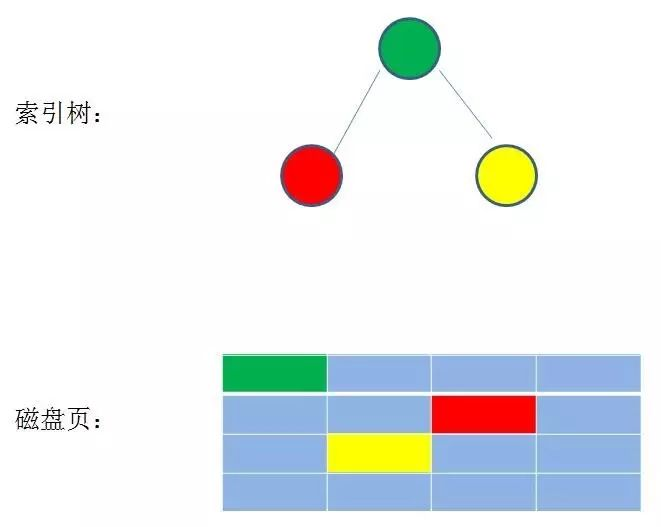
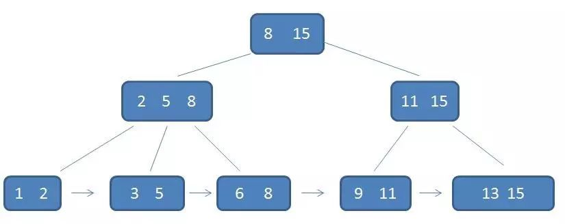

# 索引

索引的本质，消耗最少的资源，跳过不可能的记录。

------

## 散列表的基本原理与实现

   符号表是一种用于存储键值对（key-value pair）的数据结构，我们平常经常使用的数组也可以看做是一个特殊的符号表，数组中的“键”即为数组索引，值为相应的数组元素。也就是说，当符号表中所有的键都是较小的整数时，我们可以使用数组来实现符号表，将数组的索引作为键，而索引处的数组元素即为键对应的值，但是这一表示仅限于所有的键都是比较小的整数时，否则可能会使用一个非常大的数组。散列表是对以上策略的一种“升级”，但是它可以支持任意的键而并没有对它们做过多的限定。对于基于散列表实现的符号表，若我们要在其中查找一个键，需要进行以下步骤：

-   首先我们使用**散列函数**将给定键转化为一个“数组的索引”，理想情况下，不同的key会被转为不同的索引，但在实际应用中我们会遇到不同的键转为相同的索引的情况，这种情况叫做**碰撞**。解决碰撞的方法我们后面会具体介绍。
-   得到了索引后，我们就可以像访问数组一样，通过这个索引访问到相应的键值对。

​    以上就是散列表的核心思想，散列表是时空权衡的经典例子。当我们的空间无限大时，我们可以直接使用一个很大的数组来保存键值对，并用key作为数组索引，因为空间不受限，所以我们的键的取值可以无穷大，因此查找任何键都只需进行一次普通的数组访问。反过来，若对查找操作没有任何时间限制，我们就可以直接使用链表来保存所有键值对，这样把空间的使用降到了最低，但查找时只能顺序查找。在实际的应用中，我们的时间和空间都是有限的，所以我们必须在两者之间做出权衡，散列表就在时间和空间的使用上找到了一个很好的平衡点。散列表的一个优势在于我们只需调整散列算法的相应参数而无需对其他部分的代码做任何修改就能够在时间和空间的权衡上做出策略调整。

**散列函数**

   介绍散列函数前，我们先来介绍几个散列表的基本概念。在散列表内部，我们使用**桶（bucket）**来保存键值对，我们前面所说的数组索引即为桶号，决定了给定的键存于散列表的哪个桶中。散列表所拥有的桶数被称为散列表的**容量（capacity）**。

   现在假设我们的散列表中有M个桶，桶号为0到M-1。我们的散列函数的功能就是把任意给定的key转为[0, M-1]上的整数。我们对散列函数有两个基本要求：一是计算时间要短，二是尽可能把键分布在不同的桶中。对于不同类型的键，我们需要使用不同的散列函数，这样才能保证有比较好的散列效果。

​     我们使用的散列函数应该尽可能满足均匀散列假设，以下对均匀散列假设的定义来自于Sedgewick的《算法》一书：

>   （均匀散列假设）我们使用的散列函数能够均匀并独立地将所有的键散布于0到M – 1之间。

​    以上定义中有两个关键字，第一个是均匀，意思是我们对每个键计算而得的桶号有M个“候选值”，而均匀性要求这M个值被选中的概率是均等的；第二个关键字是独立，它的意思是，每个桶号被选中与否是相互独立的，与其他桶号是否被选中无关。这样一来，满足均匀性与独立性能够保证键值对在散列表的分布尽可能的均匀，不会出现“许多键值对被散列到同一个桶，而同时许多桶为空”的情况。

​    显然，设计一个较好的满足均匀散列假设的散列函数是不容易的，好消息是通常我们无需设计它，因为我们可以直接使用一些基于概率统计的高效的实现，比如Java中许多常用的类都重写了hashCode方法（Object类的hashCode方法默认返回对象的内存地址），用于为该类型对象返回一个hashCode，通常我们用这个hashCode除以桶数M的余数就可以获取一个桶号。

## B树和B+树的简单介绍

B树和B+树与二叉搜索树、平衡二叉树和红黑树三种树最明显的差异体现在多叉上，后面的三种树都是二叉树。而B树和B+树是多路查找树，目的是优化磁盘访问的速度。之前介绍的三种树是索引树，节点直接的连接可以理解为指针，即每个节点在磁盘中散列存储，像这样

想要访问红色节点，需要先访问绿色节点，根据绿色节点的左子树索引查找到红色节点位置，再访问红色节点。
我们看下之前三种树的磁盘访问
假设访问如下的树的节点10

第一次访问

第二次访问

第三次访问

第四次访问

不难看出，一个节点的访问磁盘的次数取决于该节点在树上的高度。

因此，为了减少访问磁盘的次数，就必须降低树的高度，使树变得“矮胖”，而B树和B+树都具有矮胖的特点
B树的定义
一个m阶的B树具有如下几个特征：（m阶中的m可以理解为B树的分叉数，比如5阶B树最大分叉是5）

1.根结点至少有两个子女。
2.每个有k个子树的中间节点包含k-1个元素和k个孩子，其中 m/2向上取整 <= k <= m
3.每一个叶子节点包含k-1个元素，其中 m/2向上取整 <= k <= m
4.所有的叶子结点都位于同一层。
5.每个节点中的元素从小到大排列，节点当中k-1个元素正好是k个孩子包含的元素的值域分划。
实例
这是一个B树

但实际上应该是这样的

每个节点应该有n个数据域和n+1个指针域组成，叶子节点的指针域都为空。但为了作图简单，就不将指针域画出来了
实际m阶B树节点结构如下：

除了叶子节点，其余节点的指针域可以通过双亲节点或者孩子节点的索引看出来。

以节点2，6为例，我们看到
1<2
2<3<5<6
6<8

B树的磁盘访问
以上面的树为例
第1次磁盘IO：

在内存中定位（和9比较）：

第2次磁盘IO：

在内存中定位（和2，6比较）：

第3次磁盘IO：

在内存中定位（和3，5比较）：

其实从图中可以看出，相同的数字，构建的平衡二叉树和B树的高度相差一。
从上面我们看出
B树进行了三次IO访问和5次内存比较
平衡二叉树AVL树进行了4次IO访问和4次内存比较。
我们知道，内存的访问速度是远远大于外存（IO）访问的速度的，因此，当m阶B树的m越大，单一节点的元素树越多，B树的高度就越低，IO访问的次数就越少。但是，也不是m越大越好，当m大到m个数据，外存一个磁盘页装不下就糟了。因此m是受磁盘页大小限制的
B树的插入和删除
B树也是一种自平衡树
插入分以下几种情况
1.可以直接插入的情况
2.插入后破环平衡（即破环B树的定义中的任意一个性质），需要进行分裂
删除
1.可以直接删除
2.直接删除后破环平衡，先向左右子树“借”节点
3.直接删除后破环平衡，左右子树“借”不到节点，合并子树
插入删除操作比较复杂，具体示例请参照参考链接

B树的应用
文件系统索引和部分非关系型数据库，如MongoDB。但是大多数关系型数据库使用B+树作为索引。那么B+树和B树相比有何优势呢？
提前透露一下，B+树适用于范围查找
B+树
定义
1.有k个子树的中间节点包含有k个元素（B树中是k-1个元素），每个元素不保存数据，只用来索引，所有数据都保存在叶子节点。
2.所有的叶子结点中包含了全部元素的信息，及指向含这些元素记录的指针，且叶子结点本身依关键字的大小自小而大顺序链接。
3.所有的中间节点元素都同时存在于子节点，在子节点元素中是最大（或最小）元素。
如下便是一个B+树

可以看到：
1 每一个双亲节点的元素均会出现在孩子节点中，并且是子节点的最大（或最小）元素，也就是说，B+树存在重复元素。
2 其次可以看到叶子节点用指针相连，形成一个链表。
3 另外，要注意，在当前树中，根节点的15代表整棵树的最大元素，所以，对B+树做插入是，要保证最大元素必定在根节点出现过（如果双亲节点的元素均会出现在孩子节点中，并且是子节点的最小元素，则需要反过来）
4 由于每个双亲节点均在孩子节点出现，也就是说，叶子节点包含了全部节点（当然，还包括没有在双亲节点出现的元素）

B+树的查找
之前我看了B树查找的过程，那么在B+树中是如何查找元素3呢？

一共进行了3次IO
首先，由于B+树只有根节点存储了元素数据，所以必须查到叶子节点。其次由于非叶子节点只存储索引，所以可以存储的索引树更多，能够使得B+树的高度更低，IO次数更少。

相比于B树， B+树的优势
我们看下B树的范围查找（3-11）

自顶向下，查找到范围的下限（3）–>中序遍历到元素6–>中序遍历到元素8–>中序遍历到元素9–>中序遍历到元素11，遍历结束

同样的元素构成的B+树的相同范围查找如下

自顶向下，查找到范围的下限（3）–>通过链表指针，遍历到元素6, 8–>通过链表指针，遍历到元素9, 11，遍历结束
所以说，相比于B树 B+树的优势有：

1.单一节点存储更多的元素，使得查询的IO次数更少。（单一节点存储更多的元素是因为B+的非叶子节点不存储数据，存的是索引）

2.所有查询都要查找到叶子节点，查询性能稳定。（同样是因为非叶子节点不存储数据，数据只有叶子节点有）

3.所有叶子节点形成有序链表，便于范围查询。

二叉搜索树 平衡二叉树 红黑树 B树 B+树的简单对比

|            | 简称 | 特点                                        | 平衡性 | 查找性能                                          | 插入                                               | 删除                                                         | 优势                                         | 应用                                             |
| ---------- | ---- | ------------------------------------------- | ------ | ------------------------------------------------- | -------------------------------------------------- | ------------------------------------------------------------ | -------------------------------------------- | ------------------------------------------------ |
| 二叉搜索树 | BST  | 索引树，由于构建不稳定，查找效率不稳定      | 无     | 不稳定，跟具体构建树相关，最好O(logn)，最差O（N） | 直接插入                                           | 删除的是叶子节点或只有左或右子树比较简单，如同时存在左右子树，那么要找到前驱或后继代替原先节点，再删除 | 性能高于线性查找                             |                                                  |
| 平衡二叉树 | AVL  | 索引树，BST进化版，自平衡，查找效率稳定     | 有     | 最好最坏都是O(lgn)                                | 最多需要2次旋转                                    | 最多需要lgN次旋转（参考，本人未证实）                        | 高度平衡，进一步提升查询效率                 |                                                  |
| 红黑树     | RBT  | 索引树，BST进化版，自平衡，查找效率相对稳定 | 有     | 基本维持在O(lgn),最坏比AVL略差(2lg(n+1))          | 最多需要2次旋转，3次变色                           | 最多需要3次旋转（参考，本人未证实）                          | 自平衡，进一步提升查询效率                   | Java中TreeSet和TreeMap，JDK 8以后，HashMap的设计 |
| B树        | ^    | 多路查找树，提升IO效率，索引树进化而来      | 有     | IO次数取决于高度，减少IO次数                      | 1.可以直接插入的情况2.插入后破环平衡，需要进行分裂 | 1.可以直接删除2.直接删除后破环平衡，先向左右子树“借”节点3.直接删除后破环平衡，左右子树“借”不到节点，合并子树 | 降低IO次数                                   | 文件系统索引和部分非关系型数据库，如MongoDB      |
| B+树       | ^    | 多路查找树，提升IO效率，B树进化版           | 有     | 进一步减少IO次数                                  | 类似B树                                            | 类似B树                                                      | 进一步降低IO次数，范围查询方便，查询性能稳定 | 大多关系型数据库使用B+树作为索引                 |

