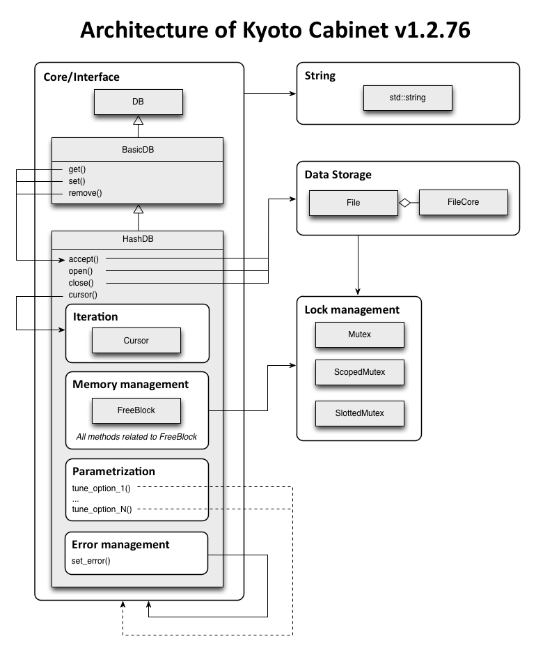
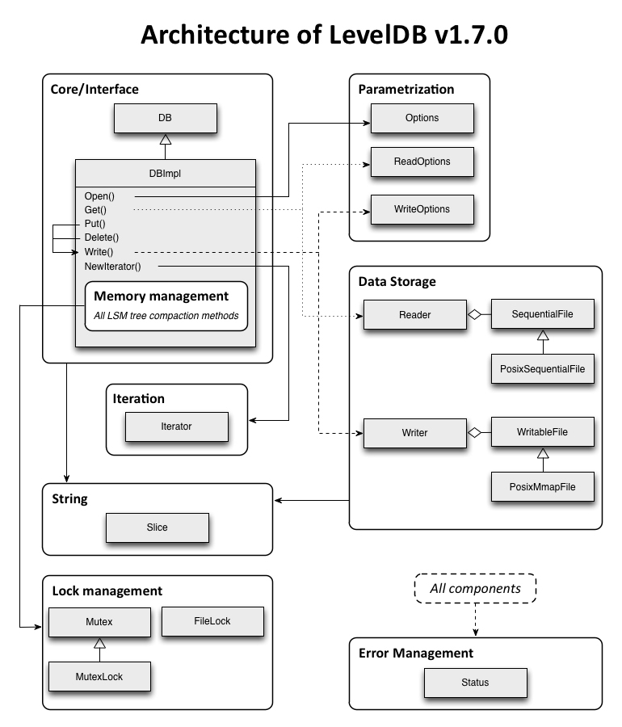
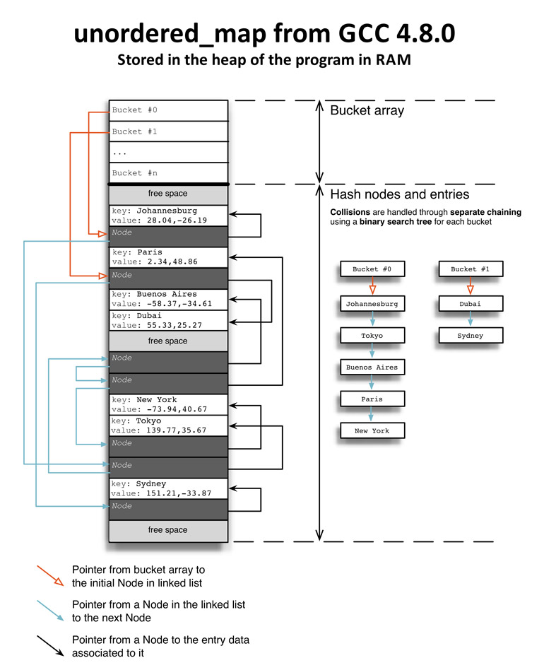
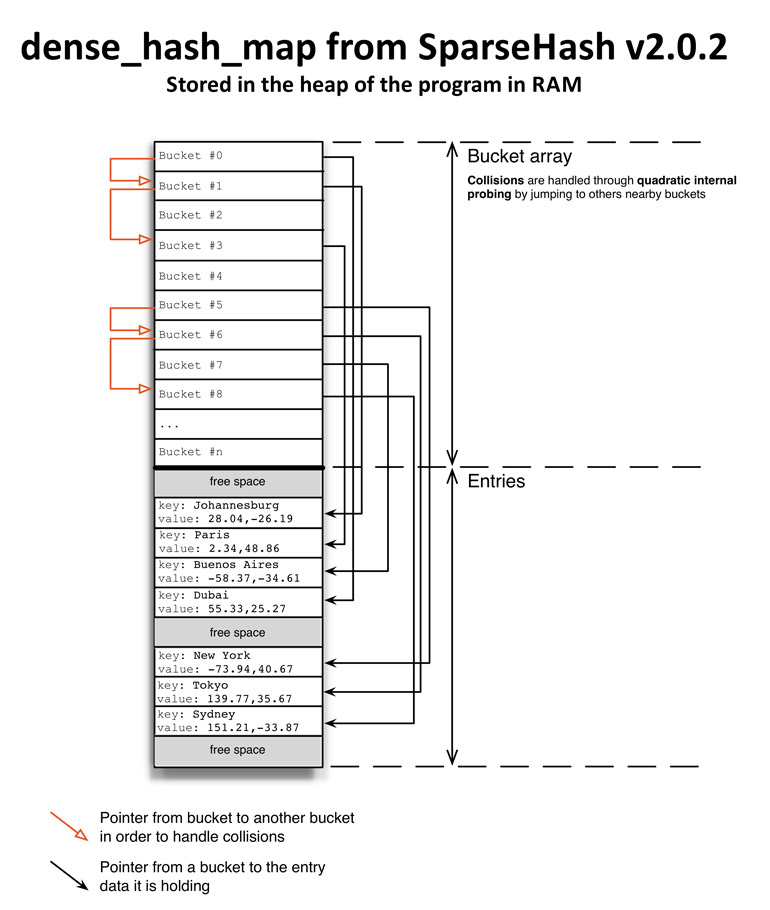
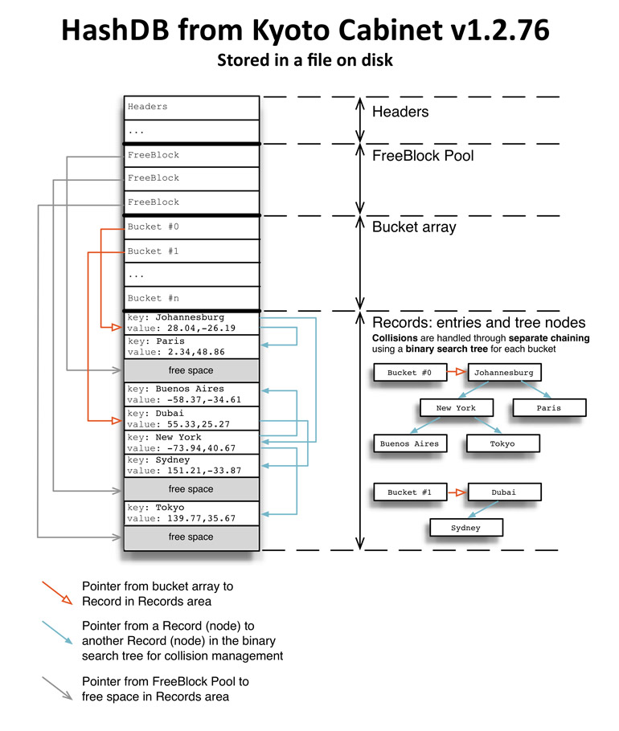

# Key-value dadabase

## abstract

This post is the main article for the series “Implementing a Key-Value Store” 

## Introduction

a short description of what key-value stores are.

### Key-value overview

Key-value stores are one of the simplest forms of database. Almost all programming languages come with in-memory key-value stores. The map container from the C++ STL is a key-value store, just like the HashMap of Java, and the dictionary type in Python.

Key-value stores interface:

get(key): get some data previously under the identifier "key"

set(key, value): store the "value" in memory under the identify "key"

delete(key): delete the data under "key"

Key-value stores are part of the NoSQL movement:

- Do not use the SQL query language
- May not provide full support of the [ACID paradigm](http://en.wikipedia.org/wiki/ACID) (atomicity, consistency, isolation, durability)
- May offer a distributed, fault-tolerant architecture.

### refresh some kownledge 

Reading books and Wikipedia articles is boring and exempt of practice, so I thought it would be better to get down to business and get my hands dirty with some code

- The C++ programming language
- Object-oriented design
- Algorithmics and data structures
- Memory management
- Concurrency control with multi-processors or multi-threading
- Networking with a server/client model
- I/O problems with disk access and use of the file system

A key-value store that is using the file system for permanent storage and which offers a networking interface would cover the whole range of topics listed above. This is just the perfect project that deals with all domains of back-end engineering.

### to be different

to have a key-value store project stand out from the crowd:

- Adapt to a specific data representation (ex: graphs, geographic data, etc.)
- Adapt to a specific operation (ex: performing very well for reads only, or writes only, etc.)
- Adapt to a specific issue (ex: automatic parameter tuning, as many key-value stores have many options, and it’s sometimes a mess to find the best ones)
- Offer more data access options. For instance in LevelDB, data can be accessed forward or backward, with iterators, and it has sorting on the keys. Not all key-value stores can do that.
- Make the implementation more accessible: right now, very few key-value stores have their code fully documented. If you need to get a project running quickly and you have to customize a key-value store for that, one that has code which seems really accessible will be a possible choice, even if it’s not a very well-known project. The fact that one can understand the code and therefore trust it will compensate for that.
- Specific applications. Here is an example of a real problem: many web crawling frameworks (web spiders) have a poor interface to manage the URLs they have to crawl, and this is often left to the client to implement the logic using a key-value store. All web crawling frameworks could benefit from a unified key-value store optimized for URL management.

### The plan

The goal of this project is to develop a lightweight key-value store in understandable C++ code. As a matter of fact, I am planning to follow the [Google C++ style guide](https://google.github.io/styleguide/cppguide.html) for this project. I will use a hash table for the underlying data structure, the data will be persistent on disk, and a network interface will also be implemented. I will not run for absolute speed, but for conciseness and clarity in both design and implementation. I will also try the best I can to minimize the memory footprint of the database file on disk.

### References

[The NoSQL Ecosystem](http://www.aosabook.org/en/nosql.html), from the book “Architecture of Open Source Applications, Volume 1”
[NoSQL Patterns](http://horicky.blogspot.com.es/2009/11/nosql-patterns.html), by Ricky Ho
[NoSQL Databases](http://nosql-database.org/), referencing all the NoSQL databases that matter at the moment
[NoSQL Data Modeling Techniques](http://highlyscalable.wordpress.com/2012/03/01/nosql-data-modeling-techniques/), by Ilya Katsov
[NoSQL databases benchmark: Cassandra, HBase, MongoDB, Riak](http://www.networkworld.com/cgi-bin/mailto/x.cgi?pagetosend=/news/tech/2012/102212-nosql-263595.html), and the discussion on [Hacker News](http://news.ycombinator.com/item?id=4733212)
[Wikipedia article on NoSQL](http://en.wikipedia.org/wiki/NoSQL)
[Wikipedia article on the ACID paradigm](http://en.wikipedia.org/wiki/ACID)
[Key Value Stores: A Practical Overview](http://blog.marc-seeger.de/2009/09/21/key-value-stores-a-practical-overview/), by Marc Seeger
[Some Notes on Distributed Key Stores](http://randomfoo.net/2009/04/20/some-notes-on-distributed-key-stores), by Leonard Lin

## Using existing key-value stores as models

### Stand on hugeman's shoulder

Key-value stores have been out there for at least a good 30 years. One of the most memorable projects is DBM, the initial database manager coded by Kenneth Thompson for Unix version 7 and released in 1979. Engineers have faced issues related to these database systems, and have either adopted or rejected various design and data structure ideas. They have learned through experiments with real-world problems. It would be foolish to not consider their work and start from scratch, only to repeat errors they have done before.

Gall’s law, from John Gall’s Systemantics: 

> A complex system that works is invariably found to have evolved from a simple system that worked. The inverse proposition also appears to be true: A complex system designed from scratch never works and cannot be made to work. You have to start over, beginning with a working simple system.

This quote brings in two fundamental ideas for the development of my key-value store project:

**1. Use models**. I need to identify key-value stores that have been out there for a while, and even better, which are successors of previously successful key-value stores. This would be the proof that their design is solid, and has been refined over time on multiple iterations. These selected key-value stores shall then be used as models for the project I am currently working on.

**2. Start small**. The first version of this project should be small and simple, so its design can be easily tested and approved. Improvements and additional features should only come in later versions, if needed.

### Model candidates and selection criteria

Model candidates:

- DBM
- Berkeley DB
- Kyoto Cabinet
- Memcached and MemcacheDB
- LevelDB
- MongoDB
- Redis
- OpenLDAP
- SQLite

My criteria are the following:

- I want to create a key-value store using **Object-Oriented Programming**, so for the design, I will have to draw inspiration from projects coded in an **OOP language.**
- For the underlying data structure, I want to have an on-disk hash table, so I will need to select projects that offer a way to **read and write information to disk**.
- I also want to have a **network access** to the data store.
- I do **not** need a **query engine or ways** to access the data in a structured way.
- I do **not** need to support the full **ACID** paradigm.
- Given that I am pursuing this project by myself, I want to take for model projects that have been implemented by **small teams, ideally one or two persons**.

### Overview models

Berkeley DB:

Berkeley DB was originally implemented in C, and continues to be a C-only nowadays. The development went through an incremental process, which added features with each major version. From a simple key-value store, Berkeley DB went on managing access concurrency, transactions and recovery, and replication.Berkeley DB has been used extensively with hundreds of millions of deployed copies, which is the proof that its architecture can be trusted as extremely solid. More information about its design can be found in the Introduction of the “*Berkeley DB Programmer’s Reference Guide*”, and the entry of “*The Architecture of Open Source Applications, Volume 1*”.

Kyoto Cabinet:

Kyoto Cabinet was implemented in C++, and implements a hash table, a B+ Tree, and other more esoteric data structures. It also offers outstanding performance. Nevertheless, there seems to be some performance problems due to the initial parameters. Indeed, many people have reported that performance is good as long as the number of items remains below a certain threshold which is proportional to the bucket array size, as defined by the parameters at the creation of a database file. Passed that threshold, performance seems to decrease dramatically. Similar problems are present with Tokyo Cabinet. This means that if the requirements of a project are changing while the database is being used, you could run into serious troubles. And we all know how much change is constant in software.

LevelDB:

LevelDB is not using a hash table or a B-tree as underlying data structure, but is based on a Log-Structured Merge Tree.  LSM structures are allegedly optimized for SSD drives. Released in 2011, LevelDB was implemented in C++, and was designed to be useful as a building block for higher-level storage systems.Looking at the source code and the way things are organized, it is just pure beauty. Everything is clear, simple, and logical. Having access to LevelDB’s source code and using it as a model is an amazing opportunity to create great code.

### References

[1] http://blog.knuthaugen.no/2010/03/a-brief-history-of-nosql.html
[2] http://en.wikipedia.org/wiki/Dbm
[3] http://en.wikipedia.org/wiki/Systemantics
[4] http://en.wikipedia.org/wiki/Berkeley_DB#Origin
[5] http://www.aosabook.org/en/bdb.html
[6] http://docs.oracle.com/cd/E17076_02/html/programmer_reference/intro.html
[7] http://fallabs.com/qdbm/
[8] http://research.google.com/people/jeff/
[9] http://research.google.com/pubs/SanjayGhemawat.html
[10] http://google-opensource.blogspot.com/2011/07/leveldb-fast-persistent-key-value-store.html
[11] http://www.w3.org/TR/IndexedDB/
[12] http://www.igvita.com/2012/02/06/sstable-and-log-structured-storage-leveldb/
[13] http://www.acunu.com/2/post/2011/04/log-file-systems-and-ssds-made-for-each-other.html
[14] http://leveldb.googlecode.com/svn/trunk/doc/benchmark.html
[15] http://www.acunu.com/2/post/2011/08/benchmarking-leveldb.html
[16] http://blog.creapptives.com/post/8330476086/leveldb-vs-kyoto-cabinet-my-findings
[17] http://highscalability.com/blog/2011/8/10/leveldb-fast-and-lightweight-keyvalue-database-from-the-auth.html
[18] http://stackoverflow.com/questions/13054852/kyoto-cabinet-berkeley-db-hash-table-size-limitations
[19] https://groups.google.com/forum/#!topic/tokyocabinet-users/Bzp4fLbmcDw/discussion
[20] http://stackoverflow.com/questions/1051847/why-does-tokyo-tyrant-slow-down-exponentially-even-after-adjusting-bnum
[21] https://groups.google.com/forum/#!topic/tokyocabinet-users/1E06DFQM8mI/discussion
[22] http://www.eecs.harvard.edu/margo/
[23] http://www.cse.yorku.ca/~oz/
[24] http://fallabs.com/mikio/profile.html

## Comparative Analysis of the Architectures

### Intent and methodology

I believe that software architecture is a craft where decision making plays a very important role, as an architect needs to consider and choose among many alternatives for every part of a system. Solutions are never evaluated by themselves in isolation, but weighted against other solutions. 

Here are the external analyses that I have chosen to use:

– BerkeleyDB, Chapter 4 in The Architecture of Open Source Applications, by Margo Seltzer and Keith Bostic (Seltzer being one of the two original authors of BerkeleyDB) [1]
– Memcached for dummies, by Tinou Bao [2]
– Memcached Internals [3]
– MongoDB Architecture, by Ricky Ho [4]
– Couchbase Architecture, by Ricky Ho [5]
– The Architecture of SQLite [6]
– Redis Documentation [7]

### Components

Below is a list of the major components encountered in most key-value stores, along with shorts descriptions of their utility.

**Interface:** The set of methods and classes exposed to the clients of a key-value store so they can interact it. This is also referred as the API. The minimum API for a key-value store must include the methods Get(), Put() and Delete().

**Parametrization:** The way that options are being set and passed to components across the whole system.

**Data Storage:** The interface used to access the memory where the data, i.e. keys and values, are stored. If the data must be *persisted* on non-volatile storage such as hard drive or flash memory, then problems of *synchronization* and *concurrency* may arise.

**Data Structure:** The algorithms and methods being used to organize the data, and allow for efficient storage and retrieval. This is generally a hash table or B+ Tree. In the case of LevelDB, it is a Log-Structured Merge Tree. The choice of the data structure may depend on the internal structure of the data and the underlying data storage solution.

**Memory Management:** The algorithms and techniques being used to manage the memory used by the system. This is crucial as a data storage accessed with the wrong memory management technique can impact performance dramatically.

**Iteration:** The ways by which all the keys and values in a database can be enumerated and accessed sequentially. The solutions are mostly Iterators and Cursors.

**String:** The data structure used to represent and access strings of characters. This might seem like a detail, but for key-value stores, a great deal of time is being spent on passing and processing strings, and std::string from the STL might not be the best solution.

**Lock Management:** All the facilities related to the locking of concurrently accessed memory areas (with mutexes and semaphores), and the locking of files if the data storage is the file system. Also handles issues related to multithreading.

**Error Management:** The techniques used to intercept and handle errors encountered in the system.

**Logging:** The facilities that log the events happening in the system.

**Transaction Management:** Mechanism over a set of operations which ensures that all the operations are executed correctly, and in case of an error, that none of the operations is executed and the database is left unchanged.

**Compression**: The algorithms used to compress the data.

**Comparators:** Comparators provide ways to order two keys with regard to each other.

**Checksum:** The methods used to test and ensure the integrity of the data.

**Snapshot:** A Snapshot provides a read-only view of the entire database as it was when the snapshot was created.

**Partitioning**: Also referred to as Sharding, this consists in splitting the data set into multiple data storages, possibly distributed across multiple nodes on a network.

**Replication**: In order to ensure durability in case of system or hardware failures, some key-value stores allow for multiple copies of the data – or of partitions of the data – to be maintained simultaneously, preferably on multiple nodes.

**Testing Framework**: Framework being used to test the system, including unit and integration testing.

### References

[1] http://www.aosabook.org/en/bdb.html
[2] http://work.tinou.com/2011/04/memcached-for-dummies.html
[3] http://code.google.com/p/memcached/wiki/NewUserInternals
[4] http://horicky.blogspot.com/2012/04/mongodb-architecture.html
[5] http://horicky.blogspot.com/2012/07/couchbase-architecture.html
[6] http://www.sqlite.org/arch.html
[7] http://redis.io/documentation

## Analysis Kyoto Cabinet and LevelDB

### Create a map of the code with Doxygen

Most people add comments with a special format to their classes and methods, and then use Doxygen to generate a documentation that contains those special comments. However, Doxygen can also be used on code that does not contain any comment, and will generate an interface based the organization – files, namespaces, classes and methods – of the system.

Installtion for Mac:

`$brew install doxygen`

Usage:

`$doxygen -g`

This will create a file called “Doxygen”. Open this file, and make sure that the following options are all set to “YES”: `EXTRACT_ALL, EXTRACT_PRIVATE, RECURSIVE, HAVE_DOT, CALL_GRAPH, CALLER_GRAPH`. These options will make sure that all entities are extracted from the code, even in sub-directories, and that call graphs are generated. Full descriptions of all the available options can be found in the online documentation of Doxygen. OUTPUT_DIRECTORY = "/Users/bicycle/Documents/gitHubR/leveldb_doc" as output file path.

`$ doxygen Doxygile`

The documentation will be generated in the “html” directory, and you can access it by opening the “index.html” file in any web browser.

### Overall architecture

Figure 3.1 and 3.2 represent the architecture of Kyoto Cabinet v1.2.76 and LevelDB 1.7.0, respectively. Classes are represented with the UML class diagram convention. Components are represented with corner-rounded rectangles, and black arrows represent the use of an entity by another. A black arrow from A to B means that A is using or accessing elements of B.

These diagrams try to represent the functional architecture as much as the structural architecture. For instance in Figure 3.1, many components are represented inside the HashDB class, because in the code those components are defined as part of the HashDB class.

In terms of internal component organization, there is no doubt that LevelDB is the big winner. The reason for this is that in Kyoto Cabinet the components for Iteration, Parametrization, Memory Management and Error Management are all defined as parts of the Core/Interface component, as shown in Figure 3.1. This creates a strong coupling of those components with the Core, and limits the modularity and future extensibility of the system. On the contrary, LevelDB is built in a very modular way, with only the Memory Management being part of the Core component.



Figure 3.1



Figure 3.2

### String

In key-value stores, there is a lot of string processing going on. Strings are being iterated, hashed, compressed, passed, and returned. Therefore, a clever implementation of String is very important, as tiny savings in objects used on a large scale can have a dramatic impact globally.

LevelDB is using a specialized class called “Slice”. A Slice holds a byte array along with the size that array. This allows to know the size of the string in time O(1), unlike strlen() on C strings which would take O(n). Note that in C++, size() for std::string is also O(1). Having the size stored separately also allows for the ‘\0’ character to be stored, which means the keys and values can be real byte array and not just null-terminated strings. Finally and more importantly, the Slice class handles the copy by making a shallow copy, not a deep copy. Meaning, it simply copies the pointer to the byte array, and doesn’t make a full copy of the byte array like std::string. This avoids copying potentially very large keys and values.

Like LevelDB, Redis is using its own data structure to represent strings. The goal expressed is also to avoid an O(n) operation to retrieve the size of the string.

Kyoto Cabinet is using std::string for its strings.

### Error Management

Exceptions are dangerous, and should be avoided whenever possible.

BerkeleyDB has a nice C-style way to handle errors. Error message and error codes are all centralized in one file. All functions that return error codes have a integer local variable named “ret”, which is filled while processing and returned at the end. This approach is rolled out in all files, and in all modules: very polished, normalized error management. In some functions, a few forward jumping gotos are used, a technique widely used in serious C-based system such as the Linux kernel [[12\]](http://codecapsule.com/2012/12/30/implementing-a-key-value-store-part-3-comparative-analysis-of-the-architectures-of-kyoto-cabinet-and-leveldb/#ref_12). Even though this error management approach is very clear and clean, a C-style error management would not make much sense in a C++ application.

In Kyoto Cabinet, one Error object is stored in every database object such as HashDB. In the database classes, methods are calling set_error() to set the Error object in case an error occurs, and return true or false in very a C-style way. No local variable returned at the very end of the methods like in BerkeleyDB, return statements are placed wherever the errors occur.

LevelDB is not using exceptions at all, but a special class called Status. This class holds both an error value and an error message. This object is returned by all methods so that the error status can be either treated on the spot or passed to other methods higher up in the calling stack. This Status class is also implemented in a very clever way, as the error code is stored inside the string itself. My understanding of this choice is that most of the time, the methods will return a Status of “OK”, to say that no error was encountered. In that case, the message string is NULL, and the occurrence of the Status object is very light. Had the authors of LevelDB chosen to have one additional attribute to store the error code, this error code would have had to be filled even in the case of a Status of “OK”, which would have meant more space used on every method call. All components are using this Status class, and there is no need to go through a centralized method as with Kyoto Cabinet, as shown in Figure 3.1 and 3.2.

### Memory Management

Both Kyoto Cabinet and LevelDB have the memory management defined inside the Core component. For Kyoto Cabinet, the memory management consists of keeping track of the block of contiguous free memory in the database file on disk, and selecting a block of adequate size whenever an item is being stored. The file itself is just memory mapped with the mmap() function. Note that MongoDB too is using a memory mapped file.

For LevelDB, which implements a Log-Structured Merge Tree, there are no gaps of free space in the file as it is the case with hash tables stored on disk. The memory management consists in compacting the log files whenever they exceed a certain size.

Other key-value stores, such as Redis, use memory allocation with malloc() — in the case of Redis, the memory allocation algorithm is not the one provided by the operating system like dlmalloc or ptmalloc3, but jemalloc.

### References

[1] http://www.aosabook.org/en/bdb.html
[2] http://work.tinou.com/2011/04/memcached-for-dummies.html
[3] http://code.google.com/p/memcached/wiki/NewUserInternals
[4] http://horicky.blogspot.com/2012/04/mongodb-architecture.html
[5] http://horicky.blogspot.com/2012/07/couchbase-architecture.html
[6] http://www.sqlite.org/arch.html
[7] http://redis.io/documentation
[8] http://doxygen.org
[9] http://www.stack.nl/~dimitri/doxygen/config.html
[10] http://leveldb.googlecode.com/svn/trunk/doc/index.html
[11] http://redis.io/topics/internals-sds
[12] http://news.ycombinator.com/item?id=3883310
[13] http://www.briancarpio.com/2012/05/03/mongodb-memory-management/
[14] http://leveldb.googlecode.com/svn/trunk/doc/impl.html
[15] http://oldblog.antirez.com/post/everything-about-redis-24.html

## API design

settle on a name for this whole key-value store project: ReDB / red-database

### General principles for API design

Bloch clearly states the two most important things the audience should remember. There, I’ve copied those points from the bumper-sticker version and added some comments:

1. **When in doubt, leave it out.** When not sure if a functionality, class, method or parameter should be included in the API, do not include it.

2. **Don’t make the client do anything the library could do.** If your API makes the client execute a series of function calls and plug the outputs of each function into the input of the next one, then just add a function to your API that does this series of function calls.

### Defining the functionalities

The basic functionalities are strictly limited to:

- Opening and closing a database
- Reading and writing data to a database
- Iterating over the full collection of keys and values in a database
- Offer a way to tune parameters
- Offer a decent error notification interface

These functionalities are too limited for some use case, but this will be enough for a single store.

### opening and closing 

```
/* Kyoto Cabinet */
HashDB db;
db.open("dbfile.kch", HashDB::OWRITER | HashDB::OCREATE);
...
db.close()
#############################################
/* SQLite3 */
sqlite3 *db;
sqlite3_open("askyb.db", &db);
...
sqlite3_close(db);
```

In an API, function calls should be symmetric as much as possible, because it is more intuitive and logical. “If I call open(), then I should call close()” is infinitely more logical than “If I call open(), then I should delete the pointer.”

### Reads and Writes

```
/* LevelDB */
std::string value;
db->Get(leveldb::ReadOptions(), "key1", &value);
db->Put(leveldb::WriteOptions(), "key2", value);
```


```
/* Kyoto Cabinet */
string value;
db.get("key1", &value);
db.set("key2", "value");
```

They have nice getter/setter symmetrical interfaces. LevelDB has Get() and Put(), and Kyoto Cabinet has get() and set(). The prototypes for the setter methods, Put() and set() are very similar: the key is *passed by value*, and the value is *passed as a pointer* so it can be updated by the call. The values are not returned by the calls, the returns are for error management here.

### Iteration

```
/* LevelDB */
leveldb::Iterator* it = db->NewIterator(leveldb::ReadOptions());
for (it->SeekToFirst(); it->Valid(); it->Next()) {
  cout << it->key().ToString() << ": "  << it->value().ToString() << endl;
}
delete it;
```


```
/* Kyoto Cabinet */
DB::Cursor* cur = db.cursor();
cur->jump();
string ckey, cvalue;
while (cur->get(&ckey, &cvalue, true)) {
  cout << ckey << ":" << cvalue << endl;
}
delete cur;
```

Kyoto Cabinet and BerkeleyDB use a cursor, which starts by creating a pointer to a cursor object and instantiating that object, then calling the get() method of the cursor repeatedly in a *while loop* in order to retrieve all the values in the database. LevelDB uses the iterator design pattern, which starts by creating a pointer to an iterator object and instantiating that object (so far just like the cursor), but then uses a *for loop* to iterate over the set of items in the collection. Note that the while vs. for loop is just a convention: cursors could be used with for loops and iterators with while loops. The main difference is that with the cursor, the keys and values are passed as pointers and being filled by the get() method of the cursor, whereas with the iterator, the keys and values are accessed as the return values of methods of the iterator.

The cursor and its while loop are, again, very "C-style". I find the iterator approach to be cleaner and more "C++ compliant", because it is how the collections of the STL are being accessed in C++. 

### Parametrization

```
/* LevelDB */
leveldb::DB* db;
leveldb::Options options;
options.create_if_missing = true;
options.compression = leveldb::kNoCompression;
leveldb::DB::Open(options, "/tmp/testdb", &db);
...
leveldb::WriteOptions write_options;
write_options.sync = true;
db->Put(write_options, "key", "value");
```


```
/* Kyoto Cabinet */
db.tune_options(GrassDB::TCCOMPESS);
db.tune_buckets(500LL * 1000);
db.tune_page(32768);
db.tune_page_cache(1LL << 20);
db.open(...);
```

LevelDB is doing it differently. Options are defined in their own classes, all in one place, and parameters are modified through attributes of these classes. Objects of these option classes are then passed as parameters of the various methods, always as the first argument. For instance, the first argument of the open() method of LevelDB's database object is of type leveldb::Options, and the first arguments of the Get() and Put() methods are leveldb::ReadOptions and leveldb::WriteOptions, respectively. A good point about this design is that options can be easily shared in case multiple databases are created at the same time, although in the case of Kyoto Cabinet and Berkeley DB, it would just as simple to create a method that set specific options, and just call that method to share configurations. The real advantage of having options in specific classes, as LevelDB does, is that the interfaces are more stable, since extending options will only modify the option classes, and not any method of the database object.

### Error management

Below are some code sample of how errors are notified to the user for the database systems being studied.

```
/* LevelDB */
leveldb::Status s = db->Put(leveldb::WriteOptions(), "key", "value");
if (!s.ok()) {
  cerr << s.ToString() << endl;
}
```


```
/* Kyoto Cabinet */
if (!db.set("baz", "jump")) {
  cerr << "set error: " << db.error().name() << endl;
}
```


```
/* SQLite3 */
int rc = sqlite3_exec(db, query, callback, 0, &zErrMsg);
if (rc != SQLITE_OK) {
  fprintf(stderr, "SQL error: %s\n", zErrMsg);
  sqlite3_free(zErrMsg);
}
```

LevelDB has a special Status class which contains the error type and a message giving more information about the error. Objects of this class are returned by all methods in the LevelDB library, and it makes it really easy to test for errors and pass errors to sub-parts of the system for further examination.

### References

[1] http://www.infoq.com/presentations/effective-api-design
[2] http://www.infoq.com/articles/API-Design-Joshua-Bloch
[3] http://www.amazon.com/Effective-Specific-Improve-Programs-Designs/dp/0321334876
[4] http://www.amazon.com/Effective-Java-Edition-Joshua-Bloch/dp/0321356683
[5] http://fallabs.com/kyotocabinet/spex.html
[6] http://leveldb.googlecode.com/svn/trunk/doc/index.html
[7] http://docs.oracle.com/cd/E17076_02/html/gsg/CXX/index.html
[8] http://www.sqlite.org/quickstart.html

## Hash Table

### intridution

A hash table allows to efficiently access *associative data*. Each *entry* is a pair of a *key* and a *value*, and can be quickly retrieved or assigned just by knowing its key. For that, the key is hashed using a *hash function*, to transform that key from its original representation into an integer. This integer is then used as an index to identify the *bucket* in the *bucket array* from which the entry’s value can be accessed. Many keys can hash to the same values, meaning that these keys will be in *collision* in the bucket array. To resolve collisions, various techniques can be used, such as *separate chaining* with linked-lists or self-balanced trees, or *open addressing* with linear or quadratic probing.

### implementions

#### unordered_map from TR1

TR1’s unordered_map provides a hash table that handles collisions with linked lists (separate chaining). The bucket array is allocated on the heap, and scales up or down automatically based on the load factor of the hash table. A node struct named `_Hash_node` is used to create the linked lists for the buckets:

```c++
/* from gcc-4.8.0/libstdc++-v3/include/tr1/hashtable_policy.h */ 
template
  struct _Hash_node<_Value, false>
  {
    _Value       _M_v;
    _Hash_node*  _M_next;
  };
```

If the keys and values are of integral types, they can be stored directly inside this struct in `_M_v`. Otherwise pointers will be stored and some extra memory will be necessary. The bucket array is allocated at once on the heap, but it’s not the case of the Nodes, which are allocated with individual calls to the C++ memory allocator:

```C++
/* from gcc-4.8.0/libstdc++-v3/include/tr1/hashtable.h */ 
Node* _M_allocate_node(const value_type& __v)
    {
      _Node* __n = _M_node_allocator.allocate(1);
      __try
	{
	  _M_get_Value_allocator().construct(&__n->_M_v, __v);
	  __n->_M_next = 0;
	  return __n;
	}
      __catch(...)
	{
	  _M_node_allocator.deallocate(__n, 1);
	  __throw_exception_again;
	}
    }
```

Figure 5.1 below offers a representation of the memory and access patterns for unordered_map from TR1. Let’s see what happens if we look for the GPS coordinates associated with the key “Johannesburg”. This key is hashed and mapped to the bucket #0. From there we jump to the first node of the linked list for that bucket (orange arrow on the left of bucket #0), and we can access the memory area in the heap that holds the data for the key “Johannesburg” (black arrow on the right of the node). If the key were to be invalid at this first node, we would have had to navigate throw other nodes.



Figure 5.1

#### dense_hash_map from SparseHash

dense_hash_map handles collisions with quadratic internal probing. Like for unordered_map, the bucket array is allocated on the heap at once, and scales up or down automatically based on the load factor of the hash table. Elements of the bucket array are instances of `std::pair` where `Key` are `T` are the template parameters for the keys and values, respectively. On a 64-bit architecture and for storing strings, an instance of pair will be 16 bytes.

Figure 5.2 below is a representation of the memory and access patterns for dense_hash_map. If we look for the GPS coordinates of “Johannesburg”, we would fall in bucket #0 at first, which has data for “Paris” (black arrow at the right of bucket #0). So we would have to probe and jump at bucket (i + 1) = (0 + 1) = 1 (orange arrow at the left of bucket #0), and then we would find the data for “Johannesburg” from bucket #1 (black arrow at the right of bucket #1). This seems similar to what was going on with unordered_map, but it is actually very different. Sure, the keys and values will have to be stored in memory allocated on the heap just like for unordered_map, which means that the key and value lookups will invalidate the cache line. But navigating among the entries in collision for a bucket is going to be rather fast. Indeed, given that each pair is 16 bytes and that the cache line is 64 bytes on most processors, the probing steps are very likely to be on the same cache line, which is going to speed things up dramatically, as opposed to the linked list in unordered_map which required jumping in the RAM to get the following nodes.



Figure 5.2

#### HashDB from Kyoto Cabinet

Kyoto Cabinet implements many data structures, among which a hash table. This hash table, HashDB, was designed to be persistent on-disk, even though there is an option to use it as an in-memory replacement for `std::map`. The hash table metadata along with the user’s data are all stored sequentially in a unique file on disk using the file system.

Kyoto Cabinet handles collisions with separate chaining through a binary search tree for each bucket. The bucket array has a fixed length and is never resized, regardless of the state of the load factor. This has been a major drawback of the hash table implementation of Kyoto Cabinet. Indeed, if the size of the bucket array defined at the creation of the database is below its actual needs, then performance suffers badly when entries start colliding.

Figure 5.3 shows the structure of a HashDB stored in a file. I have derived this internal structure from the code in the `calc_meta()` method, and from the comments of the attributes of the HashDB class at the end of kchashdb.h. The file is organized in sections as follows:

- The headers with all the metadata for the database
- The FreeBlock pool that holds the free space in the data area
- The bucket array
- The records (data area)

A record holds an entry (key/value pair), along with a node of the binary search tree for the separate chaining. Here is the Record struct:

```C++
/* from kyotocabinet-1.2.76/kchashdb.h */ 
  /**
   * Record data.
   */
  struct Record {
    int64_t off;                         ///< offset
    size_t rsiz;                         ///< whole size
    size_t psiz;                         ///< size of the padding
    size_t ksiz;                         ///< size of the key
    size_t vsiz;                         ///< size of the value
    int64_t left;                        ///< address of the left child record
    int64_t right;                       ///< address of the right child record
    const char* kbuf;                    ///< pointer to the key
    const char* vbuf;                    ///< pointer to the value
    int64_t boff;                        ///< offset of the body
    char* bbuf;                          ///< buffer of the body
  };
```



Figure 5.3

when designing the data organization of a hash table, the preferred solution should be to store the collision data with the buckets and not with the entries. This is because even if the hash table is on disk, the bucket array and collision data will be small enough so that they can be stored in the RAM, where random reads are a lot cheaper than on disk.

### references

[1] http://en.wikipedia.org/wiki/Hash_table
[2] http://www.amazon.com/Introduction-Algorithms-Thomas-H-Cormen/dp/0262033844/
[3] http://en.wikipedia.org/wiki/Avalanche_effect
[4] http://blog.reverberate.org/2012/01/state-of-hash-functions-2012.html
[5] http://www.strchr.com/hash_functions
[6] http://programmers.stackexchange.com/questions/49550/which-hashing-algorithm-is-best-for-uniqueness-and-speed/145633#145633
[7] http://blog.aggregateknowledge.com/2012/02/02/choosing-a-good-hash-function-part-3/
[8] https://sites.google.com/site/murmurhash/
[9] http://google-opensource.blogspot.fr/2011/04/introducing-cityhash.html
[10] http://incise.org/hash-table-benchmarks.html
[11] http://preshing.com/20110603/hash-table-performance-tests
[12] http://attractivechaos.wordpress.com/2008/08/28/comparison-of-hash-table-libraries/
[13] http://attractivechaos.wordpress.com/2008/10/07/another-look-at-my-old-benchmark/
[14] http://blog.aggregateknowledge.com/2011/11/27/big-memory-part-3-5-google-sparsehash/
[15] http://gcc.gnu.org/
[16] https://code.google.com/p/sparsehash/
[17] http://fallabs.com/kyotocabinet/spex.html
[18] http://www.open-std.org/jtc1/sc22/wg21/docs/papers/2003/n1456.html
[19] http://sparsehash.googlecode.com/svn/trunk/doc/implementation.html
[20] http://en.wikipedia.org/wiki/CPU_cache