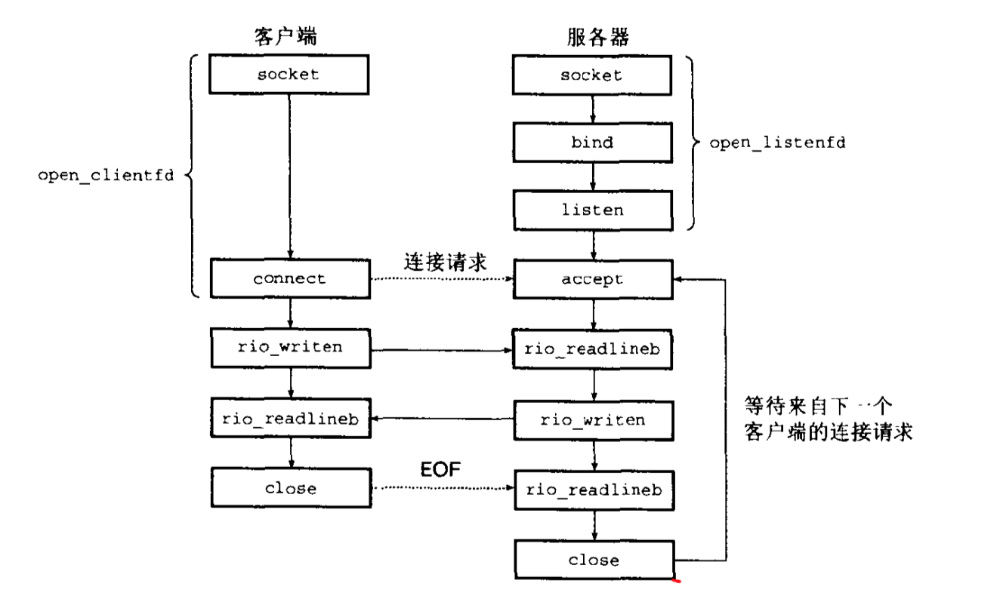

# Operating-System

## 信息存储

### 数据大小

32位机器和64位机器

### 寻址和字节顺序

多字节对象被存储为连续字节序列，例如int类型变量x的起始地址为0x100，int类型占用四个字节存储空间，x的四个字节地址为0x100, 0x101, 0x102, 0x103. 

小端法（little endian）：在存储器中按照从最低有效字节到最高有效字节顺序存储；

大端法 （big endian）：最高有效字节在最低有效字节前顺序存储。

### 整数表示

TODO：先不看，包括反码 补码

## 程序机器级

汇编语言

## 系统级IO

### Unix I/O

所有的I/O设备，网络、磁盘、终端都被模型化为文件，输入与输出被当做文件的读或写，且被统一的方式执行：

1.  打开文件。打开某个文件，内核将返回一个小的非负整数，称之为描述符，用以在后续对文件的操作中标识该文件。每个进程开始时默认会提供三个描述符，标准输入(0)、标准输出(1)、标准错误(2)。在头文件\<unistd.h\> 中定义上述三个描述符对应常量：STDIN_FILENO, STDOUT_FILENO, STDERR_FILENO.
2.  改变当前文件游标。内核维持一个变量k， 文件打开后初始化为0，表示的是从文件起始位置开始的字节偏移量。应用程序可以通过seek操作，显式地改变k值。
3.  读写文件。读操作就是拷贝n个字节到用户提供的存储空间，从k位置开始，读取到k+n，内核维持文件游标同时增加到k+n。假设文件大小为m，当k>=m时，触发EOF(end-of-file)条件；类似的，写操作就是从用户提供的存储空间拷贝n个字节到文件，并更新k。
4.  关闭文件。访问完文件后，内核释放打开文件创建的数据结构，并恢复文件描述符到描述符池。若进程终止，内核终将会关闭文件并释放其占用的系统资源。

### 打开关闭文件

#### open函数

函数原型：

```c
#include <sys/types.h>
#include <sys/stat.h>
#include <fcntl.h>

int open(char *filename, int flags, mode_t mode);
```

open函数返回值为int类型的文件描述符，一般记为fd。系统内核通常提供进程中未使用的最小描述符。

参数说明：

1.  char * filename，文件名，系统路径。

2.  int flags，访问文件的方式。
    O_RDONLY: 只读

    O_WRONLY: 只写

    O_RDWR: 可读可写

    flags参数可以有由多位掩码构成，例如：O_WDONLY|O_APPEND

     O_CREAT 若文件不存在则创建它。使用此选项时，需要同时说明第三个参数mode，用其说明该新文件的存取许可权限。

​        O_EXCL 如果同时指定了OCREAT，而文件已经存在，则出错。这可测试一个文件是

否存在，如果不存在则创建此文件成为一个原子操作。

​        O_APPEND 每次写时都加到文件的尾端。

​        O_TRUNC 属性去打开文件时，如果这个文件中本来是有内容的，而且为只读或只写成功打开，则将其长度截短为0。

1.  mode_t mode, 指定新文件的访问权限位。

#### close函数

函数原型：

```c
#include <unistd.h>
int close(int fd);
```

### 读写文件

函数原型：

```c
#include <unistd.h>
ssize_t read(int fd, void *buf, size_t, n);
ssize_t write(int fd, const void *buf, size_t n);
```

read 函数从描述符为fd的文件中拷贝n个字节到buf存储空间。返回值：-1表示出错，0表示EOF，其他正整数为实际读取到的字节数。

write 函数从存储空间buf拷贝n个字节到fd文件。

>   size_t, unsigned_int
>
>   ssize_t, int 有符号大小

### 健壮地读写

提供一个Rio包，（Robust I/O，健壮的I/O）

#### 无缓冲的输入输出函数

函数原型：

```c
ssize_t rio_readn(int fd, void *userbuf, size_t n);
ssize_t rio_writen(int fd, void *userbuf, size_t n);
```

应注意的是，读写函数在应用程序中断后应自动重启。

```c
ssize_t rio_readn(int fd, void *userbuf, size_t n)
{
		size_t nleft = n;	// 剩余需要读取的字节数
  	size_t nread = 0; // 已经读取的字节数
    char * pBuf = userbuf;  // 
  	while(nleft>0)
    {
      if((nread=read(fd, pBuf, nleft))<0)
         {
           if(errno == ENINTR)	// 发生系统中断，读取到字节数置零，重新调用循环
             nread=0;
        	 else
             return -1;					// 读取错误
         }
      else if(nread == 0)	// 读取触发EOF 循环结束
         break;
      nleft -= nread;	// 剩余字节数
      pBuf += nread;	// 指针移动已读之后
    }
  // 结束 返回已读的字节数
  return (n-nleft);
  	
}
```

```c
ssize_t rio_writen(int fd, void *userbuf, size_t n)
{
	size_t nleft = n;
  size_t nwrite = 0;
  char *pBuf = userbuf;
  while(nleft>0)
  {
    if((nwrite=nwrite(fd, pBuf, nleft))<0)
    {
      if(nwrite==ENINTR)
        nwrite=0;
      else:
      	return -1;
    }
    nleft -= nwrite;
    pBuf += nwrite;
  }
  return n;
}
```


#### 带缓冲的输入输出函数

磁盘的I/O是非常耗时间的，若频繁的调用read、write函数会造成不必要的系统资源开销。可以设计一个内部缓冲区，每次拷贝固定长度的字节数，当缓冲区变空时，自动调用read函数重新填满缓冲区。外部的程序则读取缓冲区的数据。

创建一个带缓冲区的结构体rio_t

```c
#define RIO_BUFSIZE 8192
typedef struct{
	int rio_fd;	// descriptor
  int rio_cnt;  // unread bytes
  char *rio_bufptr; // next unread buffer
  char *rio_buf[RIO_BUFSIZE];	// internal buffer
} rio_t;

void rio_readinitb(rio_t *riop, int fd)
{
  riop->rio_fd = fd;
  riop->rio_cnt = 0;
  riop->rio_bufptr = riop->rio_buf; 
}
```

重新包装的read函数，增加了缓冲区

```c
static ssize_t rio_read(rio_t *rp, char *userbuf, size_t n)
{
	int cnt;
  // 填满缓冲区
  while(rp->rio_cnt <= 0)
  {
    rp->rio_cnt=read(rp->rio_fd, rp->rio_buf, sizeof(rp->rio_buf));
    if(rp->rio_cnt < 0)
    {
      if(rp->rio_cnt != ENINTR) // 读取出错
      	return -1;
    }
    else if(rp->rio_cnt == 0) // EOF
      return 0;
    else:
    	rp->rio_bufptr = rp->rio_buf;	// reset bufptr
  }
  cnt = n;
  // read 读取到文件末尾会自动截断，返回读到的字节数
  if(rp->rio_cnt < cnt)
    cnt = rp->rio_cnt;
  // 拷贝数据到userbuf
  memset(userbuf, rp->rio_bufptr, cnt);
  rp->rio_bufprt += cnt;
  rp->rio_cnt -= cnt;
}
```

当调用rio_read函数读取n个字节时，读缓冲区内存有rio_cnt个未读字节数。当rio的内部缓冲区为空时，自动调用read函数填满缓冲区；缓冲区非空时，取n与rio_cnt较小值进行数据拷贝，最后返回拷贝的字节数。

使用包装后的读函数rio_read实现n个字节读取

```c
ssize_t rio_readnb(rio_t *rp, char *userbuf, size_t n)
{
  size_t nleft = n;
  size_t nread = 0;
  char *pbuf = userbuf;
  while(nleft>0)
  {
    if((nread=rio_read(rp, pbuf, nleft))<0)
    {
      if(error == ENINTR) // system interuptor
        nread=0;
      else			// read error
        return -1;
    }
    else if(nread == 0)	// EOF
    	break;
    nleft -= nread;	// left bytes unread
    pbuf += nread;	//  pointer offset
  }
  return (n-nleft);	// 返回已读取到的
}
```

### 文件元数据

文件的元数据即文件的基本信息，例如创建时间，修改时间等。可以通过调用系统stat，fstat函数检索文件信息

```
#include <unistd.h>
#include <sys/stat.h>
```

参考：

>   lseek
>
>   lseek - reposition read/write file offset
>
>   Synopsis
>
>   \#include <sys/types.h>
>
>   \#include <unistd.h>
>
>   `off_t lseek(int filedes, off_t offset, int whence);`
>
>   Description
>
>   The lseek() function repositions the offset of the open file associated with the file descriptor fd to the argument offset according to the directive whence as follows:
>
>   -   **SEEK_SET**
>
>       The offset is set to *offset* bytes.
>
>   -   **SEEK_CUR**
>
>       The offset is set to its current location plus *offset* bytes.
>
>   -   **SEEK_END**
>
>       The offset is set to the size of the file plus *offset* bytes.
>
>   The **lseek**() function allows the file offset to be set beyond the end of the file (but this does not change the size of the file). If data is later written at this point, subsequent reads of the data in the gap (a "hole") return null bytes (aq\0aq) until data is actually written into the gap.
>
>   ------
>
>   Name
>
>   read - read from a file descriptor
>
>   Synopsis
>
>   ```
>   #include <unistd.h>
>   ssize_t read(int fd, void *buf, size_t count);
>   ```
>
>   Description
>
>   read() attempts to read up to count bytes from file descriptor fd into the buffer starting at buf.
>
>   On files that support seeking, the read operation commences at the current file offset, and the file offset is incremented by the number of bytes read. If the current file offset is at or past the end of file, no bytes are read, and **read**() returns zero.
>
>   If *count* is zero, **read**() *may* detect the errors described below. In the absence of any errors, or if **read**() does not check for errors, a **read**() with a *count* of 0 returns zero and has no other effects.
>
>   If *count* is greater than **SSIZE_MAX**, the result is unspecified.
>
>   Return Value
>
>   On success, the number of bytes read is returned (zero indicates end of file), and the file position is advanced by this number. It is not an error if this number is smaller than the number of bytes requested; this may happen for example because fewer bytes are actually available right now (maybe because we were close to end-of-file, or because we are reading from a pipe, or from a terminal), or because read() was interrupted by a signal. On error, -1 is returned, and errno is set appropriately. In this case it is left unspecified whether the file position (if any) changes.
>
>   ------
>
>   NAME        
>
>   ```
>          write - write to a file descriptor
>   ```
>
>   SYNOPSIS        
>
>   ```
>          #include <unistd.h>
>   
>          ssize_t write(int fd, const void *buf, size_t count);
>   ```
>
>   DESCRIPTION        
>
>   ```
>          write() writes up to count bytes from the buffer starting at buf to
>          the file referred to by the file descriptor fd.
>   
>          The number of bytes written may be less than count if, for example,
>          there is insufficient space on the underlying physical medium, or the
>          RLIMIT_FSIZE resource limit is encountered (see setrlimit(2)), or the
>          call was interrupted by a signal handler after having written less
>          than count bytes.  (See also pipe(7).)
>   
>          For a seekable file (i.e., one to which lseek(2) may be applied, for
>          example, a regular file) writing takes place at the file offset, and
>          the file offset is incremented by the number of bytes actually
>          written.  If the file was open(2)ed with O_APPEND, the file offset is
>          first set to the end of the file before writing.  The adjustment of
>          the file offset and the write operation are performed as an atomic
>          step.
>   
>          POSIX requires that a read(2) that can be proved to occur after a
>          write() has returned will return the new data.  Note that not all
>          filesystems are POSIX conforming.
>   
>          According to POSIX.1, if count is greater than SSIZE_MAX, the result
>          is implementation-defined; see NOTES for the upper limit on Linux.
>   ```
>
>   RETURN VALUE        
>
>   ```
>          On success, the number of bytes written is returned.  On error, -1 is
>          returned, and errno is set to indicate the cause of the error.
>   ```
>
>   ------
>
>   SYNOPSIS
>
>   ```
>   #include <sys/types.h>
>   #include <sys/stat.h>
>   int fstat(int *fildes*, struct stat **buf*);
>   int lstat(const char *pathname, struct stat *buf);
>   int stat(const char *pathname, struct stat *buf);
>   int fstat64(int fildes, struct stat64 *buf);
>   int lstat64(const char **pathname*, struct stat64 **buf*);
>   int stat64(const char **pathname*, struct stat64 **buf*);
>   ```
>
>   DESCRIPTION
>
>   The `stat()` function gets information about the named file and writes it to the area that *buf* points to. `stat()` updates any time-related fields before writing into the `stat` structure. The system must be able to search all directories leading to the file; however, read, write, or execute permission of the file is not required.
>
>   The `fstat()` function is identical to `stat()`, except that the file whose information is retrieved is specified by file descriptor rather than file name.
>
>   The `lstat()` function has the same effect as `stat()`, except when the specified path refers to a symbolic link. In that case, `lstat()` returns information about the link, while `stat()` returns information about the file the link references.
>
>   The `fstat64()`, `lstat64()`, and `stat64()` functions are identical to the `fstat()`, `lstat()` and `stat()` functions except that they take a pointer to `struct stat64` instead of `struct stat`. This permits applications to determine the size of a file that is larger than 2 gigabyes.
>
>   PARAMETERS
>
>   -   *pathname* 
>
>       Points to a path name that names a file. The calling process must have at least search permissions on *pathname*.
>
>   -   *fildes* 
>
>       Is a file descriptor referring to a file for which status is returned.
>
>   -   *buf* 
>
>       Points to a `stat` or `stat64` structure where status information about the file is to be placed.
>
>   RETURN VALUES
>
>   If successful, these functions return a value of zero. 

## 网络编程

### IP地址

ip地址是32位无符号整型，网络套接字存储方法：

```c++
struct in_addr{
	unsigned int s_addr;
};
```

问题：为什么使用这样的结构体来保存ip地址？答案是历史遗留问题，已经有大量的应用基于此结构。

网络中主机是异构的，主机可以有不同的主机字节顺序，为了统一规则，TCP/IP 定义了网络字节排序(network byte order) , 它是大端法顺序。主机字节顺序(例如hostname, ip点分十进制)是小端法顺序，Unix提供了一下几种函数使网络字节和主机字节转换。

```c++
#include <netinet/in.h>
// 返回网络字节顺序
unsigned long int htonl(unsigned long int hostlong);
unsigned short int htons(unsigned short int hostshort);

// 返回主机字节顺序
unsigned long int ntohl(unsigned long int netlong);
unsigned short int ntohs(unsigned short int netshort);
```

为了便于人阅读，ip地址可以表示成点分十进制，例如128.2.194.242 = 0x8002c2f2。

### DNS

DNS服务器是一个维护域名与IP地址映射的数据库。

DNS存储的条目struct：

```c
struct hostent{
    char *h_name; // official domain name of host
    char **h_aliases; // null-terminated array of domain names;
    int h_addrtype; // host address type(AF_INET)
    int h_length; // length of an address
    char **h_addr_list; // null-terminated array of in_addr structs; 
};
```

从DNS服务器检索条目使用的函数gethostbyname, gethostbyaddr：

```c++
#include <netdb.h>
struct hostent *gethostbyname(const char *name);
struct hostent *gethostbyaddr(const char *addr, int len, 0);
```

gethostbyname函数返回和域名name有关的主机条目，gethostbyaddr函数返回和地址IP有关的主机条目。

### 连接

客户端与服务端通过在连接(connection)上接收和发送字节流来通信。套接字（socket）作为连接的端点（end-point），每个套接字由一个IP地址和16位的整数端口组成，组合形式为"地址：端口"，其中客户端socket端口是由操作系统的内核自动分配。Unix系统指定了一部分知名端口，例如ssh-22，ftp-21等，通过查看 `/etc/services`文件可以检索到指定的端口号对应的程序。

#### 套接字接口

套接字接口（socket interface）是一组用来结合Unix/IO函数创建网络应用的函数，下图给出了典型的客户端-服务器模型事务的上下文接口。值得一提的是，套接字概念是由加州大学伯克利分校提出，它的基于TCP/IP协议的实现，一夜之间激发了互联网技术研究的热潮。



#### 套接字地址结构

从Unix程序的角度来看，套接字就是一个有相应描述符的文件.

Internet上的套接字存放在类型为sockaddr_in的16字节结构体中，结构源码如下：

```c
// Internet-style socket address structure
struct sockaddr_in{
	unsigned short sin_family;	// address family(always AF_INET)
	unsigned short sin_port;	// port number in network byte order
    struct in_addr sin_addr;	// IP address in network byte order
    unsigned char sin_zero[8];	// pad to sizeof(struct sockaddr);
};
```

在结构体中，sin_family成员是IP地址类型，一般是AF\_INET表示IPV4；sin_port是一个16位长的端口号；sin\_addr是32位的IP地址。IP地址和端口号按照网络地址顺序存储(大端法)。注意：sin_中的in是Internet的缩写。

connect，bind，accept等函数需要一个指向与协议相关的套接字结构指针，而套接字结构因为协议的不同会有不同的类型，在设计socket的时期，c语言没有像void\*这种指向任意类型的指针，所以设计了一种通用结构sockaddr。要求应用程序将与协议特定的结构的指针强制转换成这种通用结构的指针。

```c
struct sockaddr{
    unsigned short sa_family;
    char sa_data[14];
};
```

### Web服务器

Web客户端和服务器之间的交互是通过一个基于文本的应用级协议，叫做HTTP(Hypertext Transfer Protocol，超文本传输协议)。

#### Web内容

-   Web服务器以两种方式为客户端提供内容：
    取一个磁盘的内容，并将它返回给客户端。磁盘的内容称为静态内容（static content），这种返回的方式称为服务静态内容。
-   运行一个可执行文件，并将它的输出返回给客户端。运行可执行文件的输出称为动态内容(dynamic content)，这种输出的返回过程称为服务动态内容。

每条由web服务器返回的内容都是和它管理的某个文件相关联的，这些文件的每一个都有一个唯一的名字，叫做URL(universal Resource Locator，通用资源定位符)。可执行文件的URL可以在文件名后包括程序参数，"?"字符分隔文件名和参数，每个参数用"&"分隔开

TODO: Tiny Web服务器

## 编译链接

链接(linking)，就是将不同部分的代码和数据收集并组成为一个单一文件的过程。在现代系统中，链接由链接器(linker)的程序自动执行。

链接的作用是，将大型程序分解为小的模块，可以独立地修改和编译这些模块。当修改某一小模块时，只需要重新编译它，并将它重新链接到应用上，而不必重新编译其他模块。另外，一些第三方库的使用需要链接，理解链接将帮助程序开发者开发共享库。

