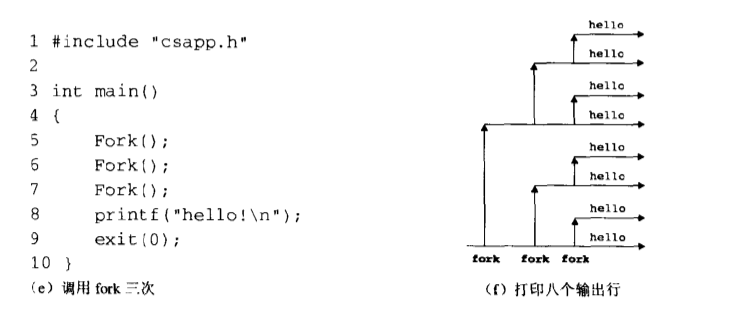

# Operating-System

## 信息存储

### 数据大小

32位机器和64位机器

### 寻址和字节顺序

多字节对象被存储为连续字节序列，例如int类型变量x的起始地址为0x100，int类型占用四个字节存储空间，x的四个字节地址为0x100, 0x101, 0x102, 0x103. 

小端法（little endian）：在存储器中按照从最低有效字节到最高有效字节顺序存储；

大端法 （big endian）：最高有效字节在最低有效字节前顺序存储。

### 整数表示

TODO：先不看，包括反码 补码

## 程序机器级

汇编语言

## 系统级IO

### Unix I/O

所有的I/O设备，网络、磁盘、终端都被模型化为文件，输入与输出被当做文件的读或写，且被统一的方式执行：

1.  打开文件。打开某个文件，内核将返回一个小的非负整数，称之为描述符，用以在后续对文件的操作中标识该文件。每个进程开始时默认会提供三个描述符，标准输入(0)、标准输出(1)、标准错误(2)。在头文件\<unistd.h\> 中定义上述三个描述符对应常量：STDIN_FILENO, STDOUT_FILENO, STDERR_FILENO.
2.  改变当前文件游标。内核维持一个变量k， 文件打开后初始化为0，表示的是从文件起始位置开始的字节偏移量。应用程序可以通过seek操作，显式地改变k值。
3.  读写文件。读操作就是拷贝n个字节到用户提供的存储空间，从k位置开始，读取到k+n，内核维持文件游标同时增加到k+n。假设文件大小为m，当k>=m时，触发EOF(end-of-file)条件；类似的，写操作就是从用户提供的存储空间拷贝n个字节到文件，并更新k。
4.  关闭文件。访问完文件后，内核释放打开文件创建的数据结构，并恢复文件描述符到描述符池。若进程终止，内核终将会关闭文件并释放其占用的系统资源。

### 打开关闭文件

#### open函数

函数原型：

```c
#include <sys/types.h>
#include <sys/stat.h>
#include <fcntl.h>

int open(char *filename, int flags, mode_t mode);
```

open函数返回值为int类型的文件描述符，一般记为fd。系统内核通常提供进程中未使用的最小描述符。

参数说明：

1.  char * filename，文件名，系统路径。

2.  int flags，访问文件的方式。
    O_RDONLY: 只读

    O_WRONLY: 只写

    O_RDWR: 可读可写

    flags参数可以有由多位掩码构成，例如：O_WDONLY|O_APPEND

     O_CREAT 若文件不存在则创建它。使用此选项时，需要同时说明第三个参数mode，用其说明该新文件的存取许可权限。

​        O_EXCL 如果同时指定了OCREAT，而文件已经存在，则出错。这可测试一个文件是

否存在，如果不存在则创建此文件成为一个原子操作。

​        O_APPEND 每次写时都加到文件的尾端。

​        O_TRUNC 属性去打开文件时，如果这个文件中本来是有内容的，而且为只读或只写成功打开，则将其长度截短为0。

1.  mode_t mode, 指定新文件的访问权限位。

#### close函数

函数原型：

```c
#include <unistd.h>
int close(int fd);
```

### 读写文件

函数原型：

```c
#include <unistd.h>
ssize_t read(int fd, void *buf, size_t, n);
ssize_t write(int fd, const void *buf, size_t n);
```

read 函数从描述符为fd的文件中拷贝n个字节到buf存储空间。返回值：-1表示出错，0表示EOF，其他正整数为实际读取到的字节数。

write 函数从存储空间buf拷贝n个字节到fd文件。

>   size_t, unsigned_int
>
>   ssize_t, int 有符号大小

### 健壮地读写

提供一个Rio包，（Robust I/O，健壮的I/O）

#### 无缓冲的输入输出函数

函数原型：

```c
ssize_t rio_readn(int fd, void *userbuf, size_t n);
ssize_t rio_writen(int fd, void *userbuf, size_t n);
```

应注意的是，读写函数在应用程序中断后应自动重启。

```c
ssize_t rio_readn(int fd, void *userbuf, size_t n)
{
		size_t nleft = n;	// 剩余需要读取的字节数
  	size_t nread = 0; // 已经读取的字节数
    char * pBuf = userbuf;  // 
  	while(nleft>0)
    {
      if((nread=read(fd, pBuf, nleft))<0)
         {
           if(errno == ENINTR)	// 发生系统中断，读取到字节数置零，重新调用循环
             nread=0;
        	 else
             return -1;					// 读取错误
         }
      else if(nread == 0)	// 读取触发EOF 循环结束
         break;
      nleft -= nread;	// 剩余字节数
      pBuf += nread;	// 指针移动已读之后
    }
  // 结束 返回已读的字节数
  return (n-nleft);
  	
}
```

```c
ssize_t rio_writen(int fd, void *userbuf, size_t n)
{
	size_t nleft = n;
  size_t nwrite = 0;
  char *pBuf = userbuf;
  while(nleft>0)
  {
    if((nwrite=nwrite(fd, pBuf, nleft))<0)
    {
      if(nwrite==ENINTR)
        nwrite=0;
      else:
      	return -1;
    }
    nleft -= nwrite;
    pBuf += nwrite;
  }
  return n;
}
```


#### 带缓冲的输入输出函数

磁盘的I/O是非常耗时间的，若频繁的调用read、write函数会造成不必要的系统资源开销。可以设计一个内部缓冲区，每次拷贝固定长度的字节数，当缓冲区变空时，自动调用read函数重新填满缓冲区。外部的程序则读取缓冲区的数据。

创建一个带缓冲区的结构体rio_t

```c
#define RIO_BUFSIZE 8192
typedef struct{
	int rio_fd;	// descriptor
  int rio_cnt;  // unread bytes
  char *rio_bufptr; // next unread buffer
  char *rio_buf[RIO_BUFSIZE];	// internal buffer
} rio_t;

void rio_readinitb(rio_t *riop, int fd)
{
  riop->rio_fd = fd;
  riop->rio_cnt = 0;
  riop->rio_bufptr = riop->rio_buf; 
}
```

重新包装的read函数，增加了缓冲区

```c
static ssize_t rio_read(rio_t *rp, char *userbuf, size_t n)
{
	int cnt;
  // 填满缓冲区
  while(rp->rio_cnt <= 0)
  {
    rp->rio_cnt=read(rp->rio_fd, rp->rio_buf, sizeof(rp->rio_buf));
    if(rp->rio_cnt < 0)
    {
      if(rp->rio_cnt != ENINTR) // 读取出错
      	return -1;
    }
    else if(rp->rio_cnt == 0) // EOF
      return 0;
    else:
    	rp->rio_bufptr = rp->rio_buf;	// reset bufptr
  }
  cnt = n;
  // read 读取到文件末尾会自动截断，返回读到的字节数
  if(rp->rio_cnt < cnt)
    cnt = rp->rio_cnt;
  // 拷贝数据到userbuf
  memset(userbuf, rp->rio_bufptr, cnt);
  rp->rio_bufprt += cnt;
  rp->rio_cnt -= cnt;
}
```

当调用rio_read函数读取n个字节时，读缓冲区内存有rio_cnt个未读字节数。当rio的内部缓冲区为空时，自动调用read函数填满缓冲区；缓冲区非空时，取n与rio_cnt较小值进行数据拷贝，最后返回拷贝的字节数。

使用包装后的读函数rio_read实现n个字节读取

```c
ssize_t rio_readnb(rio_t *rp, char *userbuf, size_t n)
{
  size_t nleft = n;
  size_t nread = 0;
  char *pbuf = userbuf;
  while(nleft>0)
  {
    if((nread=rio_read(rp, pbuf, nleft))<0)
    {
      if(error == ENINTR) // system interuptor
        nread=0;
      else			// read error
        return -1;
    }
    else if(nread == 0)	// EOF
    	break;
    nleft -= nread;	// left bytes unread
    pbuf += nread;	//  pointer offset
  }
  return (n-nleft);	// 返回已读取到的
}
```

### 文件元数据

文件的元数据即文件的基本信息，例如创建时间，修改时间等。可以通过调用系统stat，fstat函数检索文件信息

```
#include <unistd.h>
#include <sys/stat.h>
```

参考：

>   lseek
>
>   lseek - reposition read/write file offset
>
>   Synopsis
>
>   \#include <sys/types.h>
>
>   \#include <unistd.h>
>
>   `off_t lseek(int filedes, off_t offset, int whence);`
>
>   Description
>
>   The lseek() function repositions the offset of the open file associated with the file descriptor fd to the argument offset according to the directive whence as follows:
>
>   -   **SEEK_SET**
>
>       The offset is set to *offset* bytes.
>
>   -   **SEEK_CUR**
>
>       The offset is set to its current location plus *offset* bytes.
>
>   -   **SEEK_END**
>
>       The offset is set to the size of the file plus *offset* bytes.
>
>   The **lseek**() function allows the file offset to be set beyond the end of the file (but this does not change the size of the file). If data is later written at this point, subsequent reads of the data in the gap (a "hole") return null bytes (aq\0aq) until data is actually written into the gap.
>
>   ------
>
>   Name
>
>   read - read from a file descriptor
>
>   Synopsis
>
>   ```
>   #include <unistd.h>
>   ssize_t read(int fd, void *buf, size_t count);
>   ```
>
>   Description
>
>   read() attempts to read up to count bytes from file descriptor fd into the buffer starting at buf.
>
>   On files that support seeking, the read operation commences at the current file offset, and the file offset is incremented by the number of bytes read. If the current file offset is at or past the end of file, no bytes are read, and **read**() returns zero.
>
>   If *count* is zero, **read**() *may* detect the errors described below. In the absence of any errors, or if **read**() does not check for errors, a **read**() with a *count* of 0 returns zero and has no other effects.
>
>   If *count* is greater than **SSIZE_MAX**, the result is unspecified.
>
>   Return Value
>
>   On success, the number of bytes read is returned (zero indicates end of file), and the file position is advanced by this number. It is not an error if this number is smaller than the number of bytes requested; this may happen for example because fewer bytes are actually available right now (maybe because we were close to end-of-file, or because we are reading from a pipe, or from a terminal), or because read() was interrupted by a signal. On error, -1 is returned, and errno is set appropriately. In this case it is left unspecified whether the file position (if any) changes.
>
>   ------
>
>   NAME        
>
>   ```
>          write - write to a file descriptor
>   ```
>
>   SYNOPSIS        
>
>   ```
>          #include <unistd.h>
>   
>          ssize_t write(int fd, const void *buf, size_t count);
>   ```
>
>   DESCRIPTION        
>
>   ```
>          write() writes up to count bytes from the buffer starting at buf to
>          the file referred to by the file descriptor fd.
>   
>          The number of bytes written may be less than count if, for example,
>          there is insufficient space on the underlying physical medium, or the
>          RLIMIT_FSIZE resource limit is encountered (see setrlimit(2)), or the
>          call was interrupted by a signal handler after having written less
>          than count bytes.  (See also pipe(7).)
>   
>          For a seekable file (i.e., one to which lseek(2) may be applied, for
>          example, a regular file) writing takes place at the file offset, and
>          the file offset is incremented by the number of bytes actually
>          written.  If the file was open(2)ed with O_APPEND, the file offset is
>          first set to the end of the file before writing.  The adjustment of
>          the file offset and the write operation are performed as an atomic
>          step.
>   
>          POSIX requires that a read(2) that can be proved to occur after a
>          write() has returned will return the new data.  Note that not all
>          filesystems are POSIX conforming.
>   
>          According to POSIX.1, if count is greater than SSIZE_MAX, the result
>          is implementation-defined; see NOTES for the upper limit on Linux.
>   ```
>
>   RETURN VALUE        
>
>   ```
>          On success, the number of bytes written is returned.  On error, -1 is
>          returned, and errno is set to indicate the cause of the error.
>   ```
>
>   ------
>
>   SYNOPSIS
>
>   ```
>   #include <sys/types.h>
>   #include <sys/stat.h>
>   int fstat(int *fildes*, struct stat **buf*);
>   int lstat(const char *pathname, struct stat *buf);
>   int stat(const char *pathname, struct stat *buf);
>   int fstat64(int fildes, struct stat64 *buf);
>   int lstat64(const char **pathname*, struct stat64 **buf*);
>   int stat64(const char **pathname*, struct stat64 **buf*);
>   ```
>
>   DESCRIPTION
>
>   The `stat()` function gets information about the named file and writes it to the area that *buf* points to. `stat()` updates any time-related fields before writing into the `stat` structure. The system must be able to search all directories leading to the file; however, read, write, or execute permission of the file is not required.
>
>   The `fstat()` function is identical to `stat()`, except that the file whose information is retrieved is specified by file descriptor rather than file name.
>
>   The `lstat()` function has the same effect as `stat()`, except when the specified path refers to a symbolic link. In that case, `lstat()` returns information about the link, while `stat()` returns information about the file the link references.
>
>   The `fstat64()`, `lstat64()`, and `stat64()` functions are identical to the `fstat()`, `lstat()` and `stat()` functions except that they take a pointer to `struct stat64` instead of `struct stat`. This permits applications to determine the size of a file that is larger than 2 gigabyes.
>
>   PARAMETERS
>
>   -   *pathname* 
>
>       Points to a path name that names a file. The calling process must have at least search permissions on *pathname*.
>
>   -   *fildes* 
>
>       Is a file descriptor referring to a file for which status is returned.
>
>   -   *buf* 
>
>       Points to a `stat` or `stat64` structure where status information about the file is to be placed.
>
>   RETURN VALUES
>
>   If successful, these functions return a value of zero. 

## 网络编程

### IP地址

ip地址是32位无符号整型，网络套接字存储方法：

```c++
struct in_addr{
	unsigned int s_addr;
};
```

问题：为什么使用这样的结构体来保存ip地址？答案是历史遗留问题，已经有大量的应用基于此结构。

网络中主机是异构的，主机可以有不同的主机字节顺序，为了统一规则，TCP/IP 定义了网络字节排序(network byte order) , 它是大端法顺序。主机字节顺序(例如hostname, ip点分十进制)是小端法顺序，Unix提供了一下几种函数使网络字节和主机字节转换。

```c++
#include <netinet/in.h>
// 返回网络字节顺序
unsigned long int htonl(unsigned long int hostlong);
unsigned short int htons(unsigned short int hostshort);

// 返回主机字节顺序
unsigned long int ntohl(unsigned long int netlong);
unsigned short int ntohs(unsigned short int netshort);
```

为了便于人阅读，ip地址可以表示成点分十进制，例如128.2.194.242 = 0x8002c2f2。

### DNS

DNS服务器是一个维护域名与IP地址映射的数据库。

DNS存储的条目struct：

```c
struct hostent{
    char *h_name; // official domain name of host
    char **h_aliases; // null-terminated array of domain names;
    int h_addrtype; // host address type(AF_INET)
    int h_length; // length of an address
    char **h_addr_list; // null-terminated array of in_addr structs; 
};
```

从DNS服务器检索条目使用的函数gethostbyname, gethostbyaddr：

```c++
#include <netdb.h>
struct hostent *gethostbyname(const char *name);
struct hostent *gethostbyaddr(const char *addr, int len, 0);
```

gethostbyname函数返回和域名name有关的主机条目，gethostbyaddr函数返回和地址IP有关的主机条目。

### 连接

客户端与服务端通过在连接(connection)上接收和发送字节流来通信。套接字（socket）作为连接的端点（end-point），每个套接字由一个IP地址和16位的整数端口组成，组合形式为"地址：端口"，其中客户端socket端口是由操作系统的内核自动分配。Unix系统指定了一部分知名端口，例如ssh-22，ftp-21等，通过查看 `/etc/services`文件可以检索到指定的端口号对应的程序。

#### 套接字接口

套接字接口（socket interface）是一组用来结合Unix/IO函数创建网络应用的函数，下图给出了典型的客户端-服务器模型事务的上下文接口。值得一提的是，套接字概念是由加州大学伯克利分校提出，它的基于TCP/IP协议的实现，一夜之间激发了互联网技术研究的热潮。


#### 套接字地址结构

从Unix程序的角度来看，套接字就是一个有相应描述符的文件.

Internet上的套接字存放在类型为sockaddr_in的16字节结构体中，结构源码如下：

```c
// Internet-style socket address structure
struct sockaddr_in{
	unsigned short sin_family;	// address family(always AF_INET)
	unsigned short sin_port;	// port number in network byte order
    struct in_addr sin_addr;	// IP address in network byte order
    unsigned char sin_zero[8];	// pad to sizeof(struct sockaddr);
};
```

在结构体中，sin_family成员是IP地址类型，一般是AF\_INET表示IPV4；sin_port是一个16位长的端口号；sin\_addr是32位的IP地址。IP地址和端口号按照网络地址顺序存储(大端法)。注意：sin_中的in是Internet的缩写。

connect，bind，accept等函数需要一个指向与协议相关的套接字结构指针，而套接字结构因为协议的不同会有不同的类型，在设计socket的时期，c语言没有像void\*这种指向任意类型的指针，所以设计了一种通用结构sockaddr。要求应用程序将与协议特定的结构的指针强制转换成这种通用结构的指针。

```c
struct sockaddr{
    unsigned short sa_family;
    char sa_data[14];
};
```

### Web服务器

Web客户端和服务器之间的交互是通过一个基于文本的应用级协议，叫做HTTP(Hypertext Transfer Protocol，超文本传输协议)。

#### Web内容

-   Web服务器以两种方式为客户端提供内容：
    取一个磁盘的内容，并将它返回给客户端。磁盘的内容称为静态内容（static content），这种返回的方式称为服务静态内容。
-   运行一个可执行文件，并将它的输出返回给客户端。运行可执行文件的输出称为动态内容(dynamic content)，这种输出的返回过程称为服务动态内容。

每条由web服务器返回的内容都是和它管理的某个文件相关联的，这些文件的每一个都有一个唯一的名字，叫做URL(universal Resource Locator，通用资源定位符)。可执行文件的URL可以在文件名后包括程序参数，"?"字符分隔文件名和参数，每个参数用"&"分隔开

TODO: Tiny Web服务器

## 编译链接

链接(linking)，就是将不同部分的代码和数据收集并组成为一个单一文件的过程。在现代系统中，链接由链接器(linker)的程序自动执行。

链接的作用是，将大型程序分解为小的模块，可以独立地修改和编译这些模块。当修改某一小模块时，只需要重新编译它，并将它重新链接到应用上，而不必重新编译其他模块。另外，一些第三方库的使用需要链接，理解链接将帮助程序开发者开发共享库。


## 异常控制流

异常(exception)就是控制流中的突变，用来响应处理器状态中的某些变化。

其基本思想如下图：


当处理器检测到有事件（虚拟存储器缺页、算数溢出或者系统定时器产生的信号）发生时，会通过一张异常表作为一个跳转表，进行间接过程调用即异常处理。

### 异常处理

系统中可能的每种类型的异常都分配了唯一的非负整数的异常号(exception number)，包括被0除、缺页、存储器访问违例等，还包括系统内核产生的系统调用和外部I/O.

系统启动时，由操作系统分配和初始化一张异常表，使得表目K包含异常K处理程序的代码地址。触发异常后，执行间接过程调用，通过表k的地址获取处理程序。调用执行时，在系统执行指令跳转到处理程序之前，处理器将会将中断的返回地址压入栈中(某些当前程序执行需要的状态也会被压入)，如果控制由用户态转移到内核态，这些项目将会被压入到内核栈中，


### 进程

何为进程——一个执行中程序的实例，系统中每一个程序都是运行在某个进程的上下文(contex)中，上下文是由程序正确运行所需要的状态组成，包括存储器中程序代码和数据、程序的栈、通用目的寄存器的内容、程序计数器、环境变量以及打开的文件描述符等。

进程产生了两个抽象：

-   独立的逻辑控制流——好像该程序独立占用处理器。
-   私有的地址空间——好像该程序单独占用存储器系统

#### 逻辑控制流

在程序中，PC(程序计数器)的值唯一对应着可执行目标文件（或者动态链接到程序的共享对象）中的指令，一系列PC值构成的序列就是逻辑控制流。


如上图所示，三个进程是轮流使用处理器的，每个进程执行他的流的一部分，该部分执行完毕后，资源被其他进程占用，处于挂起状态。

除了特殊情况，不同进程相关的逻辑流不会影响各自的进程状态，每个逻辑流也是独立的。而特殊情况则发生在不同的进程在进行通信(IPC)时，比如(管道、套接口、共享存储器、信号量)显式地交互。

任何逻辑流在时间上和其他逻辑流重叠的进程被称为并发进程(concurrent process)，这两个进程也就是并发运行的。比如上图的A和B、A和C就是；而B和C就不是，因为C执行之前，B就执行完了。上述过程中，进程中执行任务的控制流片段被称为时间片(time slice)。

#### 私有地址空间

在一台n位地址的机器上，地址空间是$2^n$个可能地址集合，(0，1，2，···，$2^n$-1)，一个进程为他自己的程序提供一块**私有地址空间**。一般而言，在这个空间某个地址存储的字节是不能被其他进程读取或写入的。

一块私有空间的结构包括：文本、数据、堆和栈段。顶部的四分之一是预留给内核的，其余四分之三是给用户程序的。


#### 用户模式与内核模式

为了限制一个应用的可执行指令以及可访问地址空间范围。

典型的是处理器在某个控制寄存器中设置一个方式位，用来描述进程当前享有的权利。在内核模式下，进程可以执行指令集中的任何指令，并且可以访问系统中任何存储地址。在用户模式下，进程不允许执行特权指令(privileged instruction)，也不允许直接引用地址空间中内核去的代码和数据（可以通过间接的方式比如系统提供的接口）。

#### 上下文切换

操作系统内核通过上下文切换(context switch)的，一种较高形式的异常控制流，来实现多任务。

上下文就是内核重新启动一个被强占进程所需资源的状态。它由一些对象的值组成，包括通用目的寄存器、浮点寄存器、程序计数器、用户占、状态寄存器、内核栈和各种内核数据结构，比如描绘地址空间的页表(page table)、包含有关当前进程信息的进程表(process table)，以及包含进程已打开文件的信息的文件表(file table)。

在进程执行的某些时刻，内核可以决定抢占当前进程资源，并重新开始一个之前被抢占后挂起的进程，这就是**调度**(scheduling)，处理这种任务的模块被称为调度器(scheduler)。完成这种任务的机制成文切换上下文，首先保存当前进程的上下文，然后恢复先前挂起的进程所保存的上下文，最后将资源控制权传递给这个新恢复的进程。

### 进程控制

每个进程都有一个唯一的正数类型的进程ID(PID)，getpid函数返回调用进程的PID，getppid函数返回父进程的PID。二者的返回值类型为`pid_t`的整数值

```c
#include <unistd.h>
#include <sys/types.h>

pid_t getpid(void);
pid_t getppid(void);
```

#### 创建和终止进程

进程的三种状态：

-   运行。进程要么在CPU上执行，要么等待被执行且最终会被调度。
-   暂停。进程的执行被挂起(suspended)，且不会被调度。当进程收到SIGSTOP、SIGTSTP、SIDTTIN或者DIGTTOU信号时，进程就暂停，并保持暂停一直到收到SIGCONT信号，进程将再次开始运行。
-   终止。进程永远停止。收到停止信号，该信号默认行为是终止进程；从主程序返回；调用exit函数

```
#include <stdlib.h>
void exit(int status);
```

exit函数以status退出状态来终止进程。

父进程通过fork函数来创建一个新的子进程。

```
#include <unistd.h>
#include <sys/types.h>
pid_t fork(void);
```

新创建的子进程几乎但不完全与父进程相同，子进程得到与父进程用户级虚拟地址空间的一份拷贝，包括文本、数据和bss段、堆以及用户栈。子进程也获得与父进程打开文件描述符相同的拷贝，即子进程可以读写父进程打开的任何文件。

注意：fork函数只调用一次，却返回两次，一次在子进程中，一次在父进程中。在父进程中，fork返回子进程的PID，子进程中fork返回0. 通过不同的返回值，判断程序是在父进程执行还是子进程执行。

当fork函数调用多次时，画进程图会更直观些。


当父进程执行一个fork函数，会创建一个子进程并打印出hello，父进程也打印出hello。


当父进程第一次调用fork函数，创建一个子进程，然后父进程和子进程又各自调用fork函数创建自己的子进程，每个进程都调用printf函数，输出四行hello。



#### 回收子进程

当某个进程由于意外或者其他原因终止时，内核不会立即将它在系统中清楚。而是进程会保持在一种终止状态，直到被它的父进程回收(reaped)。当父进程回收已经终止的子进程时，内核将子进程的退出状态传递给父进程，并最终抛弃该子进程。终止状态的子进程被称为僵尸进程(zombie)，内核保留这种僵尸进程直到被父进程回收。

如果父进程没有回收到它的僵尸进程就终止了，那么内核就会安排init进程来回收它们。init进程的PID为1，并且是在系统初始化时由内核创建的。长时间运行的程序，比如shell或者服务器，总是应该回收他们的僵尸进程。即使僵尸进程没有运行，他们仍然消耗系统的各种资源。

一个进程可以通过调用waitpid函数来等待它的子进程终止或者暂停：

```
#include <sys/types.h>
#include <sys/wait.h>
pid_t waitpid(pid_t pid, int *status, int options);
```

返回值：成功返回子进程PID，如果WNOHANG则为0，如果出错则为-1。

waitpit直到父进程的**等待集合**中的一个子进程终止，或者集合中进程已经失效返回。最终将已终止的子进程从系统中删除。

判断等待集合：

由参数pid决定，

-   如果pid>0，那么等待集合就是一个单独的子进程，它的进程ID就是pid。
-   如果pid=-1，那么等待集合就是父进程所有子进程的组成。

行为options

-   WNOHANG：等待集合中没有任何子进程终止，那么立即返回0；
-   WUNTRACED：挂起调用进程的执行，直到等待集合中一个进程变成终止或暂停，返回的PID为导致返回的终止或暂停子进程的PID。
-   WNOHANG|WUNTRACED ，

检查已回收子进程的退出状态 *status解析

如果status是非空的，那么waitpid就会将导致返回的状态信息编码保存到status参数，其解释宏定义在wait.h中。

-   WIFEXITED（status）：如果子进程正常终止就返回真(通过调用exit结束，或者返回return)
-   WEXITSTATUS：

返回错误

如果调用进程没有子进程，那么waitpid返回-1，并且设置errno为ECHILD

如果waitpip函数被一个信号中断，那么它返回-1，并设置errno为EINTR

#### 进程休眠

sleep函数将一个进程挂起一段时间

```
#include <unistd.h>
unsigned int sleep(unsigned int secs);
```

pause函数，让调用函数休眠，直到该进程收到一个信号为止。该函数总是返回-1。

```
#include <unistd.h>
int pause(void);
```

#### 加载并运行程序

execve函数在当前进程的上下文中加载并运行一个新程序。

```
#include <unistd.h>
int execve(char *filename, char *argv[], char *envp); // 错误返回-1
```

execve函数加载并运行可执行目标文件filename，且带参数列表argv和环境变量envp。当出现错误时，例如不能找到filename，execve才会返回调用程序，其他情况execve调用一次从不返回。

**程序与进程的差异**

程序是代码和数据的集合，程序可以作为目标模块存在磁盘上，或者作为段存在地址空间中；进程是执行中程序的一个特殊示例，程序总是运行在某个进程的上下文中。

fork函数是在新的子进程中运行相同的程序，新的子进程时父进程的一个复制品。

execve函数在当前进程的上下文中加载并运行一个新的程序，它会覆盖当前进程的地址空间，但没有创建新的进程，新程序使用同一个PID，并继承了原程序已经打开的文件描述符。

**shell的main例程**


### 信号

信号允许进程中断其他进程。一个信号(signal)就是一条消息，它通知进程某种类型的事件已经在系统中发生了。Linux中30种不同的信号：


#### 发送信号

内核通过更新目的进程上下文的某个状态，发送一个信号给目的进程。发送信号的原因：

-   内核检测到一个系统事件，比如除零错误
-   一个进程调用了kill函数，显示地要求内核发送一个信号给目的进程

一个进程可以发送信号给它自己。

**进程组**

每个进程都只属于一个进程组，进程组是由一个正整数进程组ID来标识的。getpgrp函数返回当前进程的进程组ID：

```
#include <unistd.h>
pid_t getpgrp(void);
```

默认的，一个子进程和它的父进程同属于一个进程组。一个进程可以通过使用setpgid函数来改变自己或者其他进程的进程组：

```
#include <unistd.h>
pid_t setpgid(pid_t pid, pid_t pgid); // 成功返回0，失败返回-1
```

如果pid是0，那么就使用当前进程的PID。如果pgid是0，那么就用pid指定的进程的PID作为进程组ID

**使用kill程序发送信号**

/bin/kill 程序可以向另外的进程发送任意的信号。例如：

`unix>kill .9 15213`

发送信号9(SIGKILL)给进程15213。

**从键盘发送信号**

unix shell使用作业(job)的抽象概念来表示一条命令行产生的进程。

`unix> ls | sort` 创建一个由两个进程组成的前台作业，这两个进程通过unix管道连接起来的：一个进程运行ls程序，另一个运行sort程序。shell为每个作业创建一个独立的进程组，进程组ID取自作业中父进程中的一个。

在键盘上输入ctrl-c，发送SIGINT信号到shell，shell捕获该信号，然后发送SIGINT信号到这个前台进程组中的每个进程。

**使用kill函数发送信号**

进程通过调用kill函数发送信号给其他进程(包括自己)

```
#include <sys/types.h>
#include <signal.h>

int kill(pid_t pid, int sig);
```

如果pid大于0，那么kill函数发送信号sig给进程pid。如果pid小于0，那么kill发送信号sig给进程组abs(pid)中的每个进程。

**使用alarm函数发送信号**

进程可以调用alarm函数向他自己发送SIGALRM信号：

```
#include <unistd.h>
unsigned int alarm(unsigned int secs);
```

返回前一次闹钟剩余的秒数，若之前没设定，则返回0

#### 接收信号

当目的进程被内核强迫以某种方式对信号的发送做出反应时，目的进程就接收了信号。进程可以忽略这个信号，终止或者通过执行一个称为信号处理程序(signal handler)的用户层函数捕获这个信号。

一个只发出而没有被接收的信号叫做待处理信号(pending signal)，任何时刻，一种类型至多会只有一个待处理信号。如果一个进程有一个类型为K的待处理信号，那么任何接下来发送到这个进程的类型为K的信号都不会排队等待，他们只会被简单地丢弃。一个进程可以有选择的阻塞接收某种信号。当一种信号被阻塞时，它仍可以被发送，但是产生的待处理信号不会被接收，直到进程取消对这种信号的阻塞。

当内核从一个异常处理程序返回，准备将控制传递给进程p时，它会检查未被阻塞的待处理信号的集合(pending & ~blocked)。如果这个集合为空(通常情况)，那么内核传递控制给p的逻辑控制流的下一条指令。然而，如果集合是非空的，那么内核选择集合中的某个信号k(通常是最小的k)，并且强制p接收信号k。收到这个信号会触发进程的某种行为，一旦进程完成了这个行为，那么控制就传递回p的逻辑控制流的下一条指令。

每个信号类型都有一个预定义的默认行为：

-   进程终止。
-   进程终止并转存存储器(dump core）。
-   进程暂停直到被SIGCONT信号重启。
-   进程忽略该信号。

```
#include <signal.h>
typedef void handler_t(int);

handler_t *signal(int signum, handler_t *handler);
```

signal函数可以通过下列三种方法之一来改变和信号signum相关联的行为。

如果handler是SIG_IGN，那么忽略类型为signum的信号。

如果handler是SIG_DFL，那么类型为signum的信号行为恢复为默认行为。

否则，handler就是用户定义的函数的地址，称为信号处理程序(signal handler)，只要进程接收到一个类型为signum的信号，就会调用这个程序。通过把处理程序的地址传递到signal函数从而改变默认行为。信号处理程序的调用称为捕捉信号。信号处理程序的执行被称为处理信号。

当处理程序执行他的return语句时，控制通常(可能出现中断错误)传递回控制流中进程被信号接收中断位置处的指令。

## 虚拟存储器

为了更加有效地管理存储器并且少出错，现代系统提出了一种对主存的抽象概念，叫做虚拟存储器(VM)。

虚拟存储器提供了三个重要的能力：

-   它将主存看成一个存储在磁盘上的地址空间的高速缓存，在主存中只保存活动区域，并根据需要在磁盘和主存之间来回传送数据，通过这种方式，它高效使用了主存；
-   它为每个进程提供了一致的地址空间，从而简化了存储器管理；
-   它保护了每个进程的地址空间不被其他进程破坏。

### 存储器映射

使用mmap函数的用户级存储器映射

Unix进程可以使用mmap函数来创建新的虚拟存储器区域，并将对象映射到这些区域中。

```c
#include <unistd.h>
#include <sys/mman.h>
void *mmap(void *start, size_t length, int prot, int flags,	int fd, off_t offset);
```

若成功则返回指向映射区域的指针，若出错则为-1。

mmap函数要求内核创建一个新的虚拟存储器区域，最好是从地址start开始的一个区域，并将描述符fd指定的对象的一个连续的组块(chunk)映射到这个新的区域。连续的对象组块大小为length字节。从距离文件开始处偏移量为offset字节的地方开始。start地址仅仅是一个暗示，通常被定义为NULL。

### 动态存储器分配

大多数C程序在运行时需要额外虚拟存储器，使用的是动态存储器分配器(dynamic memory allocator)。动态存储器分配维护着一个进程的虚拟存储器区域，称为堆(heap)。在大多数Unix系统中，堆是一个请求二进制零的区域，它紧接在未初始化的bss区域后开始，并向上生长(高位地址)。对于每个进程，内核维护着一个变量brk(break)，指向堆的顶部。


C标准库提供了一个malloc程序包的显示分配器，程序通过调用malloc函数来从堆中分配块。

```
#include <stdlib.h>
void *malloc(size_t size);
```

若成功则返回指针，出错则返回NULL。malloc函数返回一个指针，指向一个大小为size字节的存储器块，这个块为可能包含在这个块内所有数据对象类型对齐。一般的Unix，malloc返回8字节(双字)边界对齐的块。size_t类型被定义为unsigned int(无符号整数)。

若malloc遇到问题，就返回NULL，并设置errno。malloc并不初始化它返回的存储器，calloc可以将分配的存储器初始化为0，想要改变一个已经分配块的大小，使用realloc函数。

程序使用free函数来释放已分配的堆块。

`void free(void *ptr)`，ptr应该指向一个从malloc获得的已经分配块的起始位置，如果不是，那么free的行为就是未定义的，且无效的。糟糕的是，free不会告诉应用发生错误。

程序使用动态存储器分配是因为他们经常在程序实际运行时，才知道某些数据结构的大小。

### 碎片

造成堆利用率很低的主要原因是碎片(fragmentation)的现象，当存在未使用的存储区但不能满足分配需求时，就发生碎片现象。有两种形式的碎片：内部碎片(internal)和外部碎片(external)。

内部碎片是在一个已分配块比有效载荷大时发生的。例如，对已分配块强加一个最小的大小值，而这个大小比某个请求的有效载荷大。或者分配器可能增加块大小以满足对齐约束条件。

外部碎片是当前空闲存储器合计起来足够满足一个分配请求，但是没有一个单独的空闲块足够大可以处理这个请求时发生。

### 垃圾收集器

垃圾收集器将存储器视为一张有向可达图(reachability graph)，该图的节点被分成一组根节点(root node)和一组堆节点(heap node)。每个堆节点对应于堆中的一个已分配块。有向边p->q意味着p中的某个位置指向q的某个位置。


当存在一条从任意根节点出发并到达p的有向路径时，这时节点p时可达的(reachable)。在任何时刻，和垃圾对应的不可达节点是不能被应用再次使用的。垃圾收集器的角色是维护可达图的某种表示，并通过释放不可达节点将他们返回给空闲链表，来定期的回收他们。

垃圾收集器由标记(mark)阶段和清楚(sweep)阶段组成。标记阶段标记处根节点的所有可达的和已分配的后继，而后面的清楚阶段释放每个未被标记的已分配块。典型地，块头部中空闲的低位中的一位用来表示这个块是否被标记了。

## 并发编程

现代操作系统提供了三种基本的构造并发程序的方法：

-   进程。每个逻辑控制流都是一个进程，由内核来调度和维护。因为进程有独立的虚拟地址空间，想要和其他流通信，控制流必须使用某种显示的进程间通信(interprocess communication，IPC)机制。
-   I/O多路复用。应用程序在一个进程的上下文中显式地调度它们自己的逻辑流。逻辑流被模型化为状态机，作为数据到达文件描述符的结果，主程序显式地从一个状态转换到另一个状态。所有流都共享同一个地址空间，由于程序是一个单独的进程。
-   线程。线程是运行在一个单一进程上下问中的逻辑流，有内核进行调度。

### 基于进程的并发编程

构造并发程序最简单的方法就是用进程，使用系统提供的函数fork，exec和waitpid。例如，一个构造并发服务器的自然方法就是，在父进程中接收客户端连接请求，然后创建一个新的子进程来为每个新的客户端提供服务。

基于进程的并发服务器

```cpp
while(1)
{
	connfd = Accept(listenfd, (SA *)&clientaddr, &clientlen);
	if(Fork() == 0)
	{
		Close(lisenfd); /* child closes its listening socket*/
		echo(connfd); /* child services client*/
		Close(connfd); /* child closes connection with client*/
		exit(0); /* child exits */
	}
	Close(connfd); /* parents closes connected socket*/
}

/* SIGCHLD 信号处理 */
void sigchld_handler(int sig)
{
    while(waitpid(-1, 0, WNOHANG) > 0)
        ;
    return 0;
}
```

-   服务器会运行很长的时间，所以需要包括一个SIGCHLD处理程序，来回收僵尸(zombie)子进程的资源。因为SIGCHLD处理程序执行时，SIGCHLD信号时阻塞的，而Unix信号是不排队的，所以SIGCHLD处理程序必须准备好回收多个僵尸子进程资源。
-   父子进程必须关闭他们各自的connfd拷贝，及时关闭已连接的描述符，以避免存储器泄露。

父子进程之间共享状态信息，共享文件表，但是并不共享用户地址空间。

### I/O多路复用技术

可以设计基于I/O多路复用的时间驱动编程，其设计的优点是比基于进程的设计给程序员更多的对程序行为的控制。另外，基于I/O多路复用的事件驱动服务器是运行在单一进程上下文中的，因此每个逻辑流都能访问该进程的全部地址空间。缺点就是编码复杂。

### 基于线程的并发编程

一个线程(thread)就是运行在一个进程上下文的一个逻辑流。线程由内核自动调度。每个线程都有自己的线程上下文(thread context)，包括唯一的整数线程ID(thread ID，TID)、栈、栈指针、程序计数器、通用目的寄存器和条件码。所有的运行在一个进程里的线程共享该进程的整个虚拟地址空间。多个线程共享这个进程虚拟地址空间的整个内容，包括它的代码、数据、堆、共享库和打开的文件。

#### 线程的执行模型

多线程执行模型和多进程执行模型相似。每个进程开始生命周期都是单一线程，这个线程称为主线程(main thread)。在某一时刻，主线程创建一个对等线程(peer thread)， 从这个时间点开始，两个线程就并发运行。最后，因为主线程执行一个慢速系统调用，例如read或者sleep或者中断，控制就会通过上下文切换传递到对等线程。在控制传递回主线程前，对等线程回执行一段时间。


另一方面，线程的执行不同于进程，因为一个线程的上下文要比一个进程的上下文小得多，线程的上下文切换要比进程的上下文切换快得多。而且，线程不按照严格的父子层次组织，主线程和其他线程的区别仅在于它总是进程中第一个运行的线程。对等线程可以读写相同的共享数据，也可以杀死对等线程。

#### 创建线程

线程通过pthread_create函数来创建其他线程。

```
#include <pthread.h>
typedef void *(func)(void *);
int pthread_create(pthread_t *tid, pthread_attr_t *attr,
		func *f, void *arg);
```

函数执行若成功则返回0，否则出错则为非0.

`pthread_create` 函数创建一个新的线程，并带着一个输入变量arg，在新线程的上下文中运行线程例程f。能用attr参数来改变新创建线程的默认属性。改变这些属性不过多叙述，这里一律为NULL。

当pthread_create返回时，参数tid包含新创建线程的ID。新线程可以通过调用pthread_self函数来获得他自己的线程ID。

#### 终止线程

线程终止方式分为四种：

-   当顶层的线程例程返回时，线程会隐式地终止
-   通过调用pthread_exit函数，线程会显式终止，该函数会返回一个指向返回值thread_return的指针。如果主线程调用pthread_exit，它会等待所有其他对等线程终止，然后再终止主线程和整个进程，返回值为thread_return.

```
#include <pthread.h>
int pthread_exit(void *thread_return);
// 若成功返回0，失败返回非0
```

某个对等线程调用Unix的exit函数，该函数终止进程以及所有与该进程相关的线程。

另一个对等线程通过调用当前线程ID的pthread_cancel函数来终止当前线程。

```
#include <pthread.h>
int pthread_cancel(pthread_t tid);
// 若成功返回0，出错则返回非0
```

#### 回收已终止线程的资源

线程通过调用pthread_join函数等待其他线程终止。

```
#include <pthread.h>
int pthread_join(pthread_t tid, void **thread_return);
// 若成功返回0，出错则返回非0
```

pthread_join函数会阻塞，直到tid线程终止，将线程例程返回的(void *)指针赋值给thread_return指向的位置，然后回收已终止线程占用的所有存储器资源。

pthread_join函数只能等待一个指定的线程终止。这使得我们需要设计复杂不直观的机制来检测进程终止。

#### 分离线程

任何时间点，线程是可结合(joinable)或者可分离(detached)。一个可结合的线程能够被其他线程回收资源和杀死。在被其他线程回收之前，它的存储器资源(例如栈)是不释放的。相反，一个分离的线程是不能被其他线程回收或杀死的，它的存储器资源在它终止时由系统自动释放。

默认的线程被创建成可结合的，为了避免内存泄露，每个可结合线程都应该要么被其他线程显式地回收，要么通过调用pthread_detach函数被分离。

```
#include <pthread.h>
int pthread_detach(pthread_t tid);
// 若成功则返回0，出错则非0
```

### 多线程程序中的共享变量

#### 变量映射到存储器

-   全局变量。全局变量是定义在函数之外的变量。在运行时，虚拟存储器的读写区域只包含每个全局变量的一个实例。
-   本地自动变量。本地自动变量就是定义在函数内部但是没有static属性的变量。在运行时，每个线程的栈都包含它自己的所有本地自动变量的实例。
-   本地静态变量。本地静态变量是定义在函数内部并有static属性的变量。和全局变量一样，虚拟存储器的读写区域只包含在程序中声明的每个本地静态变量的一个实例。

