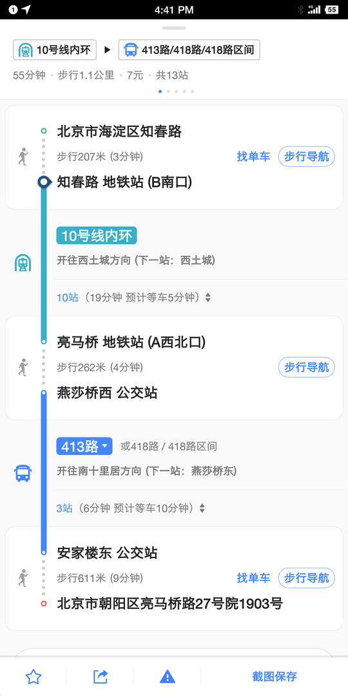

# 2019 考研经验分享
*目标院校：东北大学  目标专业：计算机技术（专硕）*
---
**主要内容：**
- 确定是否考研
- 确定目标院校
- 确定目标专业
- 做timeline schedule

---
## 确定是否考研
### 为什么要考研
*（“？？？我保研了呀 …………”）*
 	大多数人都在纠结是要考研还是要去工作，在这群人里有一半是没有自己的目标，考研纯粹是在跟风随大流。看到别人考上了不错的学校，看到班里那么多人选择了考研，于是就想要不自己也考吧，反正这么多人考呢。有这一类问题的人即使是考上研究生了，也没有什么大的意义，他们在研究生阶段问同样的问题：该不该选某某老师作导师呢？该不该去某某公司实习呢？
 ### 我的例子
​	以我为例来讲一下到底要不要考研。2017年12月，那时候的我一点都没想过要考研究生，并且认为即便是研究生毕了业也不过是多了一张文凭，将来拼的还不都是工作能力，早早踏入社会的话不就比那些研究僧多了三年工作经验。而且在当今996的互联网行业，有三年工作经验可是了不得的。我也早早的在大三找了一份小公司的实习，多多学点技术和经验，希望能在大四签一份大公司的合同。在实习的那段时间是非常累的，不仅吃不好睡不好，内心里面也是很压抑的，在公司一天基本没有什么快乐的事（当然同事们肯定都是good person）。屏幕前的读者可以在大三的时候寒暑假期间找一份实习干干，一般就在实习僧这款软件投简历。可能是我没进入超大型甚至一般的大公司，我并没感觉到工作的快乐或者成就感。对于工资，实习僧软件标价基本都在￥150-250/天，土豪点的会标到￥400/天（字节跳动技术岗），可以算一下收入和开销，公司在西二旗中关村软件园，一楼是食堂，外包的那种，中午基本吃田老师红烧肉￥25，晚上可能吃一份饺子￥20，早上一般吃点零食，这样一天的饭票要花50左右；房子租的是￥1800/月的，两人合租，算下来￥30/天，而且位置很偏，在16号线五环外，十几平的老小区，有蟑螂，没阳光，破破烂烂，而且这样的房子都还算比较好的了。交通的话北京还是方便，就是非非非常的挤，公交￥1-2，地铁短线不会超过￥5，这样算下来一天的花销是小100。所以在北京实习基本上剩不下几个钱。

​	总的来说在北京实习生的生活是很艰苦的，不是老辈子吃糠咽菜啃树皮那种，而是内心的煎熬！！！我们都知道996的样子，想必也都不想享受这福报吧。另外如果进入大厂的话，前途和薪资都是相对比较光明的，但是！！！本科没啥技术，基础又不好（数据结构和算法知识，编程语言，数据库理论，操作系统，主流框架技术）进大厂基本天方夜谭。数据来说话：阿里巴巴集团的后端开发面试有6轮左右，时长至少半个月。大厂的岗位多半会留给实习生吧，盲猜。

​	在北京打工的可能都会像上述一样吧，所以考研能解决的第一个问题就是：**提升自己的平台，提高了进大厂的概率**。

### 重新规划未来

​	我本科专业是电子信息工程专业，工作的话，对口的可能想到5G、华为通信、小米手机射频工程师，但这些职位我想最起码做到硕士研究生才能有任职资格吧。可以列举一下本科前三年学的课程：大一大二开的比较早的模电数电C++，这些只能算入门公共课，大三上有通信原理、计算机网络、高频。。。。下学期开选修模块，这些课我个人是没有办法把他们串联在一起搞一个实实在在的项目出来，大多数同学应该也是这样学了只为应付考试。可能在校招时要求会特别低，低到只要做出几道题就能签约的样子，**如果在校招阶段有心仪的工作，可以和家长商量一下签约**，一般是9月到10月。但是比较受欢迎的大公司一般都会在暑假7-8月就陆陆续续开展了秋季招聘活动，而且结束的也很快，我当时是没有时间再补计算机基础知识，面试的话肯定是不行的。

​	我不太喜欢本科专业，对电子硬件行业不太感冒，偏向于计算机软件行业。如今如火如荼的互联网只算是计算机行业的一个领域吧，计算机将来的发展必定依旧是非常光明的。这里就劝一些比较聪明积极的同志转行到CS。从EE转到CS需要补一大摞的基础知识，数据结构和算法、计算机操作系统、数据库系统原理、计算机组成原理四门基础课。而且在将来找工作的时候面试互联网公司的技术岗，以上四门课肯定是会问到的。在当前主流公司研究方向上，也要有所了解，比如大数据技术Hadoop、spark，人工智能领域tensorflow会不会用。技术岗还会考察个人项目经验，动手编程能力。

​	本科锻炼的计算机能力实在太低，所以可以选择通过考研来转行到计算机技术，在研究生开学前的这段时间把计算机基础补补，研究生阶段迅速建立起自己的知识体系，**编程能力并不需要强入神，要的是学习能力和知识维度**。

### 磨练自己

​	自从大学以后，基本没有花时间在认真做一件事情，考研是大学四年唯一坚持时间比较长，并取得成果的一个项目。考研期间有很多好玩的事，可能是回到学校后能体验学生时代本身就是一件快乐的事情。我们要珍惜眼前的大学时光，**多想想快乐的事情，少自己给自己找烦恼**。

​	说起考研初期，我非常清楚的记得我是8月22日回到学校开始准备复习的，在此之前，我对于考研可以说是一张白纸。前期的鸭梨挺大的，原因一 需要学习的东西太多了，高等数学，线性代数，英语，专业课；原因二，不知道该报哪个学校，而且打算跨到计算机的话，身边几乎没有例子，只能靠自己学。从开始到结束，我应该算是挺努力的了，每天都会到图书馆三楼，只不过有的时候可能偷个懒八点才起床，可能中午睡到三点才醒，也可能耳机戴一天听歌。但是能坚持下来就很不错了。**有些人总是失败，原因就是一直失败**。如果我们定的小目标一一实现了，大目标也会实现的，余生更大的目标也会实现，而如果小目标都不能实现，那就gg吧。

### 提升平台

​	前面提到过，大公司的提供的职位倾向于研究生，可能在于我国研究生就已经很多了，同水平的面试候选者肯定选择高学历的。我们在投简历时，流程一般是这样的：HR发布招聘需求-->HR接受各种渠道的简历-->HR筛选满意的简历-->用人部门筛选简历-->通知面试。可以看到HR这一关在海投简历时的重要性，所以高水平的简历是一个不可缺少的敲门砖，没有这块敲门砖，技术再好也是白瞎的。

​	有人喜欢钻研技术，但总有一天要用到别人的帮助，平时积攒的人品在这时候就会体现出来。更高的平台会让自己结识更多的同行专家或其他行的专家来协同合作，完成自己的一大目标。需要明确的是，这不是功利性行为。。。。。

## 确定目标院校
### 选哪个学校

​	对于计算机专业来说，可以看一下2017年学科评估结果。以东北大学为例计算机是A-，属于第三梯队了。计算机技术这个专业一是要看学校师资，二是要看地理位置。师资力量完全可以参照学科评估结果，地理位置首选北京，上海，深圳，杭州。师资力量决定的是自己研究生阶段能接触到的资源，地理位置决定的是将来工作的城市。

​	第一梯队有清华，北大，北航，上交，浙大，这几所学校学科评估都在A或者A+，而且地理位置优越；第二梯队有北理工，华科，西电，成电，以及北京的几所211学校北交，北科，北邮，这几所考研热度都不小，相对第一梯队来说难度却能降下来，北邮招的人多点；第三梯队是老牌的985高校，计算机学科评估排名还算靠前的，比如东北大学，这个梯队的学校竞争压力一般，竞争对手一般都是双非院校的同志；最后有一些实力比较强的非双一流院校，地理位置不差，比如深圳大学，广州大学。以上的学校都是考研热门学校，基本不会出现报不满的情况吧。本人推荐报考东北大学，毕竟985的名声和影响力还是在线的。不推荐报考第一梯队的学校，实力一般的同志报的话纯粹算炮灰，即便自认为数学英语超群，这些学校自主命题的专业课难度会让你达不到及格线，而且他们统考招生很少，大多数是保研生。

​	计算机科学与技术这个专业估计近5成的同志是跨专业考的，原因有二，一是好找工作，基本所有公司现在都会联网，都会设置信息部门来管理系统，招聘广告明确标出计算机相关专业；二是工资高，可以跟国外的企业比肩，带来的副作用就是九九六。

## 确定目标专业

### 专硕还是学硕

​	近年来专硕招收人数有普遍上调的趋势，2019年考研的70%的人会选择报专硕，大家都想着读完硕士就去找工作，所以觉得专硕更好一些。其实个人觉得，按照题目难度来说，专硕可能会考数二英二就显得比较简单，但这只是少部分院校，而且要注意的是考英二数二的一般是不能调剂到一志愿规定考英一数一的，所以这个理由不太可靠；按照研究生涯规划来说，学硕和专硕差不没有那么大，至少学校的培养方式是一样的，可能毕业要求不太一样，但平时干的活应该都差不多；按照报考难度来说，2019年专硕的报录比明显是要大于学硕的，以东北大学计算机专业为例，专硕报考600人最终录120，学硕报考190最终录60。个人推荐能报学硕的不要报专硕。

### 要不要换专业

​	如果对未来十年有明确规划的，确定了要走什么路，而这条路与自己当前专业差别比较大的，可以考虑换专业。

​	换专业会出现各种问题，比如专业课复习安排，复试面试环节准备，基础知识怎么补回来。这些都需要自己去克服的。

​	不推荐理工科换到文科。

## 做好复习准备

下面这两条算是一个复习的框架，具体的应该从各种论坛都能找到相关学长学姐的经验分享。比如看什么书，听什么课，就不在这里写了，况且我用的方法不一定适合大家伙。

### timeline

​	这个时间线上要标明什么阶段要完成多少任务。

### schedule

​	这个是每天的时刻表，什么点该做什么。

## 复试

初试完一定要好好准备复试，不然前功尽弃的滋味很不好受的。这个有时间再聊。

### 加薇^芯 有问题单聊

