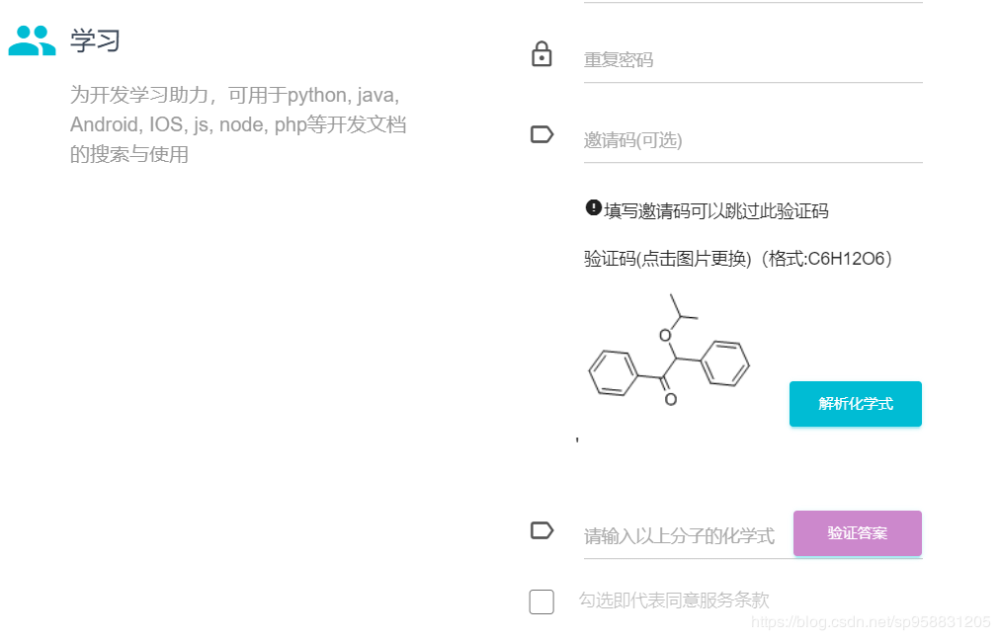

# yahaha 破解方程式源码分析

yahaha网站提供vpn产品服务，但是注册用户阶段需要用户验证——填写邀请码或者解析一个化学式。本文是在解析CSDN上一位网友编写的js注入py解析图片化学式的源代码。

源代码并不是通过某种深不可测的机器学习来识别化学式，而是通过追踪用户操作流程，找到化学式库网站接口，并反向读取yahaha网站跳转化学式库网站提交的业务信息，从而获取到当前注册页面化学式图片在化学式库中的关键字，随后在库网站模拟用户输入关键字即可得到对应化学品的信息，最后调用beautiful soup库解析网页信息中的化学式。



------

## 前端分析

前端展示给用户注册的化学式图片点击可以更新，然而更新的来源库就直接写在图片的点击事件里。这里是`src=/auth/chemical_code/r`. 


追踪图片的点击事件可以发现*src*表示的地址实际上是通过随机数向前端页面传输一个gif文件。


将*src*直接粘贴到浏览器地址栏，网页经过一次跳转，最终获取到一个*chemicalbook*库提供的gif文件。

通过chrome的开发者工具，在Network工具栏查看当前gif文件信息：


确实经过一次跳转。

source文件里的r表示yahaha处理化学式图片请求的中间服务，点击可以看到Headers里：

location表示


cookie表示当前用户的信息。通过传入cookie可以确定当前注册用户页面显示的到底是哪一种化学式图片。


至此我们可以得出化学式图片在yahaha注册页面的流程：已知地址`src = /auth/chemical_code/r`, 使用`GET`方法访问该`chemical_code`地址, 服务器会response并在返回的response的headers信息里写入location，location里包含资源重定向跳转的图片地址，该图片地址是当前图片在chemicalbook库的索引URL，`chemical_code`资源返回chemical图片到浏览器。返回信息中可以看到图片URL唯一的标识`*-*-*.gif`。

## 解决方案

将cookies和url得到后，使用requests库的get方法访问资源，访问到的response解析出location，location包含化学式的keyword，将keyword传入chemicalbook网站，最后使用beautiful soup即可解析化学方程式。

## 前端代码

前端注入js代码，模仿操作按钮——"解析"，点击事件为驱动，主要是提取注册页面化学式图片访问地址url：`"/auth/chemical_code/r" `, 在当前页调用`getCookie('PHPSESSID')`获取cookies的信息`PHPSESSID`, 将二者作为param构成一个图片src，前端注入图片显示为none仅仅是为了get资源，这时浏览器访问新的资源，资源地址是Python后台提供的。

访问后台的地址和端口是后台自定义的。

```javascript
// register comp
function register_comp(){
	console.log("注册解析组件")
	var p = document.createElement('p');
	p.innerHTML = "<button id='parse_MF' onclick='parse();' class='btn btn-info' style='margin-top:-40px;width:38%;float:right; margin-bottom:0px; z-index:99; padding: 10px 5px; background-color:#00bcd4' type='button'>解析化学式</button>'"
	parentElem = $("form.form").children('div.card-content').children('div.input-group').get(6)
	$(parentElem).append(p);
}

//register
register_comp();

function parse(){
	code_img_src = $("#chemical_code").attr('src')
	url = code_img_src
	PHPSESSID = getCookie('PHPSESSID')
	console.log("开始解析"+url);
	var li = document.createElement('p')
	var src_param = "http://127.0.0.1:43271?url="+url+"&PHPSESSID="+PHPSESSID
	li.innerHTML = ""
	parentElem = $("form.form").children('div.card-content').children('div.input-group').get(6)
	$(parentElem).append(li);
}

function getCookie(cname)
{
  var name = cname + "=";
  var ca = document.cookie.split(';');
  for(var i=0; i<ca.length; i++) 
  {
    var c = ca[i].trim();
    if (c.indexOf(name)==0) return c.substring(name.length,c.length);
  }
  return "";
}
```

## 后台代码

后台调用http.server创建服务器，服务器提供通讯tcp协议端口，与前端代码通信。

```python
# -*- coding: utf-8 -*-#

#-------------------------------------------------------------------------------
# Name:         parser
# Description:  
# Author:       ffish
# Date:         2019/9/25
#-------------------------------------------------------------------------------
from http.server import BaseHTTPRequestHandler,HTTPServer
import urllib
import requests
from bs4 import BeautifulSoup
import datetime

class Parser(BaseHTTPRequestHandler):
    def do_GET(self):
        log("正在获取keyword...")
        if '?' in self.path:
            self.queryString = urllib.parse.unquote(self.path.split('?',1)[1])
            params = urllib.parse.parse_qs(self.queryString)
            code_url = 'https://www.yahaha.ltd' + params['url'][0]
            cookie = 'PHPSESSID=' + params['PHPSESSID'][0]
            print("cookie:",cookie)
            headers = {
                "Accept": "text/html,application/xhtml+xml,application/xml;q=0.9,image/webp,image/apng,*/*;q=0.8,application/signed-exchange;v=b3",
                "Accept-Encoding": "gzip, deflate, br",
                "Accept-Language": "zh-CN,zh;q=0.9",
                "Cookie": cookie,
                "sec-fetch-mode": "navigate",
                "sec-fetch-site": "none",
                "sec-fetch-user": "?1",
                "upgrade-insecure-requests": "1",
                "User-Agent": "Mozilla/5.0 (Windows NT 10.0; Win64; x64) AppleWebKit/537.36 (KHTML, like Gecko) Chrome/77.0.3865.90 Safari/537.36"
            }
            resp = requests.get(url=code_url,headers=headers)
            reditList = resp.history
            location = reditList[len(reditList)-1].headers['Location']

            if location != None:
                sps = location.split("/")
                gif = sps[len(sps)-1]
                keyword = gif.split(".")[0]
                len("keyword 获取成功！")
                isExist,MF = Search(keyword)
                if isExist:
                    log("解析成功。化学式为:"+MF)
                else:
                    log("解析失败。可能该keyword的化学式不存在，可以尝试重新获取...")
            else:
                len("keyword 获取失败！")

        try:
            self.send_response(200)
            self.send_header('Content-type',"image/png")
            self.end_headers()
        except IOError:
            self.send_error(404,'File Not Found: %s' % self.path)

def Search(keyword):
    log("正在解析keyword为化学式...")
    url = 'https://www.chemicalbook.com/Search.aspx?keyword='

    isExist = False
    MF = None
    resp = requests.get(url+keyword)
    html = resp.text
    soup = BeautifulSoup(html, "html.parser")
    if len(soup.select('table.mid')[0].find_all('a',href='CAS/GIF/'+keyword+'.gif')) > 0:
        isExist = True
        MF = soup.select('table.mid')[0].select('table.mbox')[0].select('tr')[3].select('td')[1].get_text()
    return isExist,MF

def log(text):
    currTime = datetime.datetime.now().strftime('%Y-%m-%d %H:%M:%S')
    print(currTime,":",text)

def main():
    HOST = "127.0.0.1"
    PORT = 43271
    ADDR = (HOST,PORT)
    try:
        server = HTTPServer(ADDR,Parser)
        print("######################################################################")
        print("#--------------------------------------------------------------------#")
        print("#-----------------------欢迎使用EasyParser工具-----------------------#")
        print("#--------------------------------------------------------------------#")
        print("######################################################################")
        server.serve_forever()
    except KeyboardInterrupt:
        server.server_close()

if __name__ == '__main__':
    main()

```

